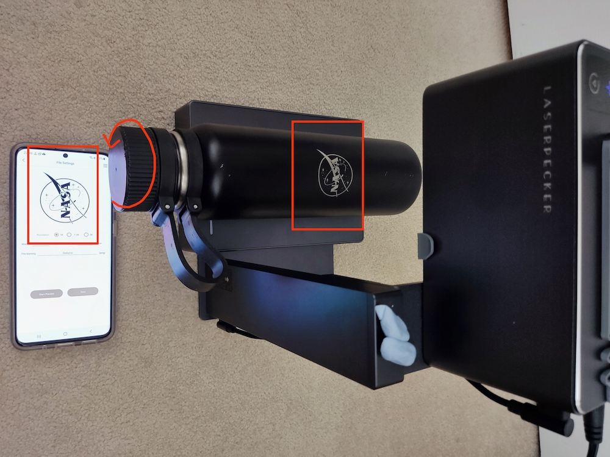
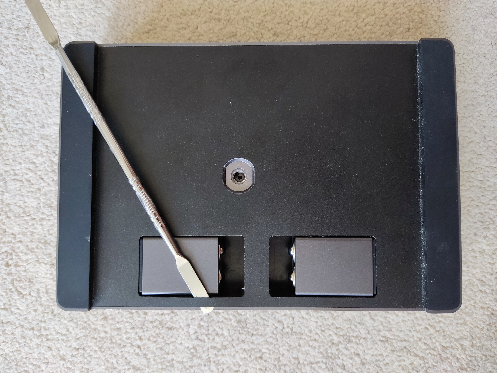
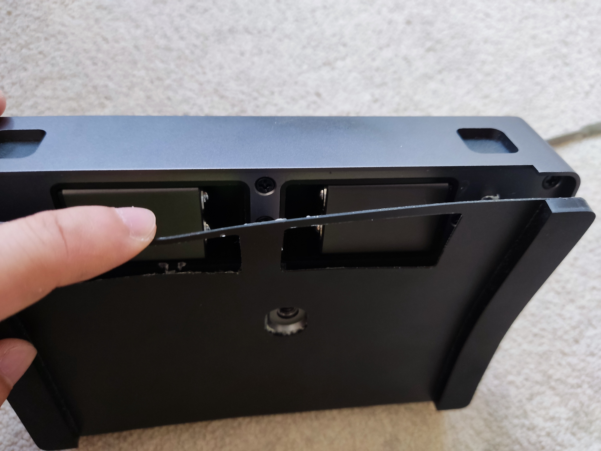
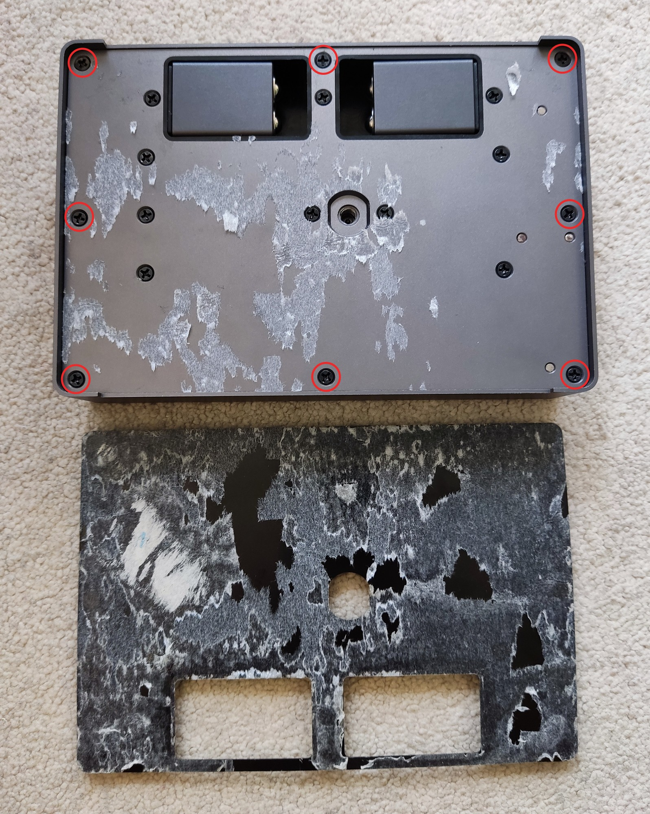
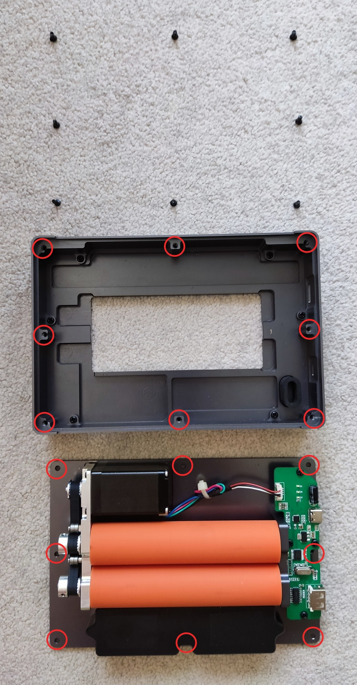
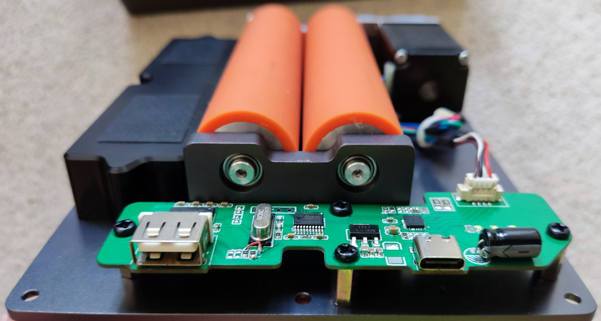
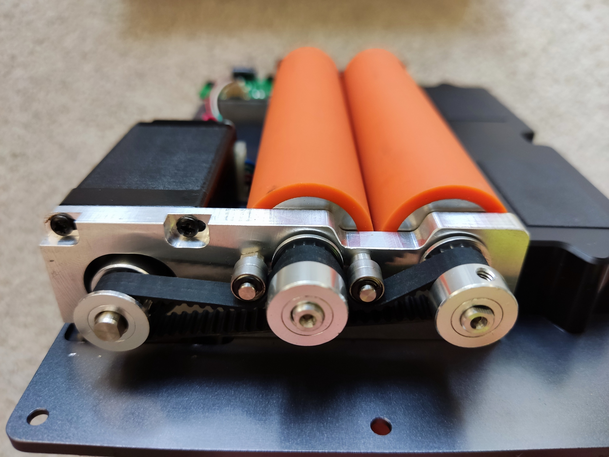
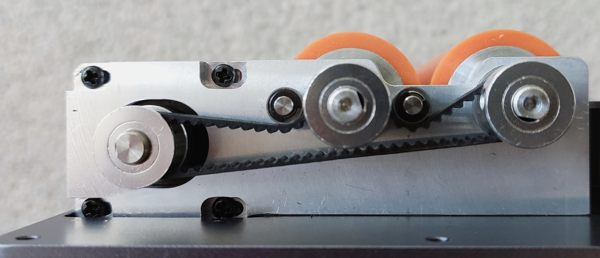
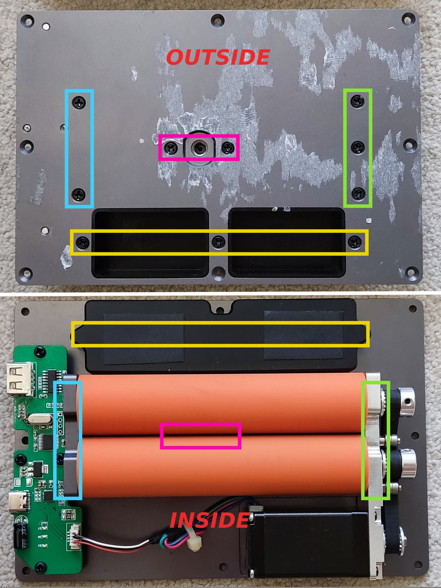

# Using The 3rd Axis Addon

You must enable it in the app settings and select a desired mode before using it. The rollers will roll towards the appropriate direction per engraving mode. Naming them `Slab`, `Trolley` and `Cylinder` simplifies the confusion for users.

**Tip**: place your phone in parallel with the LP2 side by side, so that what's shown on the phone is in the same direction as what's going to be engraved. Then rotate your image in the LP app as needed. This is particularly useful when engraving on cylinders. Do a **Scroll Preview** (this button is labeled **Continue** in iOS App) as well to make sure your cylinder is placed in the right direction on the 3rd axis. See my [demos of using the 3rd axis](/LP2_pre_release_tests.md#3rd-axis).  

 

## Slab

## Trolley

## Cylinder

# Common Issues & Solutions

## My object skids or tips over on the 3rd axis in Slab mode.

If your object is too short or light in weight, it may not have enough friction against the metal rollers, or tips over as it moves to the end of engraving. A quick fix it to make a conveyor plane with a wood board or something similar.

 

# 3rd Axis Addon Disassembly

## WARNING

**You will void the warranty of your 3rd axis addon if you disassemble it.**

## Step 1
Use something thin to separate the thick black plastic sheet from the bottom of the 3rd axis addon. Start from the thinest part.

 

## Step 2
Remove these 8 screws so the top cover and the base plate are separated.

## Internals

### Screw positions

