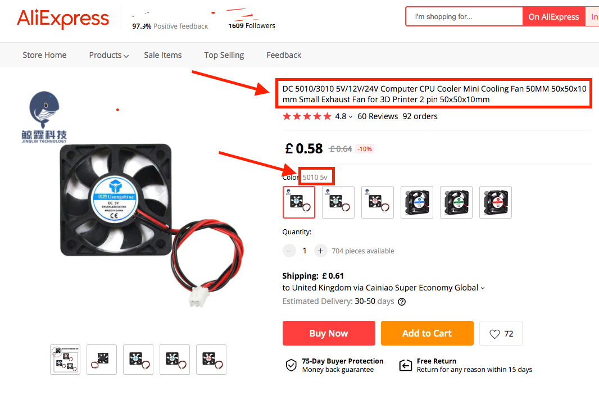
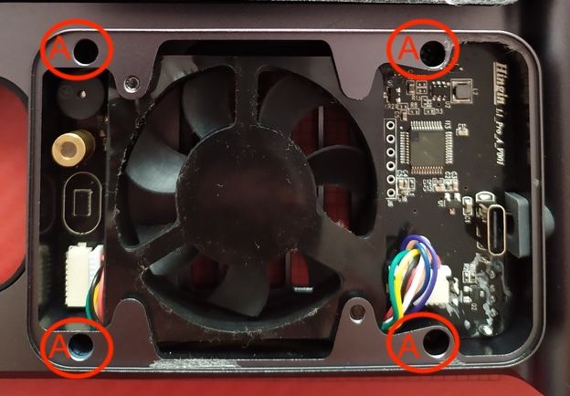
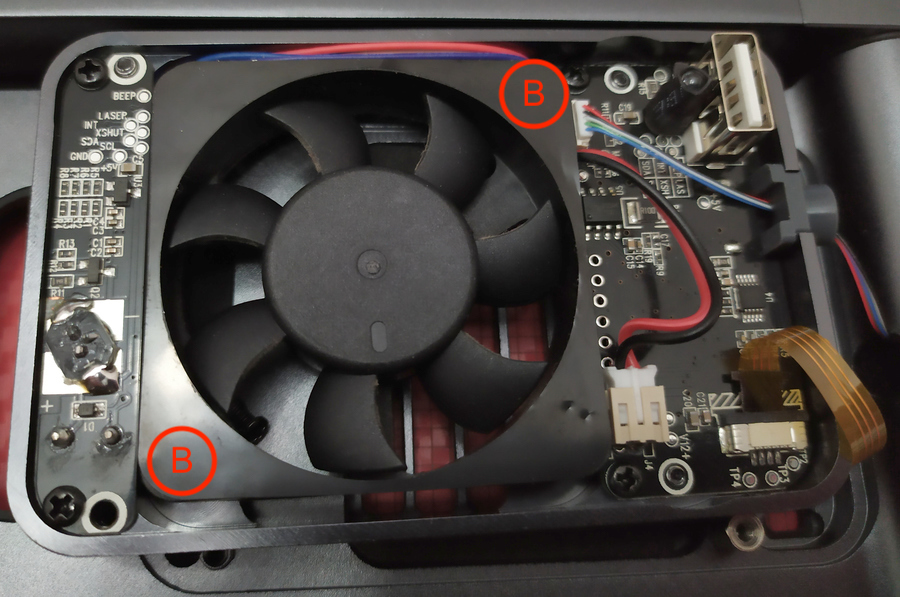

# LaserPecker Automatic Stand For L1/Pro

The automatic stand was released with the Pro model. It is compatible with L1 and can be purchased separately.

The stand folds up and fits into the carry case nicely. It does not have built-in battery. You will need one USB C cable to feed power to it; and it relays the power to the engraver via another short USB C cable. Both cables come along with the stand.

This stand can raise the engraver up to 29cm away from the base, meaning it can engrave objects up to 9cm thick, which covers most objects you want to engrave on. In case you want to engrave on very large objects, or engrave at certain angle, use the tripod that came with the engraver.

I have put a carbon-fibre sticker onto the base, and engraved a 100mm x 100mm grid over it to assist alignment of target objects. The grid is done via Gcode. I actually has 3 designs of the grids in Gcode files which can be found here: [yy502/inkscape-laserpecker/](https://github.com/yy502/inkscape-laserpecker/) in `misc` directory. 

I was curious about its design, so I opened it up. It was easy. All the key components are in the rectangle shaped container. The plastic is stuck on with double sided tape. It does not require much effort to remove it.

Then, on the left, there are beeper, copper laser head for the 5-point guide (not a very useful feature in my opinion), and laser emitter + receiver for distance measurement.

In the middle, there's the fan for blowing smoke away for consistent engraving result.

On the right, connectors and the main processor.

## Noisy Fan & Replacement

Noisy fan has been a common issue. Overtime, some fans become imbalanced and make loud noises due to vibration. At eraly stage, it can be fixed by eitehr turning the stand of and on again repeatedly, or use something to gentally tap on the centre area of the fan through the grille. Vibration makes this issue worse, so eventually it needs replacing.

LaserPecker recognises this issue, and will replace the faulty fan free of charge. However, it takes too long for the user to post the stand back to China for the repaire and then wait for it to be sent back. If you are up for it, you can ask LaserPecker for a replacement fan or purchase a replacement fan (very cheap) and replace it yourself. I replaced mine.

You need to get a standard 5010 5V PC fan. I bought mine from Aliexpress for about £1 including shipping. The keyword to search for is "5V 50mm fan", and this is a sample lising of such a fan.

To replace the fan, loosen 4 screws marked `A` in the image below, so the whole metal frame comes off the stand. **Be very careful to turn it over in place! It's got a fagile ribbon cable connecetd to the capacitive buttons.**

Once turned over, remove the black film on the frame of the fan and remove 2 screws marked `B` in the photo below, and then you will be able to replace the fan.

Finally, reverse the process to put everything back.

## Power Consumption

|State|Current (mA)|
| ------ | ------ |
| Off (Standby) | 30 |
| On | 415 |
| Moving up (with more resistance) |550-700|
| Hitting upper limit, before auto stopping|1120|
| Moving Down | 520-600|
