# All About L1

L1 is cheaper, faster, slightly more powerful than the Pro. Accuracy-wise, it's not as precise as Pro. You need to think about what you want to achieve. As an owner of L1 Pro, I'd say it does not replace L1 completely, and I will keep using my L1 for certain tasks.

## Power Consumption & Heat Dissipation
moved to https://lp.systemd.one/?p=495

## Speed & Configuration

moved to https://lp.systemd.one/?p=497

## Engraving Beyond the Designed Range

moved to https://lp.systemd.one/?p=499

## Cutting With Gcode

Gcode allows you to efficiently trace edges/paths. It is particularly useful for cutting materials, e.g. stickers.

### Decorative Carbon-Fibre Car Sticker

Here's an example of cutting stickers. In my test with this material, cutting once with high power is better than cutting twice with lower setting. Cutting twice resulted in more burnt edges.

### Felt Paper

The default setting of (100,10) is for engraving. To cut it, I used (100,50)x2 in Gcode mode for a clean cut.

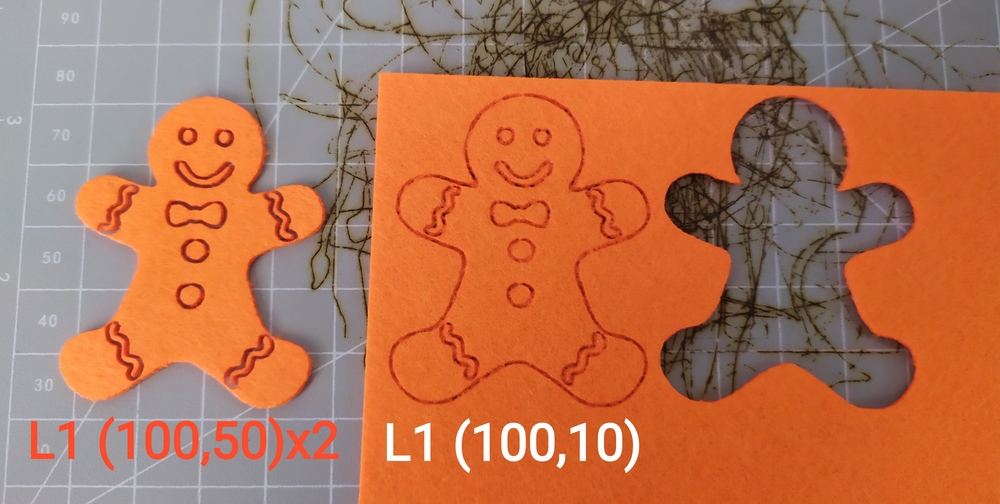

## Working with Different Materials

### Wood

Wood is one of the most easy & satisfying materials to engrave. Darker wood grain is harder to burn in, while lighter wood grain can be engraved with lower power. So, for relatively consistent result, I suggest you over-burn a little. Do some test burns by yourself and find the best setting for your material.

**Tip**: If the first go leaves an uneven result. Do not touch your material and do a 2nd burn over it with the same or higher setting.

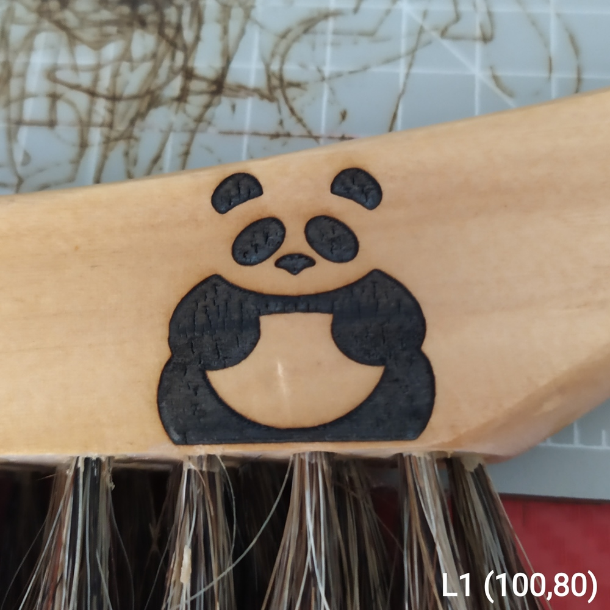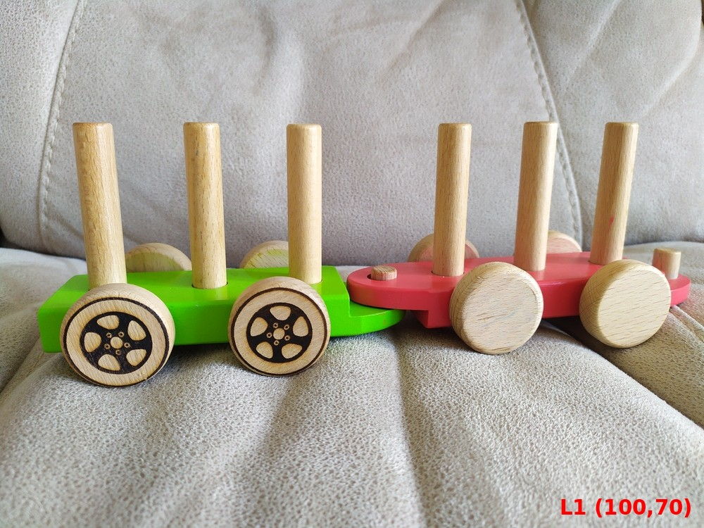

### Plastic

Plastic is easy to engrave, and you can't go too wrong about it. The only trick is that, for light coloured or clear materials, which will reflect most of the light, you need to colour it black with a whiteboard marker, so the surface will absorb laser energy. The engraved part will melt and mix with the dry ink. The rest dry ink will wipe off. See below for examples.

1. Colour a light-yellow plastic bottle black, and engrave over it (20,30).

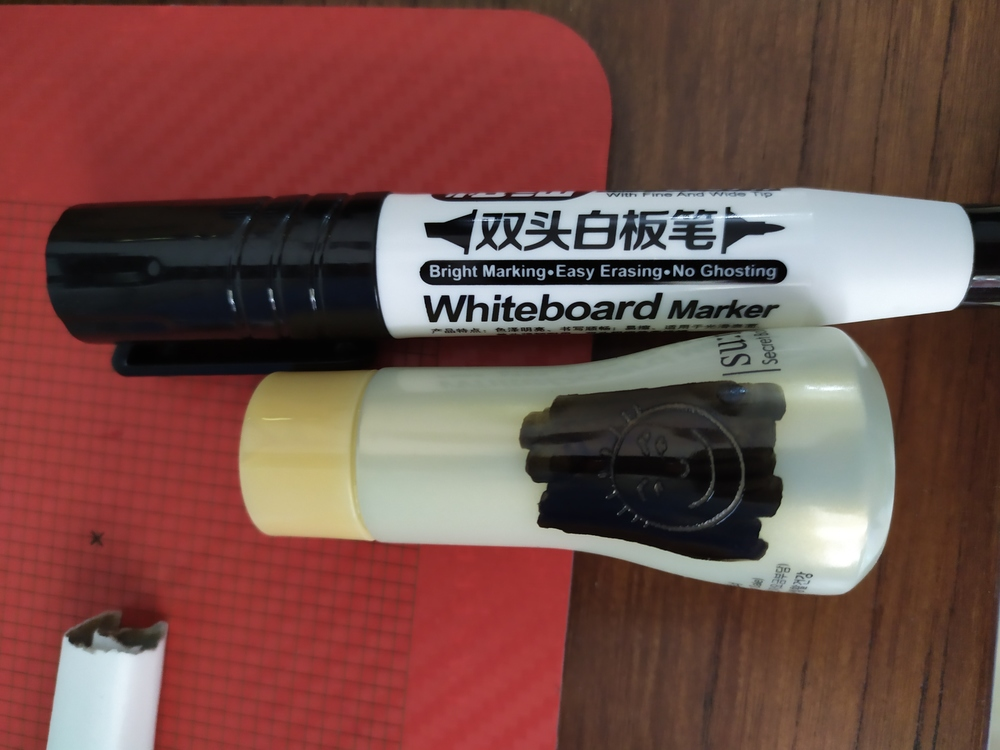

2 Wipe off the excessive ink, and the engraved pattern stays.

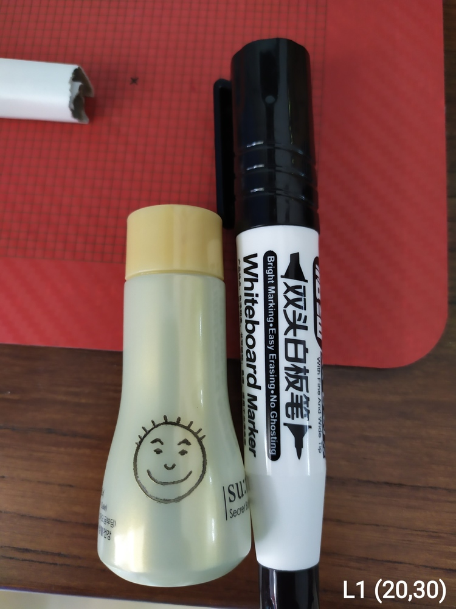

### Fruit Skin

Fruit skins contain lots of water, so they require the maximum power and depth (100,100) to engrave.

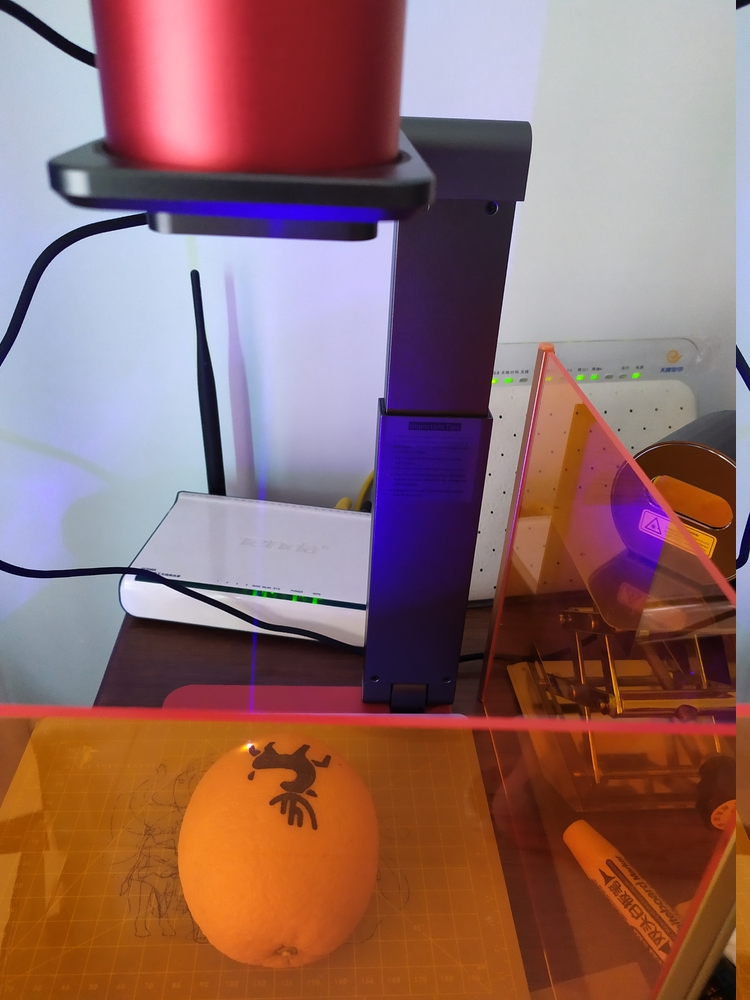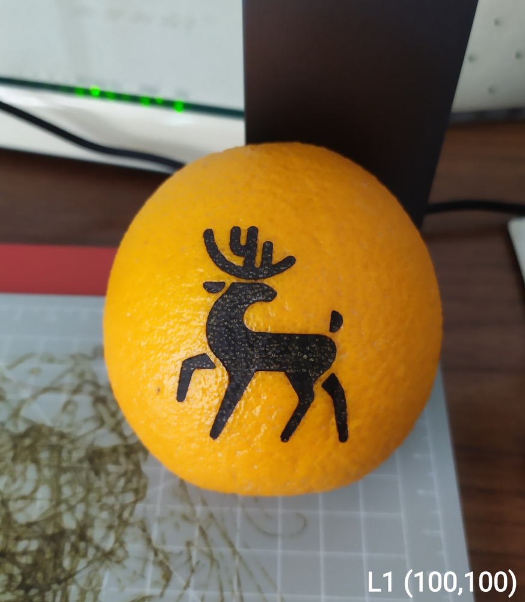

### Cardboard

Cardboard from various packing boxes is great to engrave on. Here are a few tests I made.

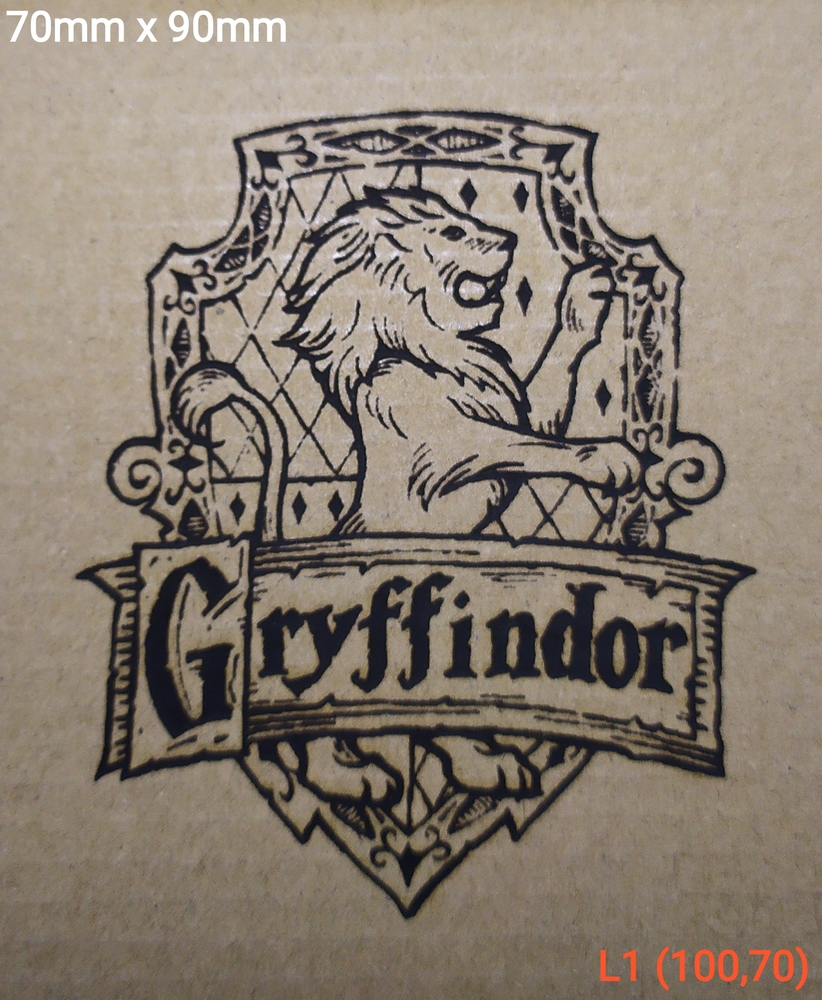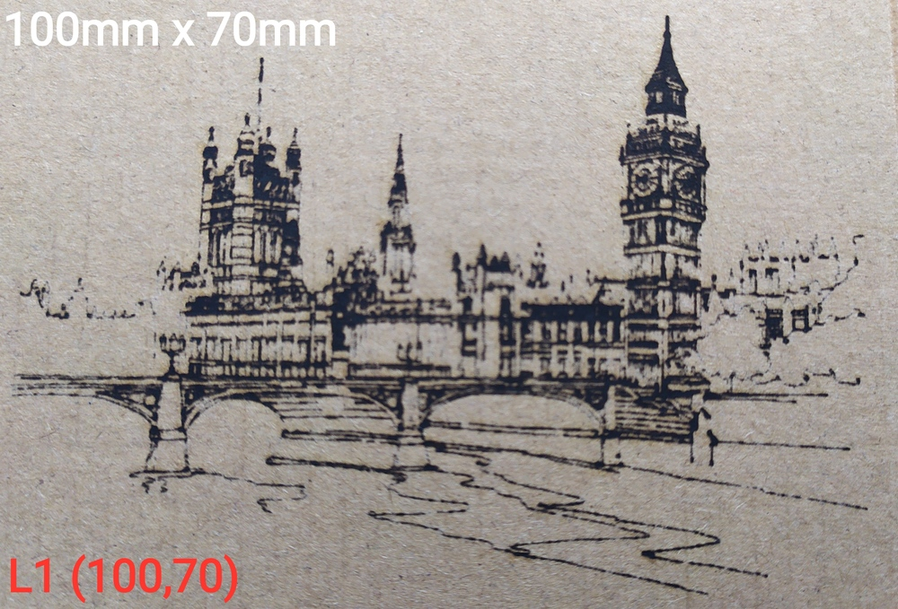

### Making 3D Paper Model

I created a little 3D car model as below:

And generated [Gcode file for cutting](https://github.com/yy502/inkscape-laserpecker/blob/master/misc/car.txt) using my [Inkscape extension](https://github.com/yy502/inkscape-laserpecker).

I have set to max power and slowest speed for best cutting result. If your paper is too think to cut in one go, set your LaserPecker to **cut multiple times**.

And this is the result:

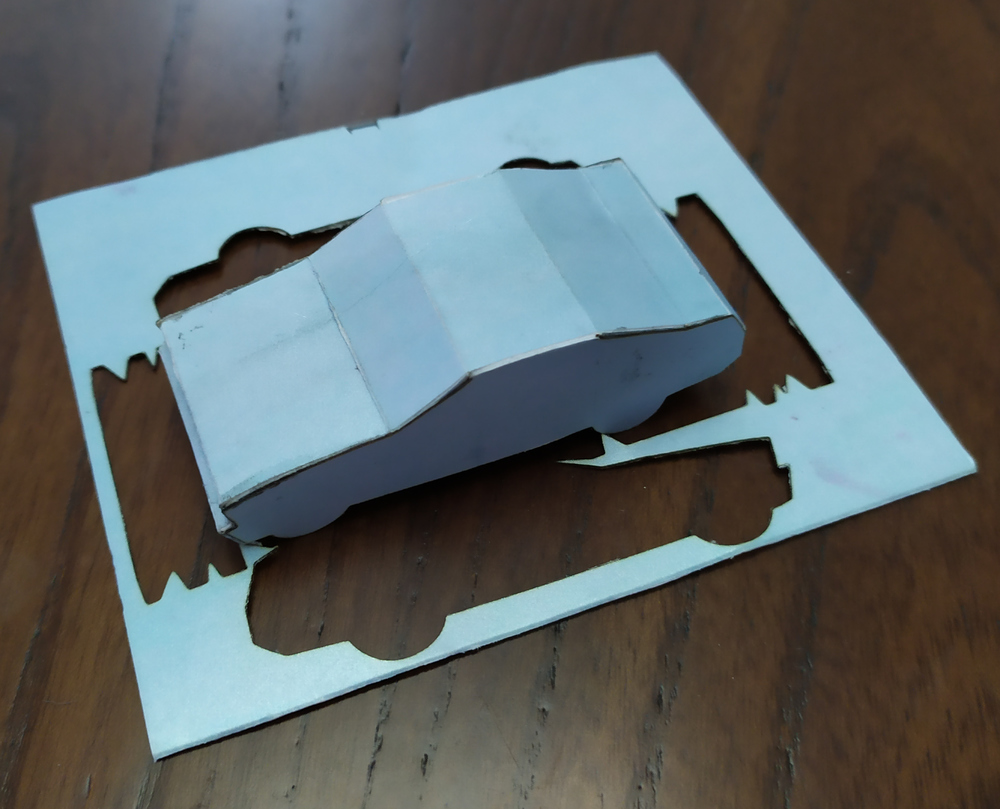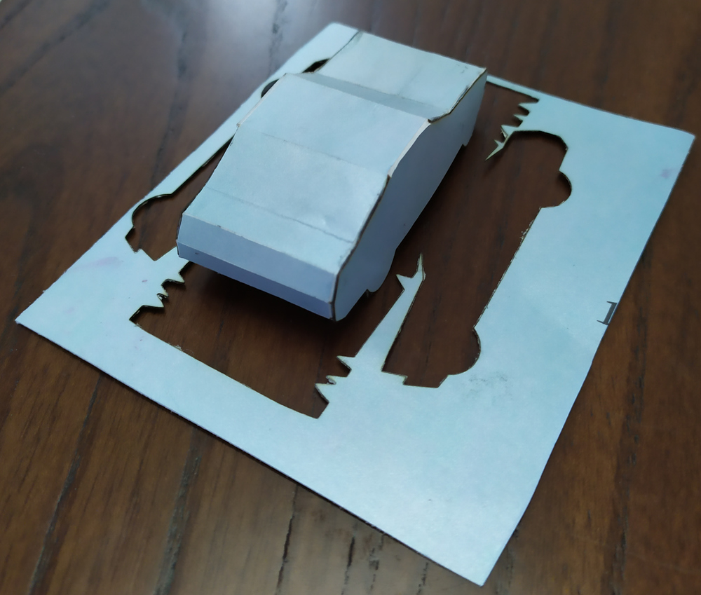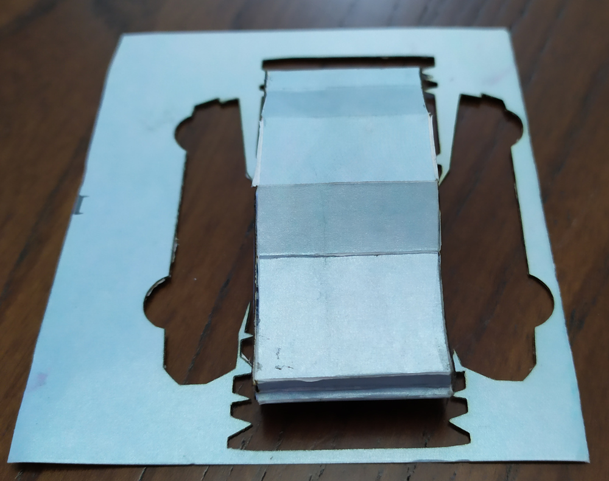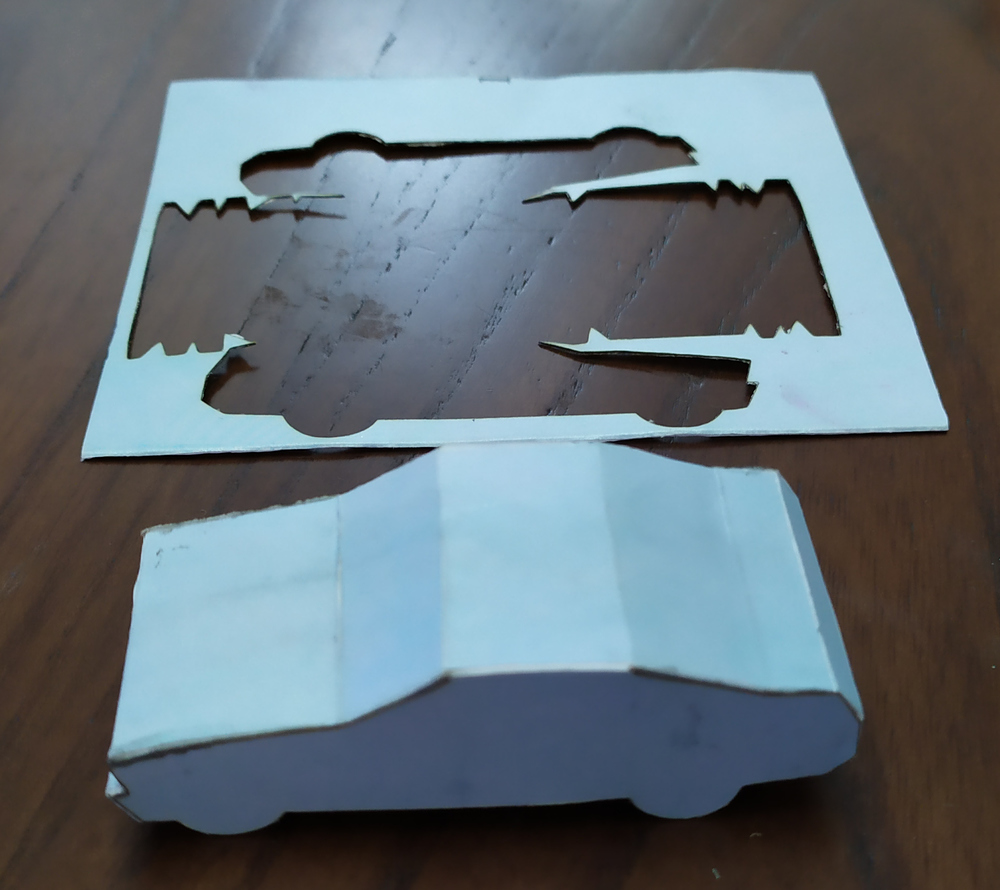

## Kick-Ass Modification (Cheap & Cheerful) 

moved to https://lp.systemd.one/?p=173

