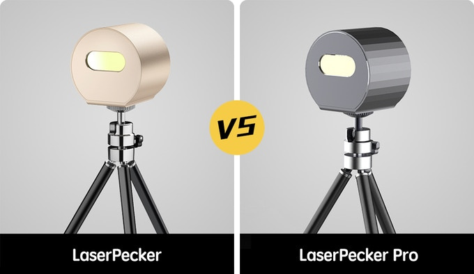
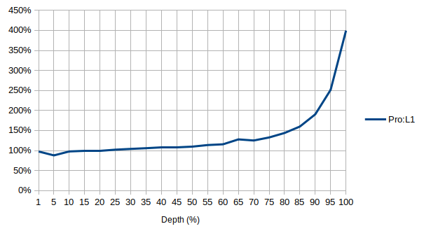
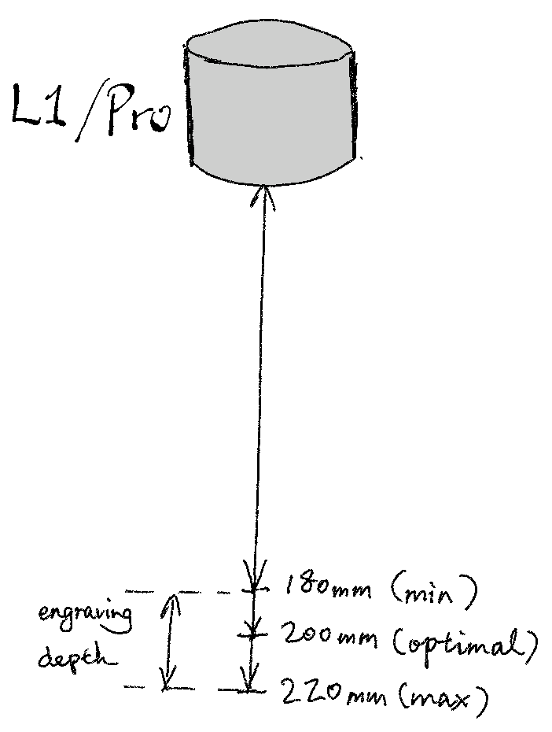

# L1 & L1 Pro

## The Look
L1 and Pro are of the same size & design, with minor difference as shown below. Therefore both will fit onto the automatic stand. 

## Key Specifications

|  | L1 | L1 Pro |
| ------ | ------ | ------ |
| Laser | 450nm Blue, 1600mW | 405nm Blue-Violet, 500mW (equivalent to 1500mW) |
| Pixel Size | 0.3mm (or smaller\*) | 0.15mm |
| Engrave Range|100mm x 100mm | 100mm x 100mm |

\* Can be improved with an easy modification, but engraving range will reduce as a trade-off. Read on.

## Speed Comparison

Due to Pro's increased precision, it takes up to **four** times long to engrave the same amount of pixels. I have tested every depth setting available in the App, and have produced the graph below. It shows how much time a Pro takes compared to an L1.

Some quick numbers to note:

* at up to 75% depth, Pro performs very similarly to L1.
* at 80-85% depth, Pro takes about 1.5 times long compared to L1.
* at 90% depth, Pro takes about 2 times long compared to L1.
* at 95% depth, Pro takes about 2.5 times long compared to L1.
* at 100% depth, Pro takes about 4 times long compared to L1.

# Know Your Engraver

## Valid Engraving Distance

Both L1 and Pro can engrave from 180mm to 220mm away from the target object, which means they can tolerate curved surfaces very well.
However, there will be some level of distortion if the variance of engraving depth is too much, but normally it's not too obvious.

## Common Issues & Solutions

### My engraver engraves for a fraction of a second and stops.

It stops due to low voltage from the power source, which could be either a poor quality power supply or a poor quality cable. Try a different power supply (5V2A, an original charger that came with your smartphone will do), or a better quality USB C cable.

### My engraver won't connect to the app.

If your engraver has a flshing blue light, it's standing by for connection. If you use an Android phone, enable GPS so the app can search nearby Bluetooth devices.

If your engraver has a flashing green or yellow light after powering on, it's faulty. Contact the seller to arrange a replacement.

### Emergency stop! Out of bounds.

Try this:
1. go to menu > Laser Adjustment > turn on laser > auto adjust.
2. then go to mode settings > tap on "security status" (the text) 5 times to enter the hidden calibration page
3. click on the complete adjustment button, wait for the self test to complete
4. power off the engraver and then back on.

## [Demos and Tips of L1](L1.md)

## [Demos and Tips of Pro](Pro.md)

# [Automatic Stand](Auto_Stand.md)
* [Noisy Fan & Replacement](Auto_Stand.md#noisy-fan--replacement)

# L1/Pro Modifications
* [Kick-ass mod to improve L1 accuracy and power](/L1.md#kick-ass-modification-cheap--cheerful)
* [Laser guide add-on to assist alignment for both L1 and L1 Pro](/modifications.md#laser-guide-add-on-to-assist-alignment-for-both-l1-and-l1-pro)
* [Flip adaptor for auto-stand](/modifications.md#flip-adaptor-for-auto-stand)
* [4-way placement extension for auto-stand](/modifications.md#4-way-placement-extension-for-auto-stand)
* [3-way compact adaptor for auto-stand](/modifications.md#3-way-compact-adaptor-for-auto-stand)

