## 激光啄木鸟L1(一代）改装教程 

这是激光啄木鸟交流微信群里的**龍ARON**无私分享的技巧，特此感谢！

通过加装一片几元钱到十几元钱的放大镜，我们可以大大提高L1的**相对功率**和**精度**，足以给没有Pro的小伙伴们体验下媲美Pro的精度。当然，这个改装是不可能把L1变成Pro的。改装后，雕刻范围会大大缩小。

### 所需配件

1) 一片放大镜: 不需要什么特殊的镜片，就是普通的4到6倍放大镜就可以。可能你手边已经有了，比如儿童玩具上，焊台上带的放大镜，都可以拿来试下。并不是放大倍率越大越好。尺寸最好是在直径35mm到60mm之间。35mm是激光窗口的宽度；60mm是L1机身的直径。虽然双面凸透镜可以完美实现这个改装，如果你反正是要去购买镜片的话，我个人建议你买直径50mm到60mm的平凸镜，便于安装。

这个就是我在某宝上买到的很合适的玻璃平凸镜片，15元包邮。仅供参考。

2) 如果你有电动支架，就不需要别的材料了。没有的话，找点胶带、双面胶、彩泥之类的东西用来固定镜片就好。

### 改装步骤

有电动支架的朋友，像这样把镜片放在支架上稍微偏右一点点就好。因为激光是从窗口正中靠右一点射出的。

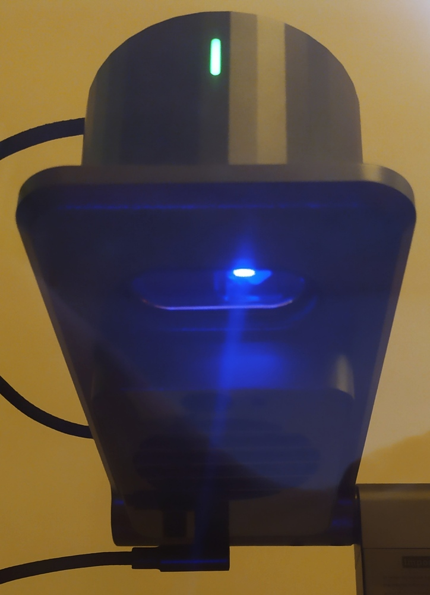

然后把L1平放在镜片之上。你可能需要在左边塞点东西把机器垫平。

没有电动支架的朋友，想办法把镜片紧贴机器的激光窗口，用胶带或别的东西固定即可。比如下面这个例子用的是焊台上的玻璃放大镜，效果非常好。

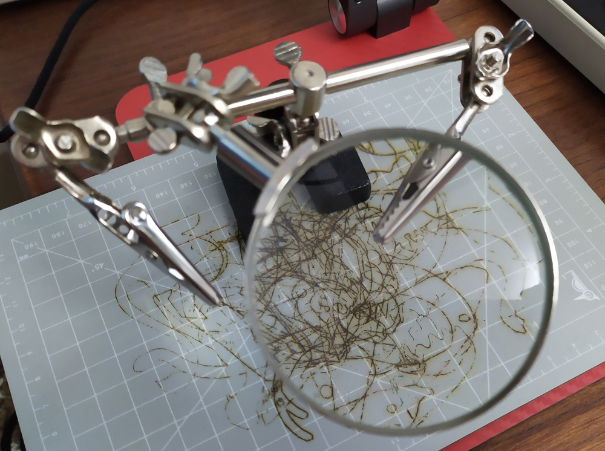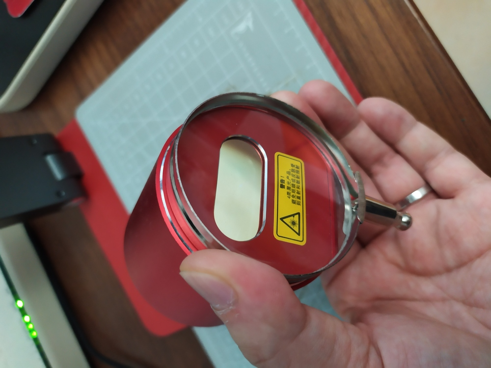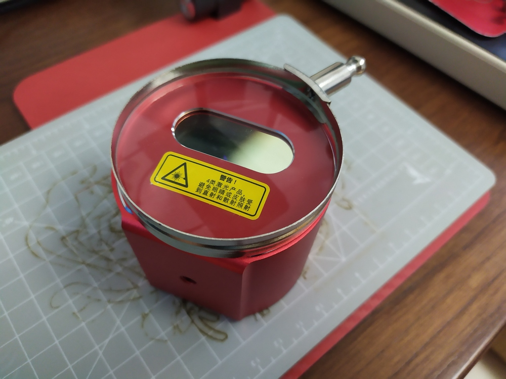

如果你有3D打印机和建模手艺的话，可以尝试设计你自己的镜片架。以下是激光啄木鸟交流微信群里的**正沧**设计制作的。仅供参考。

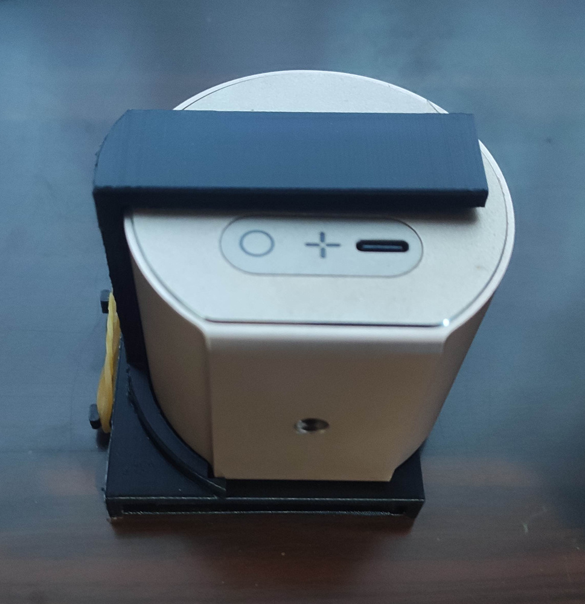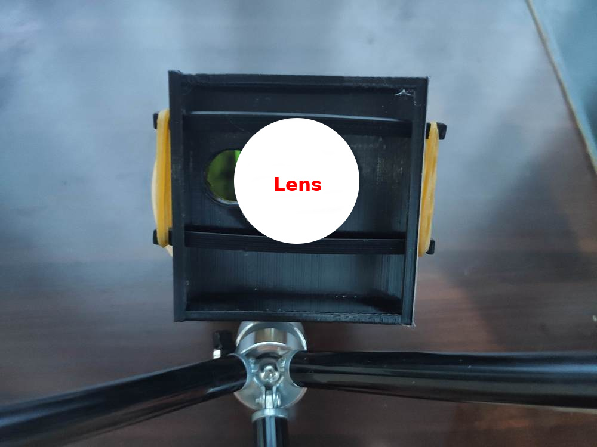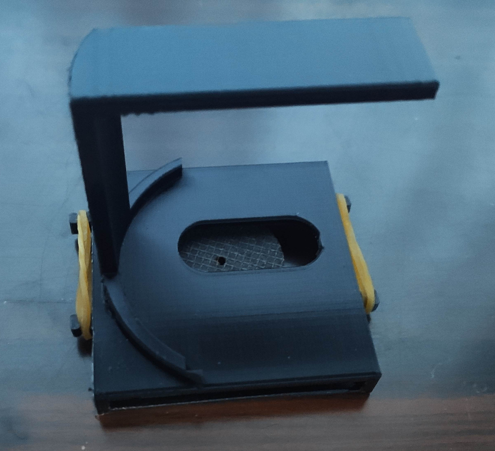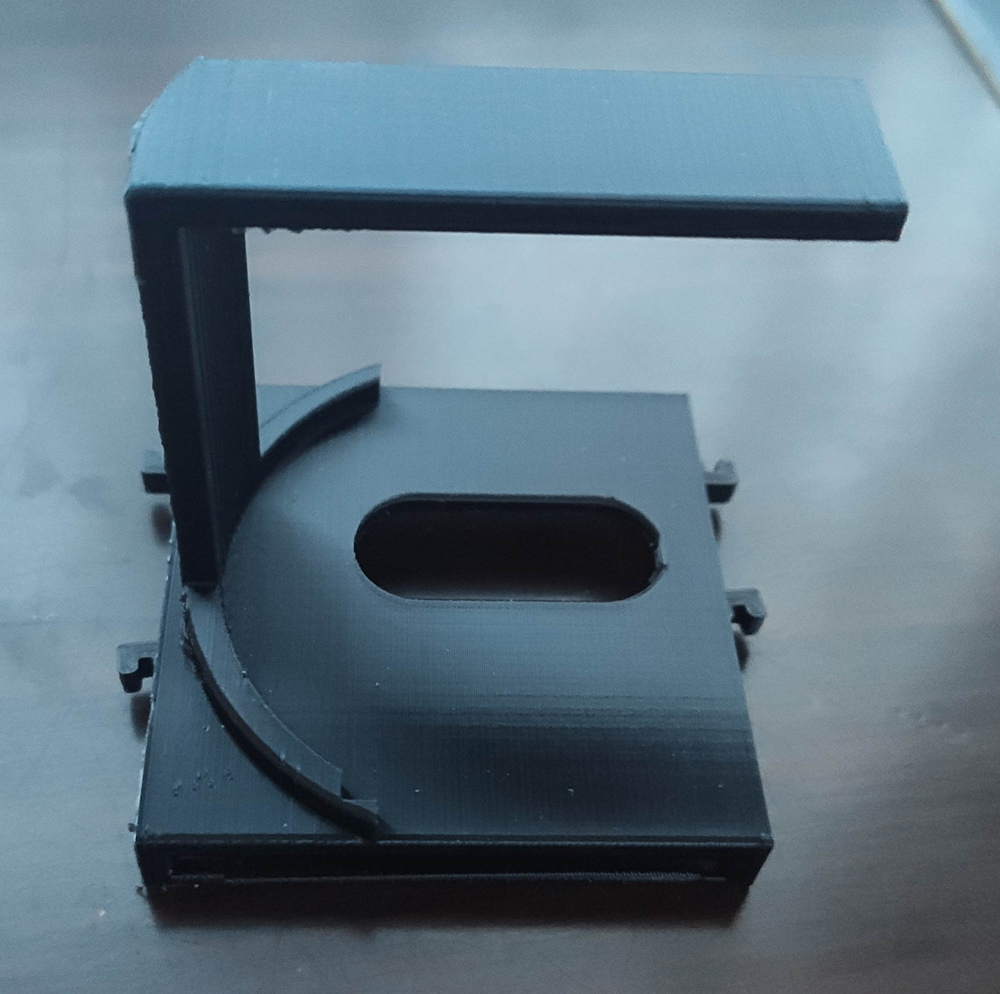

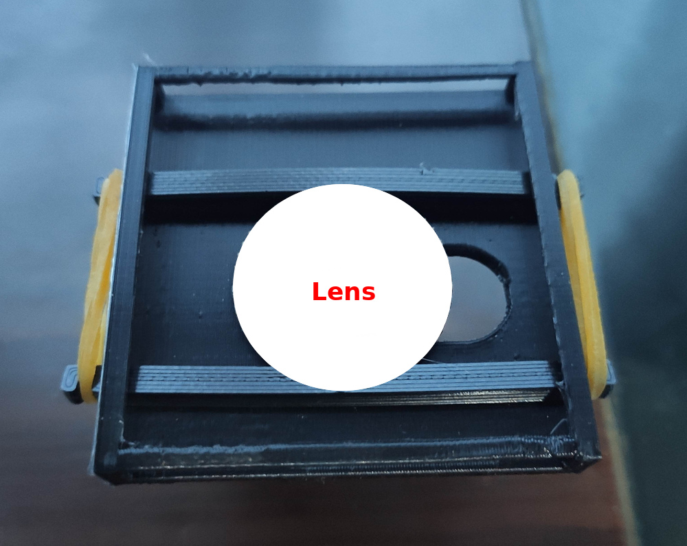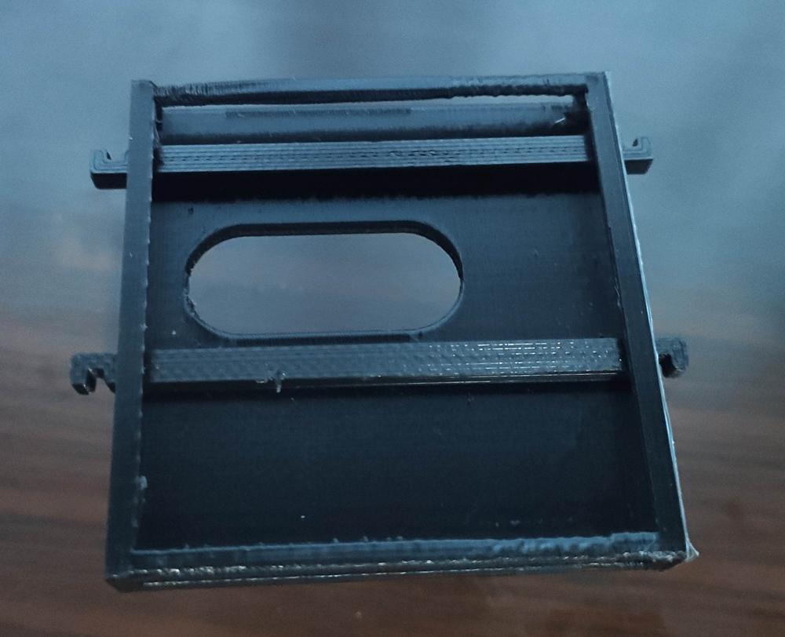

装了放大镜之后，雕刻焦距相比原先的20cm会大大缩短。这个完全取决于你用的镜片，但是不用担心，新的焦距很容易找。

首先，在app中通过校准激光位置功能打开激光点。这是低功率模式，不会烧材料。

我有个试验用升降台可以很方便的调节高度找焦点。你没有的话也完全不用担心，用一摞书、积木、一张纸，只要是可以上下调整高度的平面都可以。戴上你的护目镜，在10cm左右处上下移动找到最小激光点。记录下这个距离方便以后使用。例如我用的镜片的最佳焦距是9cm。

现在退出校准激光位置模式，雕刻一个100mm x 100mm的方框或者圆圈，然后测量下尺寸和形变。

例如，我用的这个放大镜会把输出图形沿各边缩小到40%。也就是，app里设置输出的100mm x 100mm的图形实际刻出来是40mm x 40mm。面积上来说，缩小到了设置输出的（40x40）/(100x100)=**16%**。设置上来说，因为app里只设最长边长，所以只要记住40%就好了。比如需要30mm长的图形的话，app里要设置75mm。

输出面积变原来的16%看起来太糟了。。。但是看看这效果先！

1) 激光点从直径0.3mm缩小了几倍，几乎可以媲美Pro的0.15mm分辨率。*下面有雕刻效果对比!*

2) 由于激光功率未变但光点变小了，相对雕刻功率就大大增加了。现在你改装过的L1应该可以轻易切割厚纸，甚至纯白的纸了。

这是在硬纸版上的改前改后切割效果对比。

## 精度测试和对比

只看数据的话，Pro的精度是L1的4倍(0.15x0.15mm vs 0.3x0.3mm)。先看**未改装**的雕刻精度对比:

1) **L1 vs Pro，100mm x 100mm尺寸图案**: 测试中L1用（100,50）的设置烧穿了部分测试用纸。Pro的功率没那么大，精度和火力控制更好。在同样的纸上，用（100,60）得到了比较精美的结果。

2) **L1 vs Pro，40mm x 40mm尺寸图案**: 雕刻小图案的对比就比较明显了。Pro完胜。

### 现在看看改装过的L1对比Pro的效果

注意：

1) L1的输出设置的是100mm x 100mm，经过了放大镜变形之后，实际雕刻结果是40mm x 40mm。
2) L1雕刻设置从之前的（100,70）降到了最低的（1,1）。不然就会烧穿或者烧糊我用的牛皮纸。

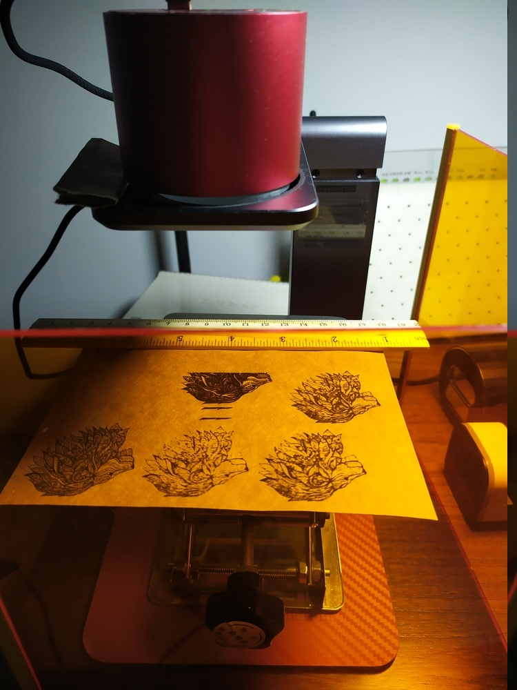

最后附上测试雕刻用的图案。你可以自己测试看看你的改装效果。

