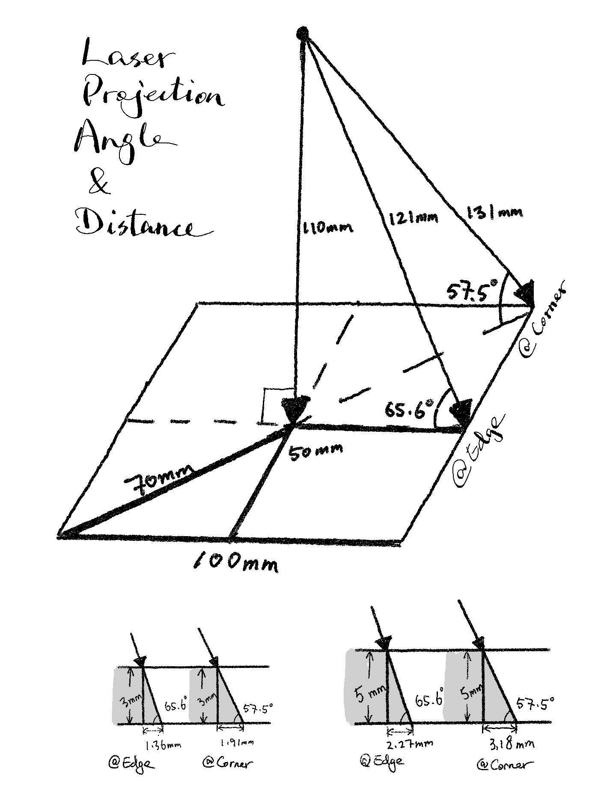
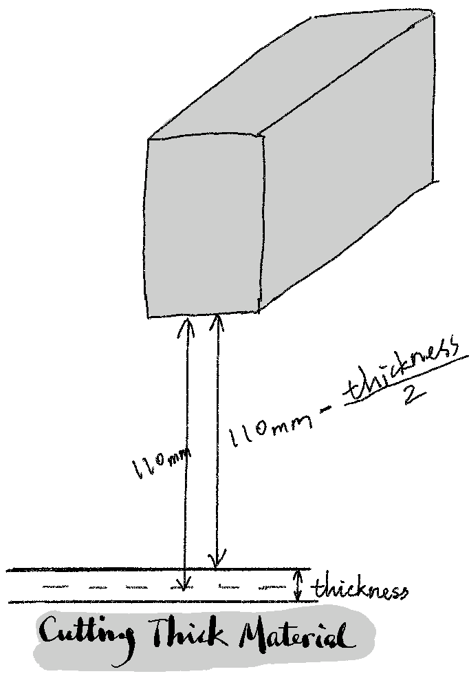
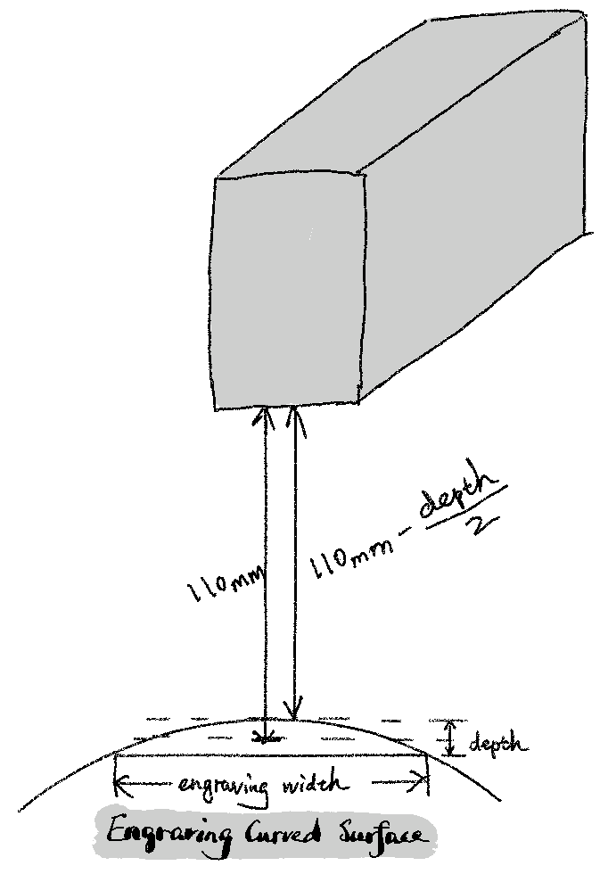
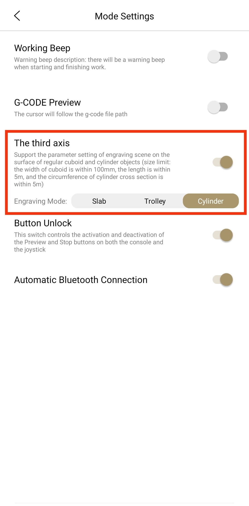
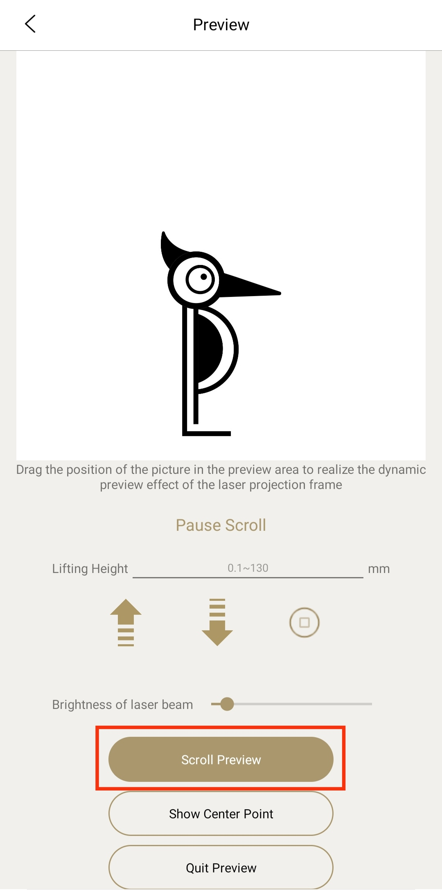
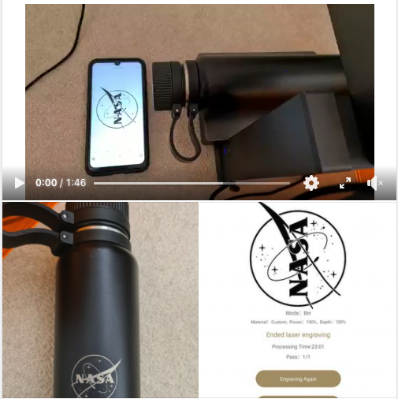
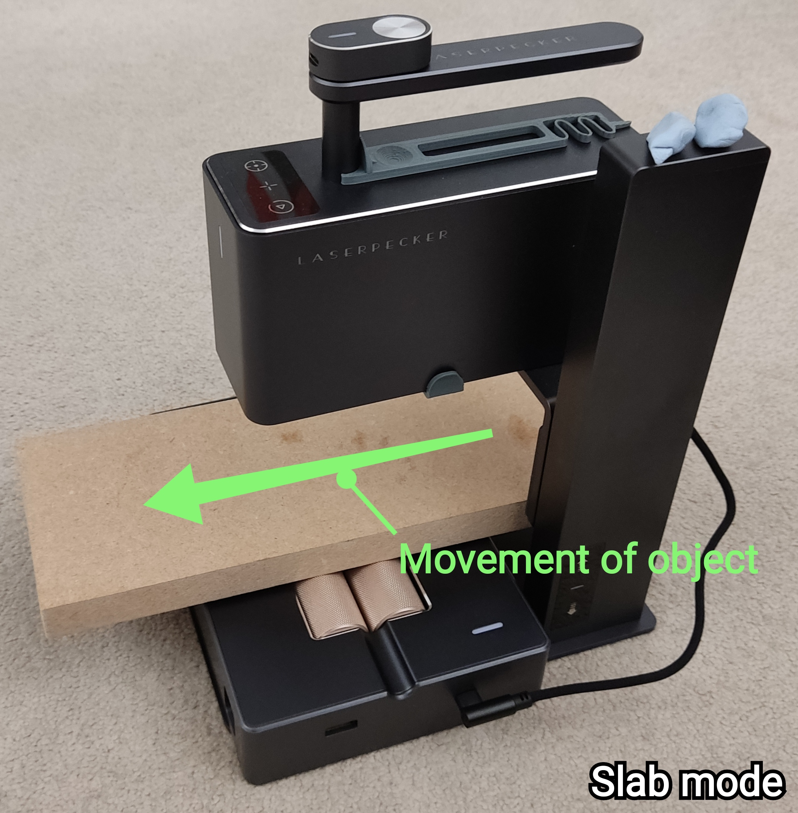
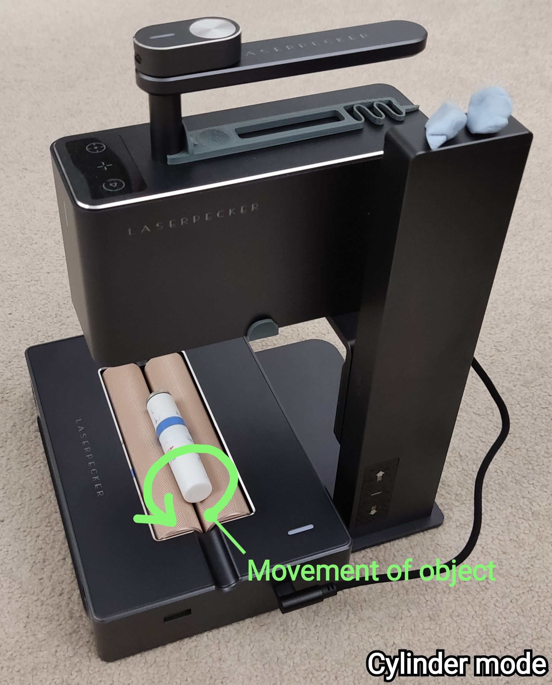

# Know Your LP2

## Limitations by Design
Since the laser source is static on the engraver, it will project to a very small central area at approximately 90 degrees with the best focus spot (0.05mm).
As the laser moves to the edges and corners of the max engraving area (100mm x 100mm), the projection angle reduces and the laser spot become an oval, which
means the focused power will be weaker and the engraving quality degrades. See [Test #29: Faded Corners at Max Size](https://www.facebook.com/groups/374697760505822/permalink/444594843516113/)
and [Test #44: Dealing with Faded Corners](https://www.facebook.com/groups/374697760505822/permalink/452307826078148/).

Another side effect is that when cutting large thick material, the bottom layer will be larger than the top layer. I've done some maths below to show what the
differences are at the edge and corner with 3mm and 5mm thick material. 

## Engraving Distance

LP2's optimal engraving distance is `110±1mm` (i.e. 109-111mm). Too close or too far will result in uneven results when you engrave a large-ish area, say over 65mm x 65mm.
If you are unsure about it, test on some scrap material after setting the engraving distance.

### Cutting Thick Material
If you cut sheet material that is more than 3mm thick, it is recommended to set your engraving distance to `110mm - material_thickness/2`,
so that the perfect 110mm focus point falls in the middle of the material to be cut. In this way, the laser will be out of optimal focus by half
material thickness at most. Otherwise, it will be out of focus by 100% material thickness as it cuts through to the bottom side of the material.
See demo of cutting 5.5mm wood in [Test #63: Mixed Materials](https://www.facebook.com/groups/374697760505822/permalink/494716925170571/).

### Curved Surface
Because the optimal engraving depth is only 2mm (`110±1mm`), to minimise the amount the laser becomes out of focus when engraving on a curved
surface which has varying distance to the engraver, you should estimate the depth of the engraving area and offset the engraving distance by half of it.

Again, you may want to do some tests to check the engraving quality at slightly different distances before doing the "real job".

## Using The 3rd Axis Addon
You must enable it in the app settings and select a desired mode before using it. The rollers will roll towards the appropriate direction per engraving mode. Naming them `Slab`, `Trolley` and `Cylinder` simplifies the confusion for users.

**Tip**: place your phone in parallel with the LP2 side by side, so that what's shown on the phone is in the same direction as what's going to be engraved. Then rotate your image as needed. This is particularly useful when engraving on cylinders. Do a scroll preview as well to make sure your cylinder is placed in the right direction on the 3rd axis. See my [demos of using the 3rd axis](/LP2_pre_release_tests.md#3rd-axis).  

 

### Slab

### Trolley

### Cylinder

## Common Issues & Solutions

### My engraver won't connect to the app.

If your engraver has a flshing blue light, it's standing by for connection. If you use an Android phone, enable GPS so the app can search nearby Bluetooth devices.

If your engraver has a flashing green or yellow light after powering on, it's faulty. Contact the seller to arrange a replacement.
