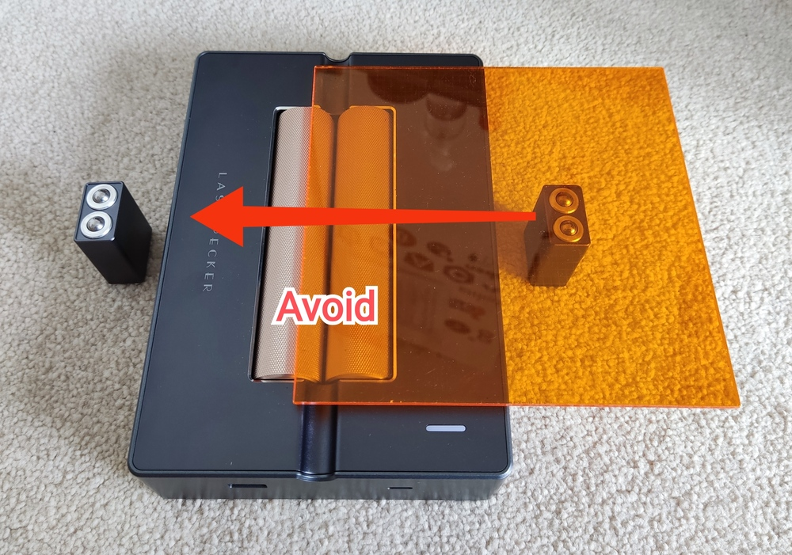
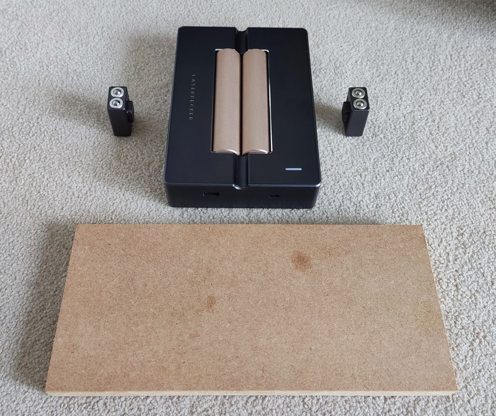
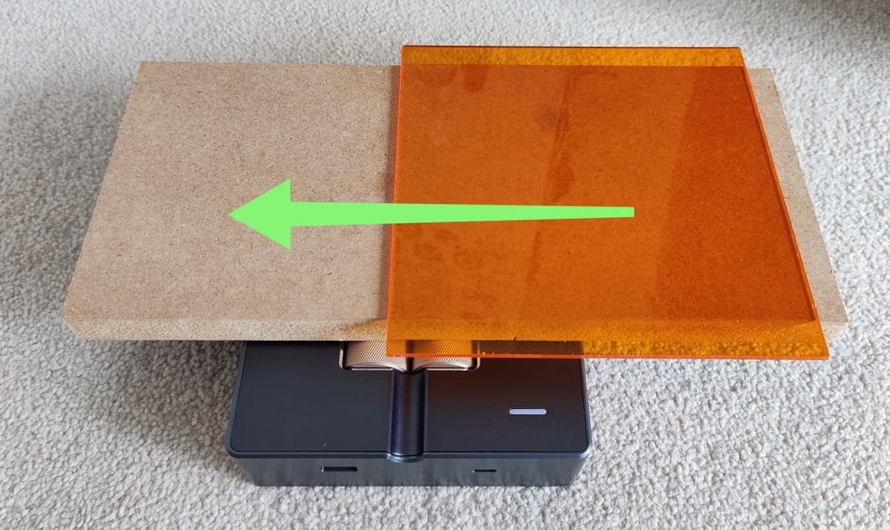
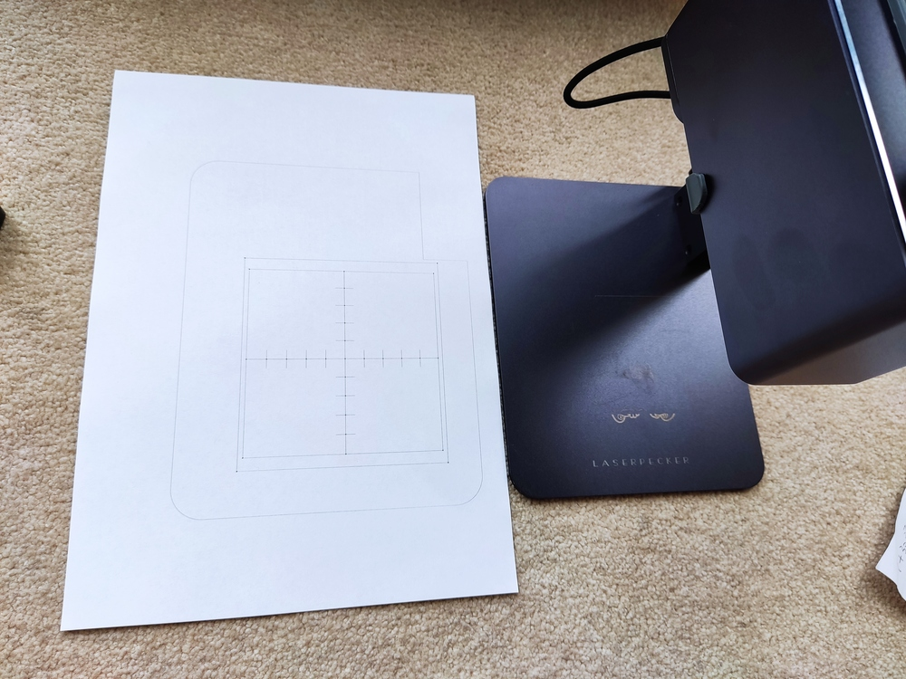
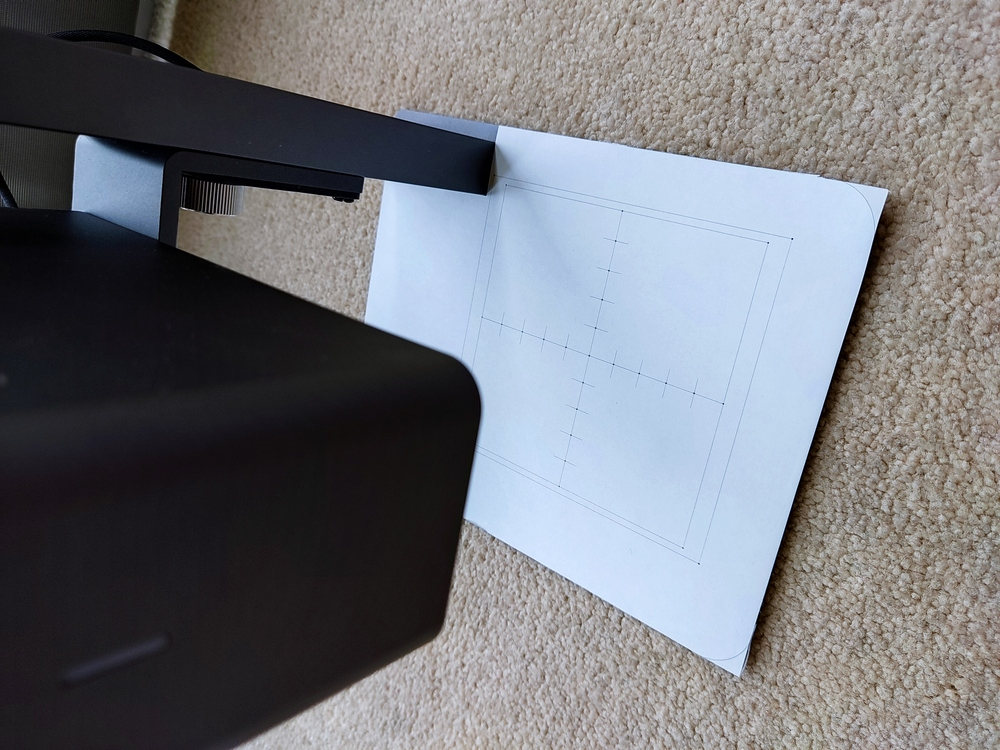
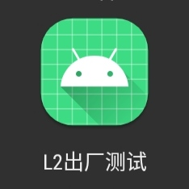
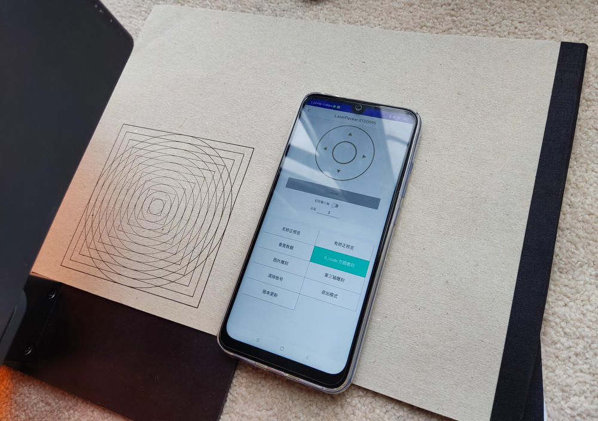
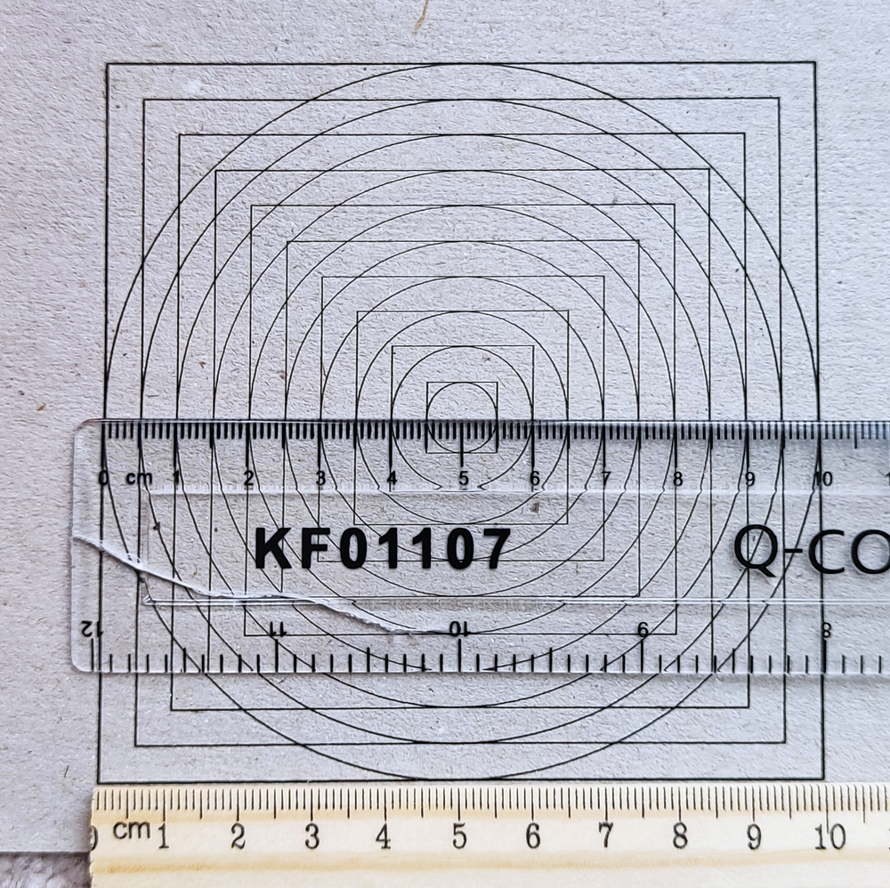

# Know Your LP2

## Limitations by Design
Since the laser source is static on the engraver, it will project to a very small central area at approximately 90 degrees with the best focus spot (0.05mm).
As the laser moves to the edges and corners of the max engraving area (100mm x 100mm), the projection angle reduces and the laser spot become an oval, which
means the focused power will be weaker and the engraving quality degrades. See [Test #29: Faded Corners at Max Size](https://www.facebook.com/groups/374697760505822/permalink/444594843516113/)
and [Test #44: Dealing with Faded Corners](https://www.facebook.com/groups/374697760505822/permalink/452307826078148/).

Another side effect is that when cutting large thick material, the bottom layer will be larger than the top layer. I've done some maths below to show what the
differences are at the edge and corner with 3mm and 5mm thick material. 

## Engraving Distance

LP2's optimal engraving distance is `110±1mm` (i.e. 109-111mm). Too close or too far will result in uneven results when you engrave a large-ish area, say over 65mm x 65mm.
If you are unsure about it, test on some scrap material after setting the engraving distance.

### Cutting Thick Material
If you cut sheet material that is more than 3mm thick, it is recommended to set your engraving distance to `110mm - material_thickness/2`,
so that the perfect 110mm focus point falls in the middle of the material to be cut. In this way, the laser will be out of optimal focus by half
material thickness at most. Otherwise, it will be out of focus by 100% material thickness as it cuts through to the bottom side of the material.
See demo of cutting 5.5mm wood in [Test #63: Mixed Materials](https://www.facebook.com/groups/374697760505822/permalink/494716925170571/).

### Curved Surface
Because the optimal engraving depth is only 2mm (`110±1mm`), to minimise the amount the laser becomes out of focus when engraving on a curved
surface which has varying distance to the engraver, you should estimate the depth of the engraving area and offset the engraving distance by half of it.

Again, you may want to do some tests to check the engraving quality at slightly different distances before doing the "real job".

## Using The 3rd Axis Addon
You must enable it in the app settings and select a desired mode before using it. The rollers will roll towards the appropriate direction per engraving mode. Naming them `Slab`, `Trolley` and `Cylinder` simplifies the confusion for users.

**Tip**: place your phone in parallel with the LP2 side by side, so that what's shown on the phone is in the same direction as what's going to be engraved. Then rotate your image in the LP app as needed. This is particularly useful when engraving on cylinders. Do a scroll preview as well to make sure your cylinder is placed in the right direction on the 3rd axis. See my [demos of using the 3rd axis](/LP2_pre_release_tests.md#3rd-axis).  

 

### Slab

### Trolley

### Cylinder

## Common Issues & Solutions

### My engraver won't connect to the app.

If your engraver has a flshing blue light, it's standing by for connection. If you use an Android phone, enable GPS so the app can search nearby Bluetooth devices.

If your engraver has a flashing green or yellow light after powering on, it's faulty. Contact the seller to arrange a replacement.

### My object skids or tips over on the 3rd axis in Slab mode.

If your object is too short or light in weight, it may not have enough friction against the metal rollers, or tips over as it moves to the end of engraving. A quick fix it to make a conveyor plane with a wood board or something similar.

 

## Factory Calibration

### Warning
* **ONLY** do this when your engraving is visibly distorted. This should be a one-off process and you should not do this often just because you can.
* Do **NOT** try any other button in the app! **YOU COULD BRICK YOUR LP2 AND VOID YOUR WARRANTY!!**

### Requirements

1) Print this [calibration reference sheet](/misc/LP2_calibration_reference.pdf) and an A4 paper and cut it along the outline.

 

2) Use an Android phone, install LP2 factory calibration app [(apk file)](/misc/LP2_factory_calibration.apk). After installation, it looks like this:

### Procedures

Click to watch a video demo of the whole process.

1) Place the calibration reference sheet onto the base of the stand. It should match the size of the base plate perfectly, otherwise your print is in a wrong size.
2) Mount your LP2 onto the electric stand, lower it to the lowest position.
3) Launch the factory calibration app. Select L2 on the top and then tap on your LP2 when it is discovered.
4) Wait a few seconds until the red texts in the middle of the screen become "数据处理完成" (it means "data processed").
5) Tap on any of the direction button to light up the laser and start calibration.
6) Use the direction buttons to move the laser spot to its closest reference point, then tap on the gray Confirm button. Laser spot then moves to the next calibration point.
7) Repeat step 6 until the laser spot returns to the centre and turns off. Now wait for a long beep and the laser lights up again in the centre. It will finally continuously trace the 100x100mm square. This is the end of calibration.
8) Power off your LP2 and then power it back up.
9) (Optional) Reconnect to the factory calibration app. Wait about 5 seconds for the initial data transmission. Place a non-white paper under the engraver. Wear your laser goggles. Tap on this "G_code方圆雕刻" button to engrave a squares+circles image to verify the calibration.

## Factory Reset Firmware

In case of firmware upgrade failure or issues with a new firmware, you can easily rollback to the factory firmware (v3.0.1) by:

1) Unplug power from your LP2
2) Plug in power to your LP2 and immediately press and hold the **two** circle buttons on the top of your LP2 until a red light comes up.
3) Release the buttons. The red light will go off and a blue light should start to flash on your LP2.

Rollback completed.
