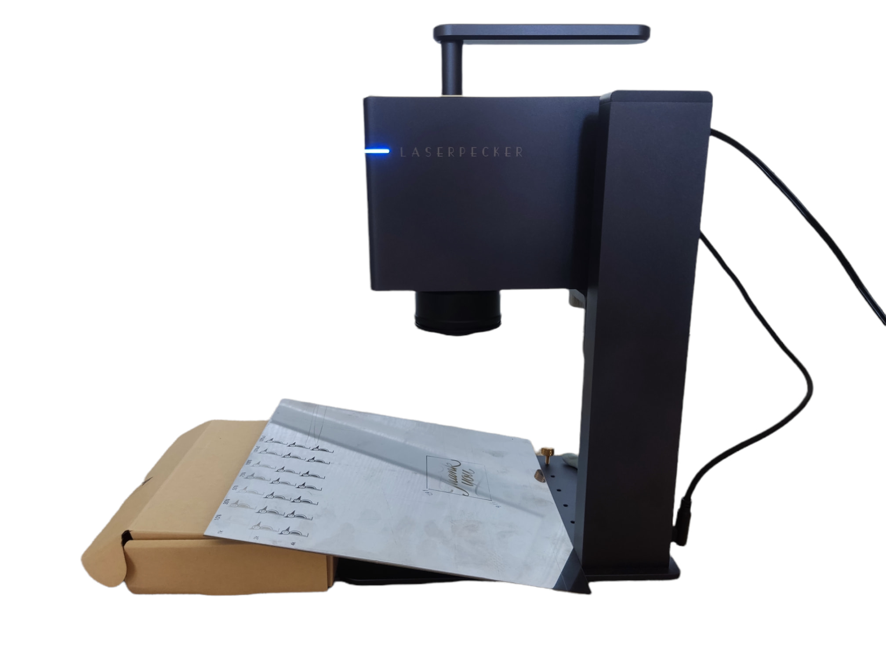
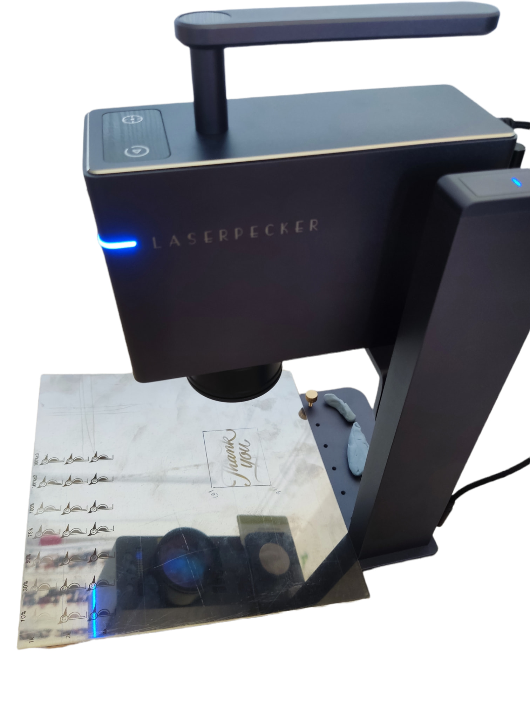
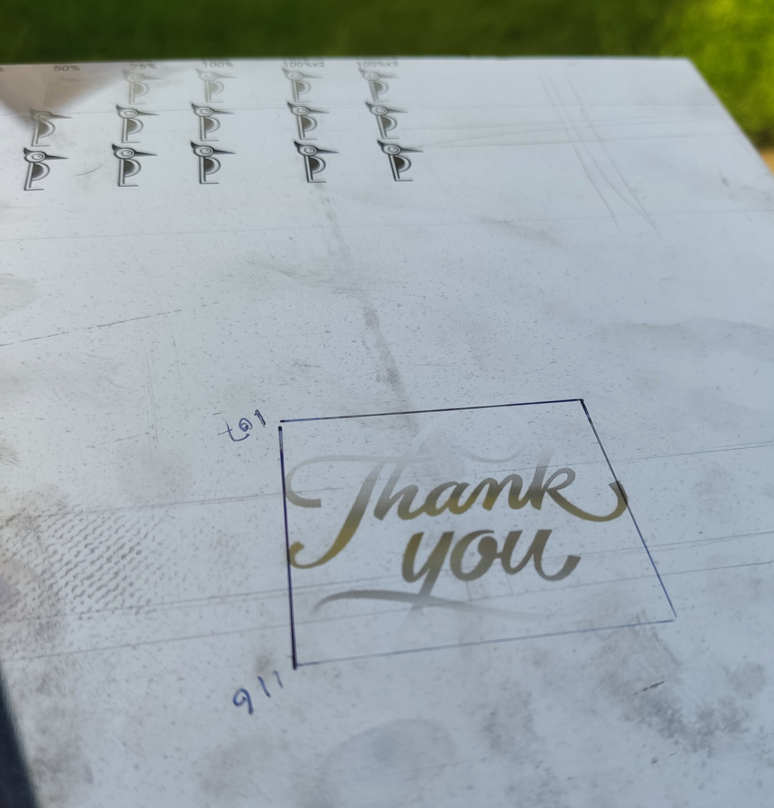
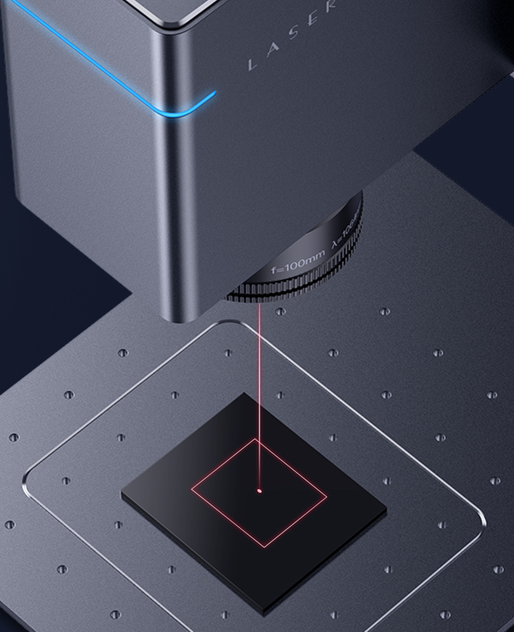
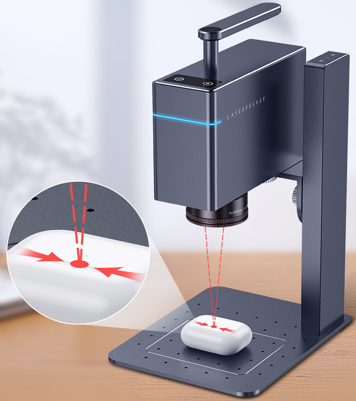
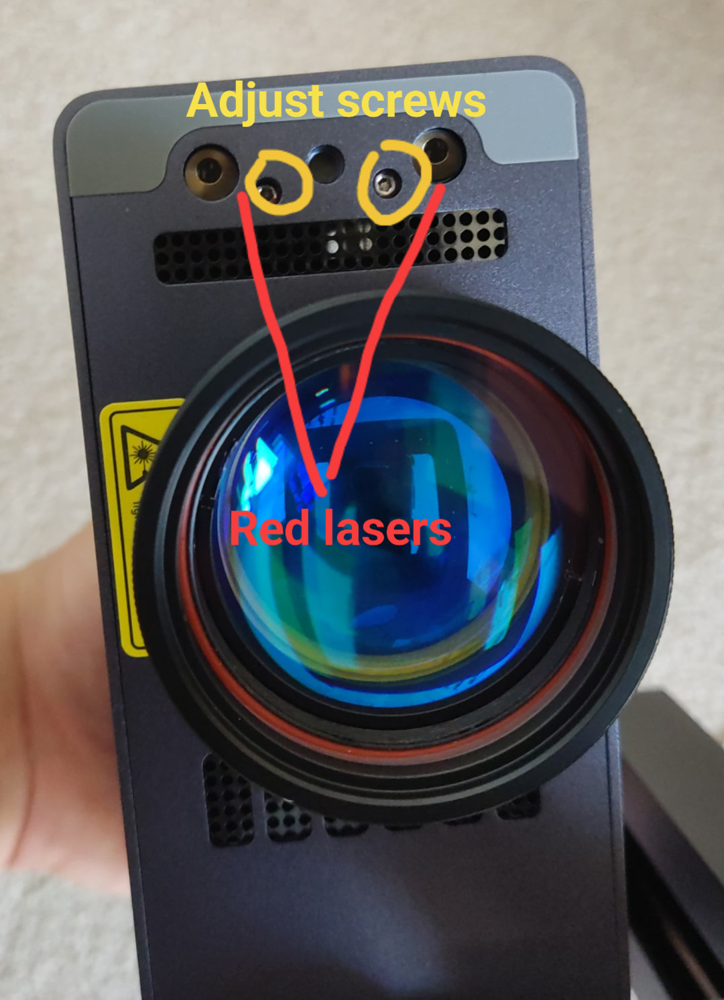

# Know Your LP3

## LP2 vs LP3 (including the upgraded stand)

moved to https://lp.systemd.one/?p=290

## Turn It On/Off

moved to https://lp.systemd.one/?p=304

## What is A Field Lens?

In short, it is expensive and helps laser to focus on a flat engraving surface uniformly, despite it is projected from a sing static point.
Otherwise, the laser is only well focused in the centre area, and becomes out of focus as it moves away. The LP2 lacks such a field lens and therefore does not engrave as well where it is close to the edges and corners of the 100x100mm engraving area.

Below is a demo of *single line* engraving using Gcode. Note that the width of the line is uniform acoss the entire 90mm width.

## Finding the Optimal Engraving Distance

Although the manual suggests that the engraving surface should be *115mm* away from the button edge of the lens, my LP3 *test unit* was not calibrated to this. Yours may well be better calibrated, but it's still worth doing a few quick tests at slightly different heights/distances just to double check, and also get to know the tolerance of engraving distances/heights in case you wish to engrave something that's not perfectly flat.

### The Slope Test

Below is my "slope test" to find out the vertical engraving range using a sheet of SS. During preview, I used a marker to trace the engraving area, and used a ruler to measure the closest (107mm) and furthest (116mm) distancs. Finally, I just engraved a random image in Bin mode using the default setting for SS. In my case, the optimal engraving distance is 112mm ±1mm.

 

Read below for next steps.

## Assist Red Lasers
### What they are
There are 3 assist red lasers in total. All of them are low power red lasers as visual aids. Just like red laser pointers.

One is internal. It only lights up when the LP3 is previewing or engraving. This one is aligned with the 1064nm invisible laser beam, purely to show where it is engraving.

Two of them can be seen at the buttom of the LP3. They will light up during preview, and can be manually turned on in app mode settings (`Red light stay`). They are to visually helping adjust the height of your engraver without using a ruler, provided the height they overlap at is the optimal height for engraving.

### Adjustment

~If you found the optimal engraving height/distance for yours differs from what the red lasers indicate, the angle of the two red lasers can be adjusted using a suitable Allen key from the bottom of the LP3.~

~Steps:~

1. ~Position your LP3 to the desired height.~
2. ~Trn on the assist red lasers via app settings or just preview an engraving.~
3. ~Turn the two screws **slowly and alternately** till the two red laser dots overlap on the engraving surface. Don't force it, or you might break it.~

**UPDATE (19/Aug/2022)**: LP now uses some glue to seal the screws to prevent users from adjusting them, and therefore breaking the assist lasers accidentally. So please don't try to adjust them!
