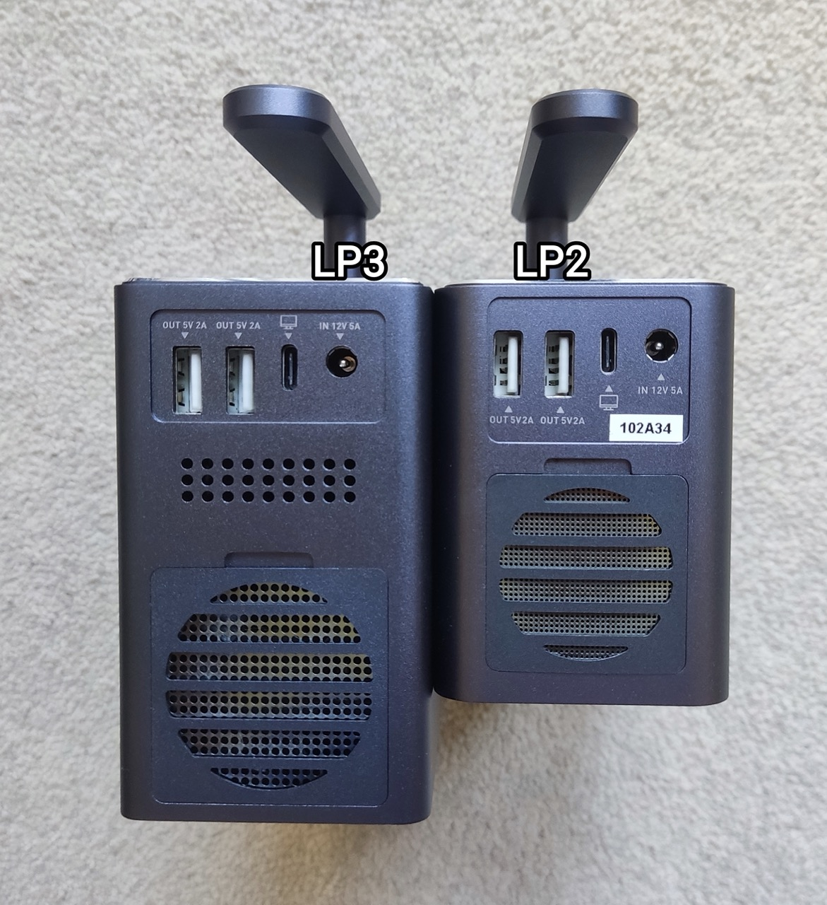
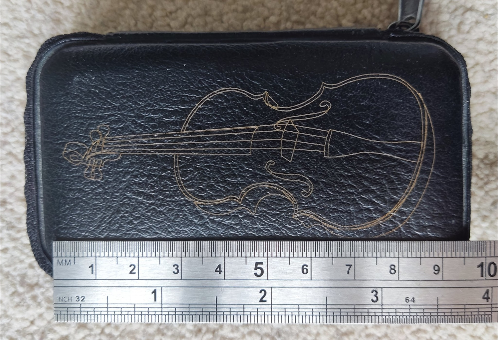

# Know Your LP3

## LP2 vs LP3 (including the upgraded stand)

This is probaly the most asked question, so let's clarify this first of all.

No, the LP3 is **NOT a replacement** of the LP2 that does everything better. View them as **spoon vs fork** rather than **tea spoon vs table spoon**. They are simply *differet lasers for different purposes/materials*. Below is a table of supported materiels sourced from LP:

- Left: LP2 only
- Right: LP3 only
- Middle: supported by both

And I can confirm after testing that, although the LP3 seems so powerful that it can easily engrave all sorts of metals without needing a coating, it will not even scratch materials like paper, cardboard, wood, fabrics, ceramics, glasses, ... So think clearly what you wish to engrave before deciding which one to get.

It seems that getting both LP2 and LP3 will cover all the materials, and indeed many users do this. LP also thought about this, and made all LP2 add-ons, like the batch button, 3rd axis, including the stand, to be compatible with the LP3. The LP3 laser head as well as the upgraded stand will be sold separately to make it easier for loyal users to upgrade.

I just mentioned the upgraded stand that comes with the LP3. Let's have a look:

 
 
 
 

It's not obvious in the photos, but the new stand is slightly taller, feels much sturdier and it has 2 additional guiding rods built-in to improve stability. I cross tested LP2, LP3 on the old and new stand. In short, although LP3 is much heavier than LP2, the old stand can support it just fine.

|  |Movement| LP2 (975g) | LP3 (1607g) |
| ------ | ------ | ------ | ------ |
| LP2 stand |Up| 200-220mA | 240-260mA |
|           |Down| 140-150mA | 140-160mA |
| LP3 stand |Up|165-175mA | 180-190mA |
|           |Down|140-150mA|140-150mA|

## Turn It On/Off

The LP3 can be turned off without unplugging the power cord by holding the "Play" button on its top for 3s.
To turn it back on, tap the same button once. If this did not work for you, make sure your LP2's firmware is up-to-date.

## What is A Field Lens?

In short, it is expensive and helps laser to focus on a flat engraving surface uniformly, despite it is projected from a sing static point.
Otherwise, the laser is only well focused in the centre area, and becomes out of focus as it moves away. The LP2 lacks such a field lens and therefore does not engrave as well where it is close to the edges and corners of the 100x100mm engraving area.

Below is a demo of *single line* engraving using Gcode. Note that the width of the line is uniform acoss the entire 90mm width.

