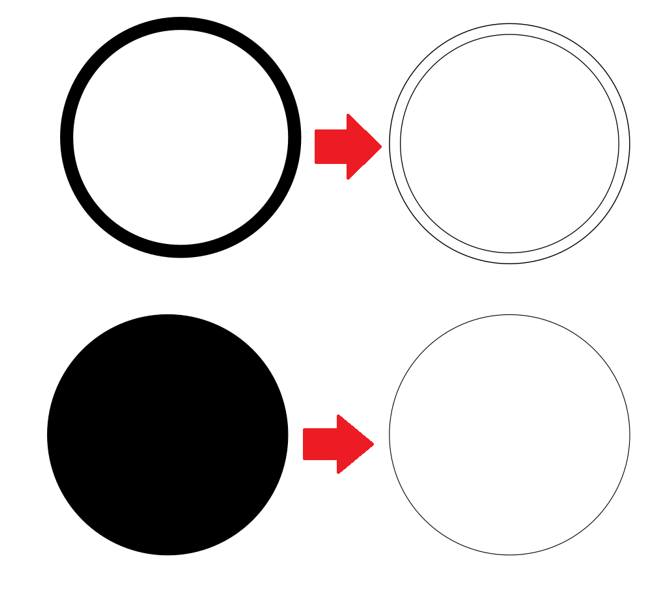
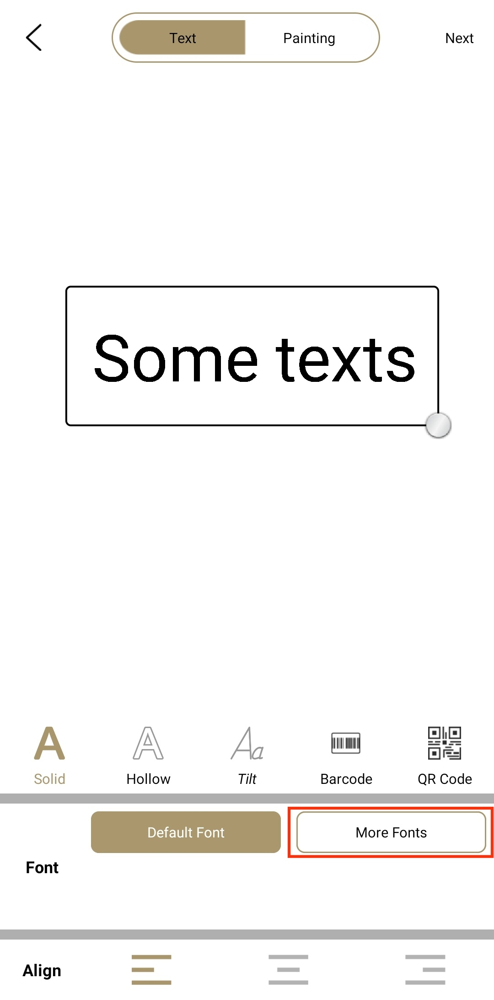
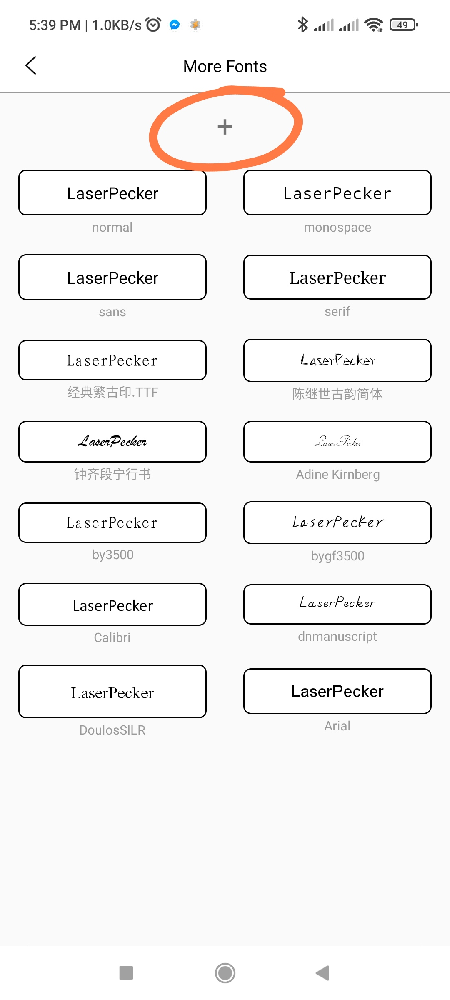

# LaserPecker Fundamentals

## About the LaserPecker App

_**The App is updated frequently. My description here may be outdated. The latest version at the time of writing this article was v3.73**_

Controlling the engraver is done via LaserPecker App in your smartphone/tablet over Bluetooth. The official desktop client is due to be released in 2021.

Don't be put off by the low rating of the App in Play Store or App Store. People leave bad ratings when they encounter bugs but never update their ratings when the bugs are fixed.

### Android App - Why Require Location Permission?

To Android users, the App requires **Location Permission** because Google made it that way, not that LaserPecker wants to know where you are. For your reference, read this [Android development documentation here](https://developer.android.com/guide/topics/connectivity/bluetooth#Permissions). To summarise, it's because by allowing **an App** to perform a Bluetooth scan, it can potentially identify your location. To force-make users aware of this risk, any App that needs to scan for BLE (Bluetooth Low Energy) devices is forced to request Location Permission. This is different to manually doing a Bluetooth scan in your phone's Bluetooth settings.

### Offline Engraving

Most people don't realise that, **once an engraving job is started, it is OK to quit the app or move your phone out of Bluetooth range.** You will lose the timer and progress info, (L1/Pro only: also unable to carry on multi-pass engraving if you chose to engrave more than 1 pass,) but you are free to walk away with your phone/tablet while waiting for the engraving to finish.

Without the app, you can pause/resume an ongoing job by tapping on the **circle button** on the back of your L1/Pro or the **Play button** on the back of your LP2. Hold that button to cancel the job.

### Access to Internet

Only required during initial registration and first use of a fresh install of the LP app.

### Registration & Safety PIN

_Registration process has changed in late Dec/2021, from Android app v3.74 and iOS app v???. This section has been updated for the new registration process._

The initial registration process works as below:

1. Enter your email address and get a verification code sent to it. At the same time, the code is sent to the app in the background to be verified against.
2. Wait for the verification email. **Check your Spam/Junk folder. Do not repeatedly click on "Send Code" button in the app.** You will end up getting multiple verification emails, but only the last one is valid. So it does not decrease your wait time but make it worse.
3. Once you get the verification code and set a safety PIN for your engraver, the safety PIN and the unique ID of your engraver are stored in your account in LP's server as well as locally in your phone. (Previously, safety PIN was stored in the engraver itself, which sometimes caused issues.) You can register multiple LP devices under one account. This is a very useful feature for (surprisingly many) users who have multiple LP engravers.
4. When you start a fresh install of the LP app, you only need to log in once to retrieve all safety PINs for all your devices.

If you transfer your device to a different user, you do not need to disclose your account or safety PIN unless you want to. The new user can go through the registration process like you did and set their own safety PIN.

### App Settings

I'll omit some obvious ones.

#### G-CODE Preview

* **On**: During preview, the laser will trace the actual paths of the graphic. For example, a star.
* **Off**: During preview, the laser will trace the rectangle that can contain the graphic. This is same as the preview in Bin, Gray and other modes.

#### The third axis

This option can only be enabled when a 3rd axis is connected to an LP2.

To use the 3rd axis addon for engraving, you must enable it in app settings and select a desired mode.

### Engraving Settings and Notations
* **Resolution (LP2 only)**: 1k, 1.3k or 2k. It means the number of dots or pixels per 100mm. So these settings can translate to 10px/mm (254dpi), 13px/mm (330dpi) or 20px/mm (508dpi).
* **Power**: 1% to 100%. Higher power means higher engraving temperature.
* **Depth**: 1% to 100%. Deeper means slower laser movement.
* **Pass**: Times of engraving. Sometimes low power multi-pass works better than high power single-pass.

Below are *my own* ways of writing down engraving settings concisely.

For L1/Pro, I write `(100,50)` for Power: `100%`, Depth: `50%`, `1`-pass; `(90,80)x2` for Power: `90%`, Depth: `80%`, `2`-pass. 

For LP2, it's important to note the resolution, too. So I write `(1,100,50,1)` for Resolution: `1k`, Power: `100%`, Depth: `50%`, `1`-pass; `(2,80,20,2)` for Resolution: `2k`, Power: `80%`, Depth: `20%`, `2`-pass; and finally `(G,20,1,5)` for `Gcode` mode (does not have a resolution option, defaults to 2k), Power: `20%`, Depth: `1%`, `5`-pass.

### Engraving Modes

There are **5 modes** for image processing:

#### Pencil

Converts image to pencil sketch style via edge detection. The converted image is black & white.

#### G-code

Converts image to vector paths via edge detection, mainly used for cutting or tracing the outlines of patterns. You can add different levels of line-fill in the dark/solid areas of the original image byt sliding the slider dot to the right. Moving to the very right end will give you 100% solid fill. It is not necessarily faster than directly using Bin mode, depending on the complexity of your image.

Try it out to see what works better for you. **Note that with L1/Pro, Gcode mode is secretly about 2x powerful than other modes suing the same setting.** For example, I found that Gcode mode with (70,30) setting produces about the same result as Bin mode with (100,70) setting. So potentially, you can lower the depth in Gcode mode to speed up your job.

Mind that when converting an image to Gcode, use solid drawings instead of line drawings. Using line drawings, even the lines are very thin, will result in double lines as illustrated below:

#### Bin

Binary, i.e. black & white mode. It converts your image to black and white for engraving. Move the slider to adjust the conversion threshold.

#### Gray

Converts your image to grayscale, and therefore to different levels of power settings per laser pulse. Your image may look nice in the App, but the engraving result is most likely not as good as you expect. Choice of material is very *very* **very** important. MDF boards and thick brown paper are pretty good for this. Try it out for yourself. Be warned that engraving gray scale image is **very** slow compared to other modes, as every pixel is engraved with varying power settings.

Don't be disappointed if your result misses half of the details. Think of it this way, imagine all the gray pixels in your image are converted to different power levels according to their brightness, let's say from level 1 to level 10, to achieve 10 levels of brightness of burns, in theory. However, in reality your material does not get burnt up to power level 5; and it gets burnt equally dark from level 9 to 10. So all the pixels that are meant to be burnt with power level 1 to 5 won't show. And all the pixels burnt with power 9 and 10 become indistinguishable. As a result, the 10-level grayscale image becomes 4-level only (level 6, 7, 8, 9+10). This is a common challenge in laser engraving. And the solution is to dither your image (i.e. to use different densities of black & white pixes to emulate grayscale) and use Bin mode to engrave it. See [Dithering](/laser_engraving.md#dithering) for more details.

**[Dec/2021 update]:** From Android app v3.73 (iOS app version unknown), LP has listened to the community and added built-in dithering feature **for LP2**, which is amazing! (It does not work well with L1/L1 Pro, so this feature is not available to the 1st gen models.) Please also make sure you update LP2's firmware to v3.0.9 or higher, which contains an improvement that _significantly_ speeds up Gray mode engraving.

#### Seal

Inverts your desired image/pattern for making stamps. To be used with photosensitive stamps.

The Creation mode is being actively developed. It now supports custom fonts. Note that if you set your texts to hollow style, they will be engraved with Gcode mode. i.e. the laser will trace each character's outline rather than scanning through line by line.

### Adding Custom Fonts

Download your `.ttf` font files from the Internet to your phone. Make sure they are not zip/compressed files.

Launch LaserPecker app, go to **Creation** > **More Fonts** and click on the **+** on the top to select and add fonts. The font files will be copied into LP app. So if you uninstall your LP app, your fonts are gone. Personally I suggest you keep a copy of your font files in your phone, outside the LP app as a backup.

 

To delete a custom font from LP app, tap and hold on the font to be deleted in **More Fonts**, and then confirm deletion in the pop up.
