[中文评测点此处](Pro_CN.md)

# All About L1 Pro (being updated...)

## Unpacking Pro Deluxe Edition
**What came in the Deluxe Edition**:
* L1 Pro laser engraver
* USB power adapter (5V2A, US/CN plug)
* Engraving material pack
* A 20cm ruler (for measuring the optimal distance for engraver placement)
* A black whiteboard marker
* A cutting mat
* USB Cables (1 long, 1 short)
* A small foldable tripod
* Automatic stand
* A pair of protective goggles (filters harmful laser light)
* 4 pieces of magnetic protective shields (filters harmful laser light)
* A hard carry case

## Power Consumption & Heat Dissipation

## Speed & Configuration

I have to say, having played with L1 before Pro, I find Pro is much slower than L1. Particularly over depth 100. So, Pro users, avoid depth 100 if you can.

I guess it's because L1's laser is more powerful, so it requires less time for the same depth.

## Precision Test

By the numbers, it is obvious that L1's precision is only 1/4 of what the Pro offers (0.3x0.3 vs 0.15x0.15). Here's how they compare with a rather extreme test image:

1) **L1 vs Pro over 100mm x 100mm**: L1 was too powerful for the paper I used. It burnt through the paper with (100,50) setting. On the other hand, Pro is less powerful and had much better control over each pixel. The slightly higher setting of (100,60) was just right for the same paper.

2) **L1 vs Pro over 40mm x 40mm**: here you see the real difference between the two models over a much smaller job.

For your interest, the source image for testing is here (click to view and download the original image):

## Gcode

Gcode 

### Gray Scale & Cutting

## Working with Different Materials

Throughout my article, I will use the notation of (P,D)xT to indicate the engraving configuration, where P is power, D is depth and T is times of engraving. I will omit x1 time, so (100,80)x1 becomes (100,80), meaning power:100, depth:80, once. (50,20)x2 means power:50, depth:20, 2 times. (30,50)x3 means power:30, depth:50, 3 times.

Remember, the engraving configurations for different materials in the App are only recommended values. Apart from material, colour, density and even room temperature will have some impact on the result. So I suggest you either do some test engraving before your "big job", or start with low power, shallow burns and work your way up to avoid over burning your material.

Sometimes, multiple low power shallow burns are better than one hig power deep burn. For example, I prefer using 80,50 x2 times in Gcode mode to cut PVC stickers, rather than using 100,80 to cut once. The edges are much better (less burnt).

The bottom lines is, there's no perfect setting for a class of materials. Don't get frustrated or upset when you fail to achieve what you wanted in one go. The more you play with your LaserPecker, the better you will know its capabilities and performance on different materials. Do take notes of the perfect configurations that you have tested out for specific materials which you frequently use.

### Wood
Wood is one of the most easy & satisfying materials to engrave. Darker wood grain is harder to burn in, while lighter wood grain can be engraved with lower power. So, for relatively consistent result, I suggest you over-burn a little. For this dark wood of mine, I used (100,80). Again, don't just take my settings. Do some test burns by yourself and find the best setting for your material.

**Tip**: If the first go leaves an uneven result. Do not touch your material and do a 2nd burn over it with the same or higher setting.

### Cardboard

### Fruit Skin

Fruit skins contain lots of water, so they require the maximum power and depth (100,100) to engrave. For Pro, depth 100 is very very very slow... Try it for yourself. The result is fun though!

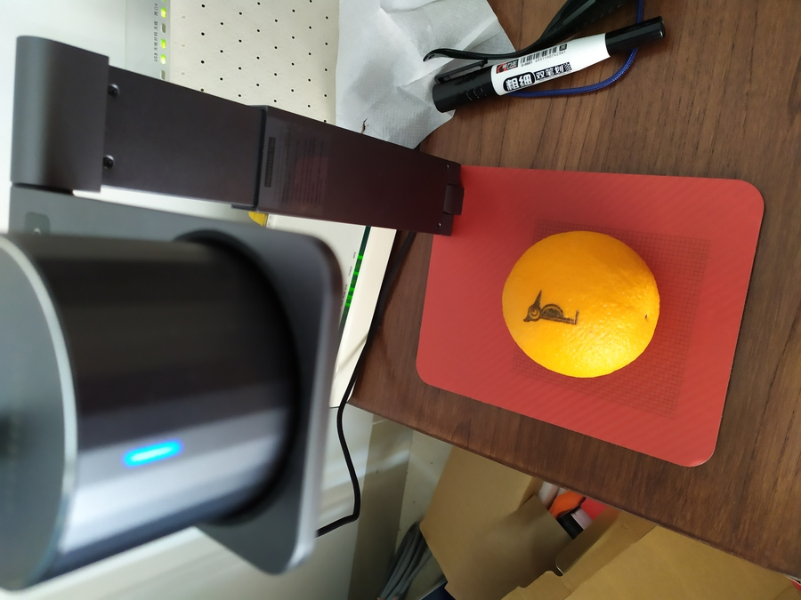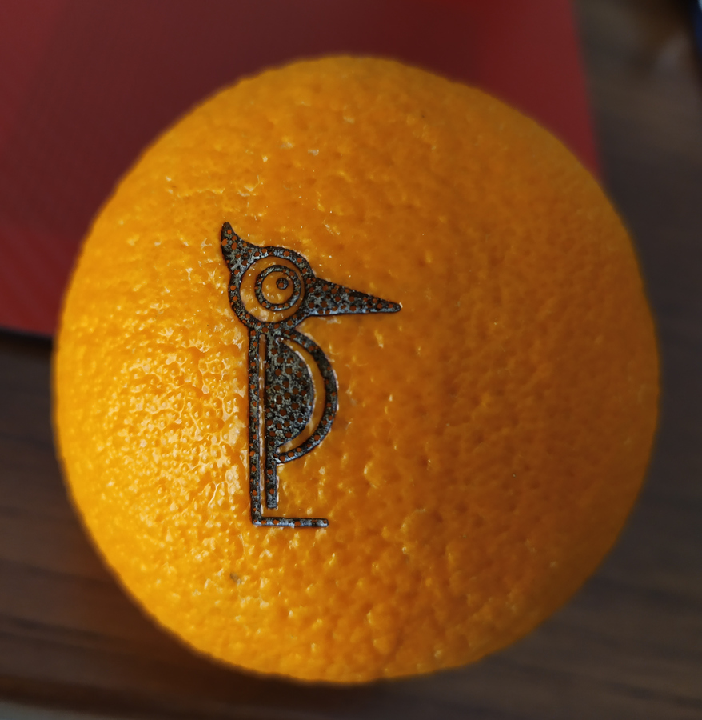

### Plastic

Plastic is easy to engrave, and you can't go too wrong about it. The only trick is that, for light coloured or clear materials, which will reflect most of the light, you need to colour it black with a whiteboard marker, so the surface will absorb laser energy. The engraved part will melt and mix with the dry ink. The rest dry ink will wipe off. See below for examples.

1.1 Colour a light-yellow plastic spoon black.

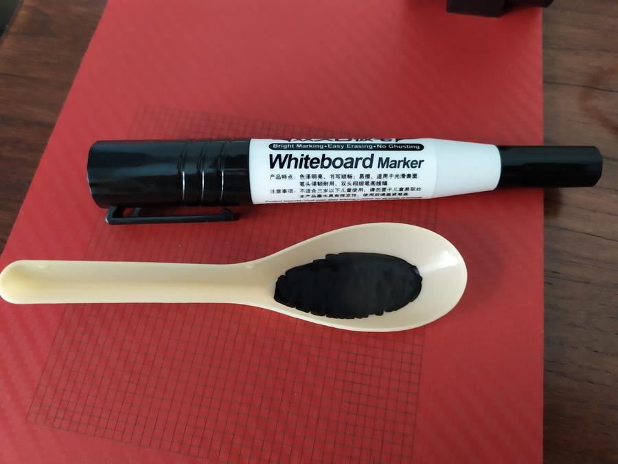

1.2 Engrave over it (30,40).

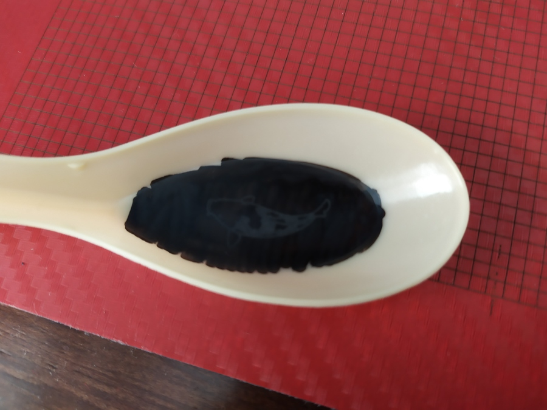

1.3 Wipe off the excessive ink, and the engraved pattern stays.

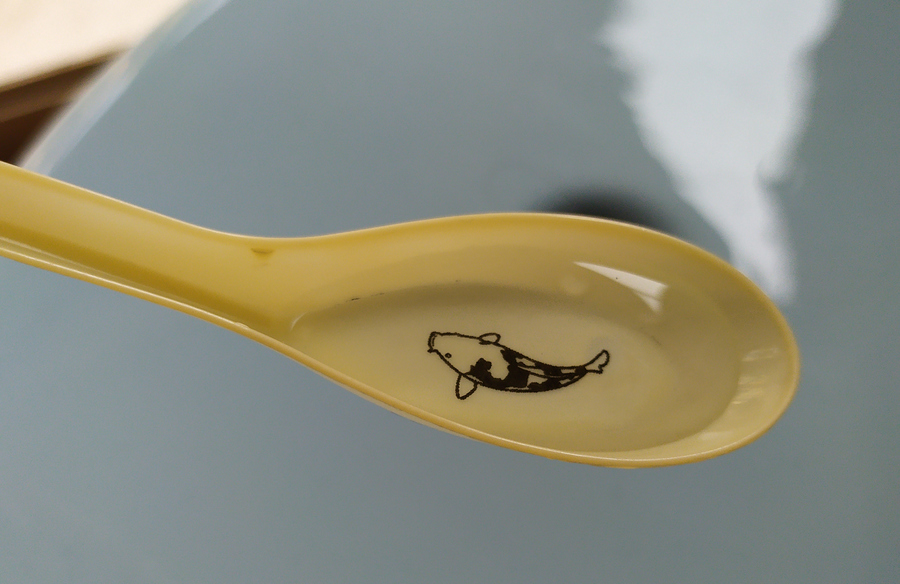

2.1 Colour a clear plastic fork black.

2.2 The result with (30,30)

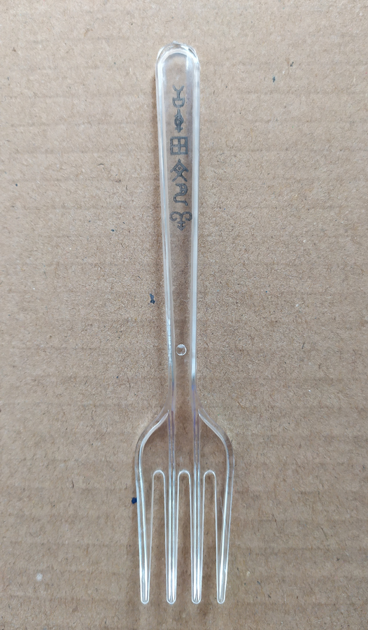

3 A few more examples: electric shaver case (30,30), plastic bottle (30,30), electric toothbrush heads (30,30).

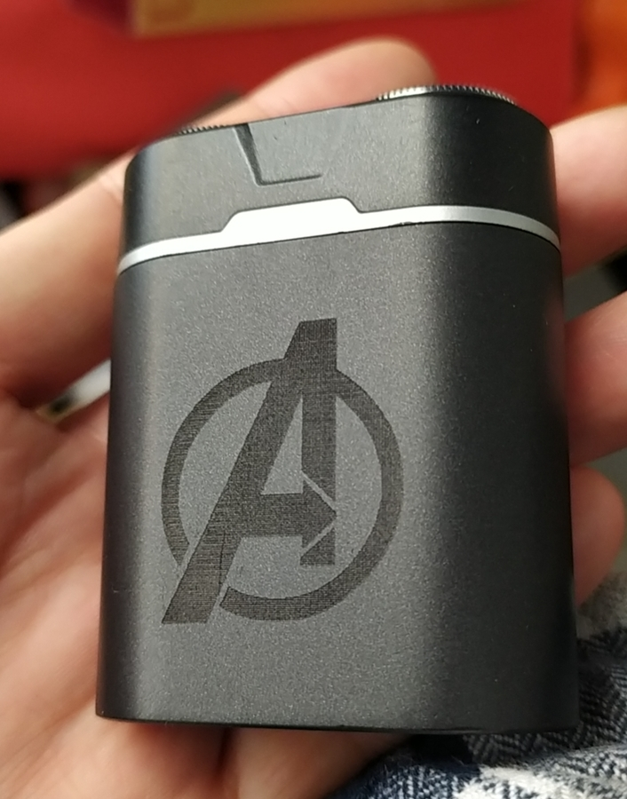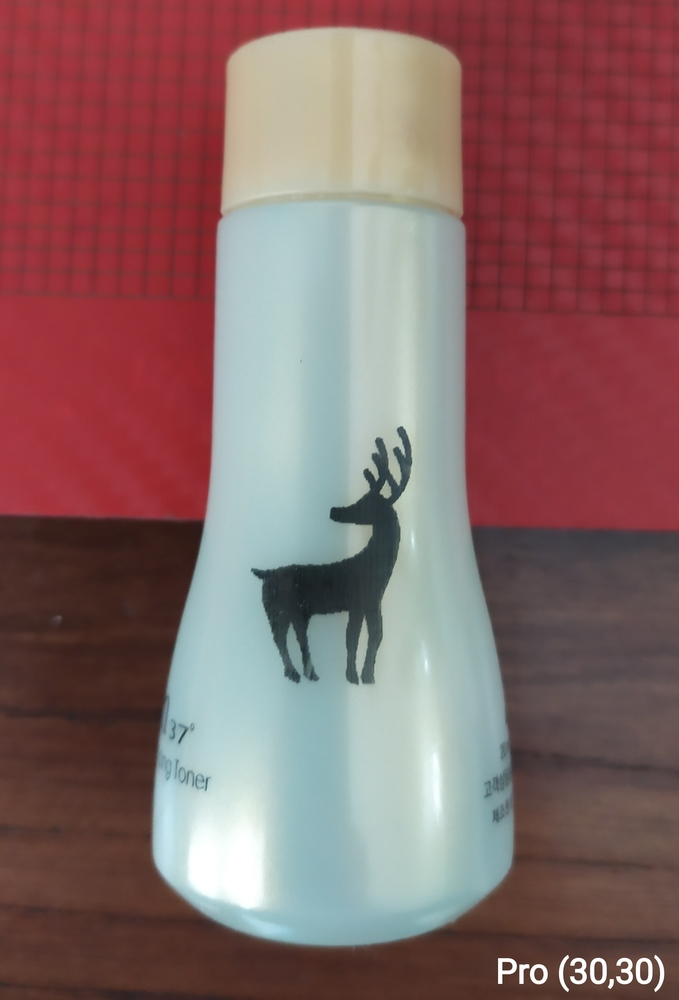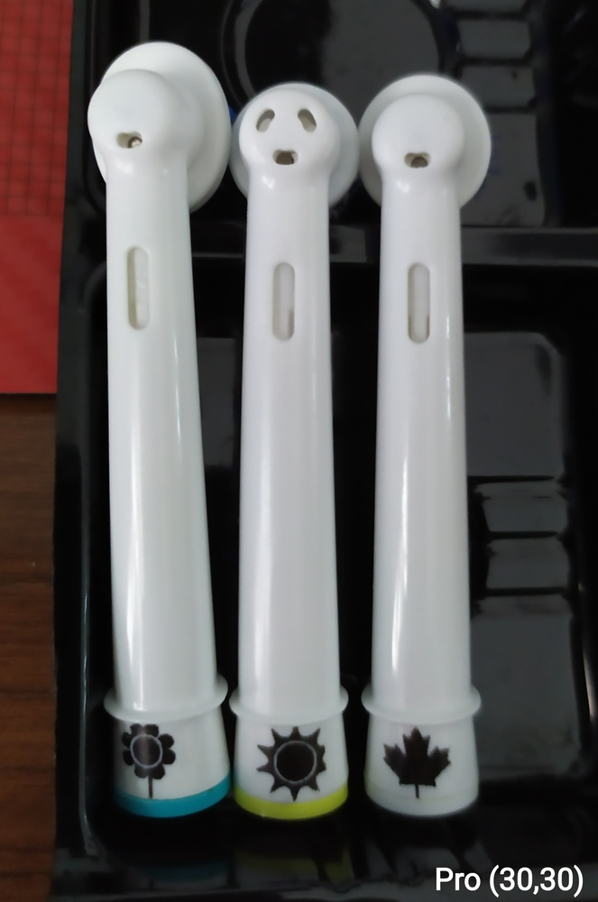

### Eyeglass Cleaning Cloths

I find the default (100,70) for cloths does not work well with microfiber cloths, maybe it's for cotton cloths. I reduced it to (100,50) and got satisfying result. See below for comparison.

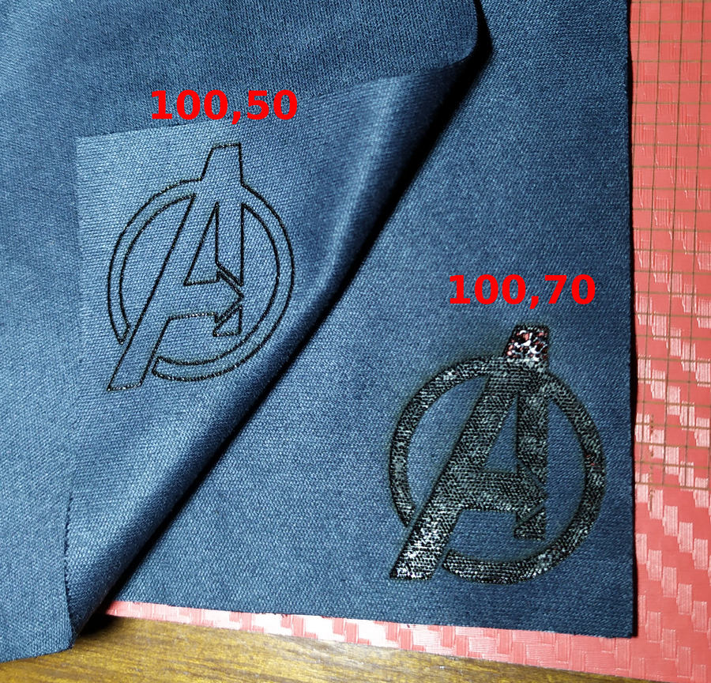

### Coloured Paper

### PCB (L1 vs L1 Pro)
PCB is easy to engrave. Here's a comparison of L1's and Pro's result. After the not-so-successful result of L1 at the bottom of my USB power meter (forgot about the setting), I tried my Pro on the top-left for the same texts with (30,30)x2 setting, and it looks really good. Mainly due to Pro's improved resolution.

### Decorative Carbon-Fibre Car Sticker
Firstly, please use Gcode mode for cutting.

Secondly, cutting plastic or paper stickers will have more or less burnt edges. Instead of cutting with high power once, e.g. (100,100), using lower power setting to cut multiple times will reducing burning.

Here I used (60,50)x2. YMMV. Remember that colour plays a role here, too.

### Felt Paper
I have cut these for my son to play with. Instead of (100,80), I used (80,60)x2 in Gcode mode for a clean cut. Occasionally, I had to use utility knife to cut part of the shape off.

### Photosensitive Stamp

The App's Seal mode will do the inversions for you. All you need to do is to design what your stamp should look like, and engrave the image in the App's Seal mode. The part that is engraved will melt and seal up, meaning it won't absorb ink or let ink out. The unprocessed part of the photosensitive stamp will absorb ink and make a mark on paper.

Here are two styles of stamps that I made. In Chinese, these are called Yin and Yang engraving.

**Stamp 1: Yin Engraving** (5,75)

The design on the plastic cover with (30,30).

**Stamp 2: Yang Engraving** (5,75)

The design on the plastic cover with (30,30).

# Automatic Stand

The automatic stand was released with the Pro model. It is compatible with L1 and can be purchased separately.

The stand folds up and fits into the carry case nicely. It does not have built-in battery. You will need one USB C cable to feed power to it; and it relays the power to the engraver via another short USB C cable. Both cables come along with the stand.

This stand can raise the engraver up to 29cm away from the base, meaning it can engrave objects up to 9cm thick, which covers most objects you want to engrave on. In case you want to engrave on very large objects, or engrave at certain angle, use the tripod that came with the engraver.

I have put a carbon-fibre sticker onto the base, and engraved a 100mm x 100mm grid over it to assist alignment of target objects. The grid is done via Gcode. I actually has 3 designs of the grids in Gcode files which can be found here: [yy502/inkscape-laserpecker/](https://github.com/yy502/inkscape-laserpecker/) in `misc` directory. 

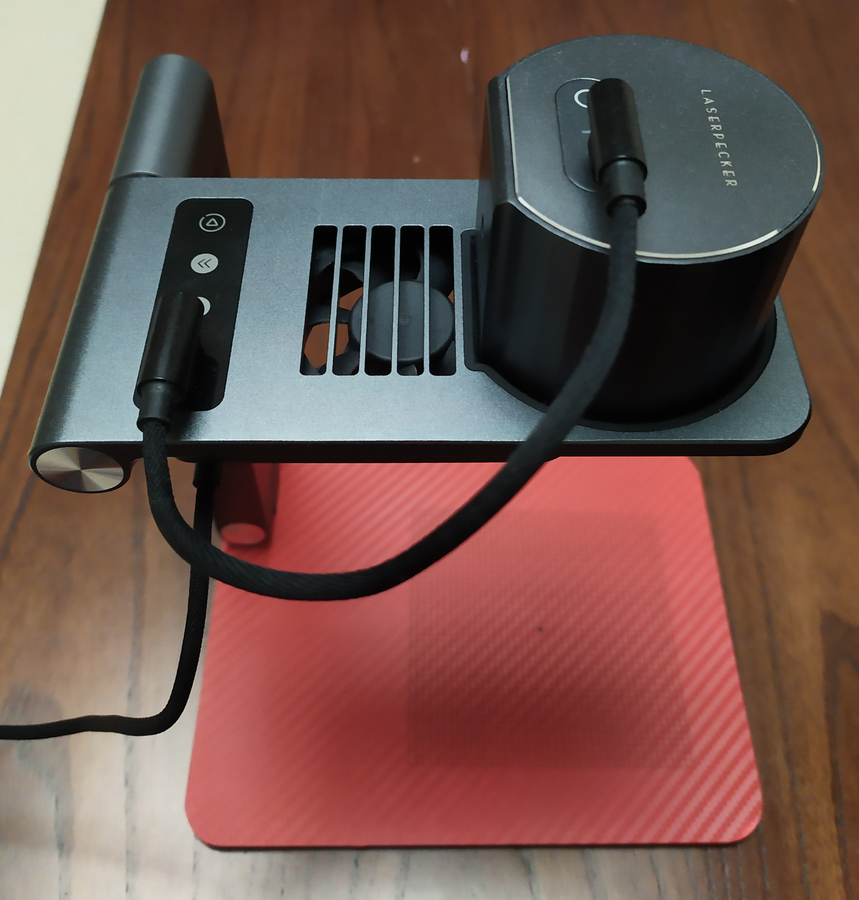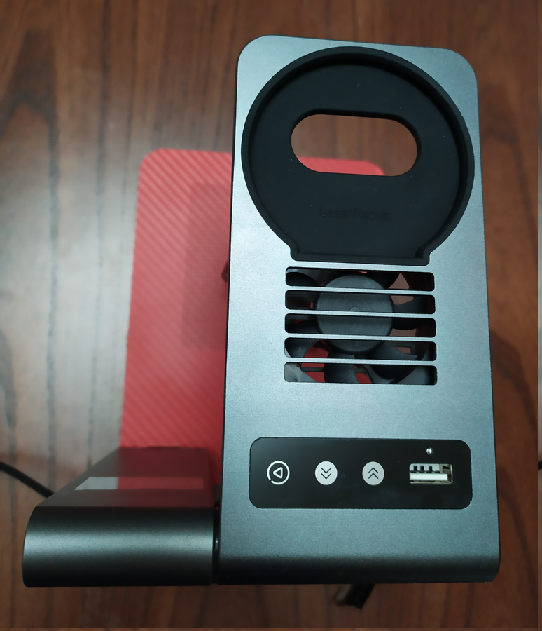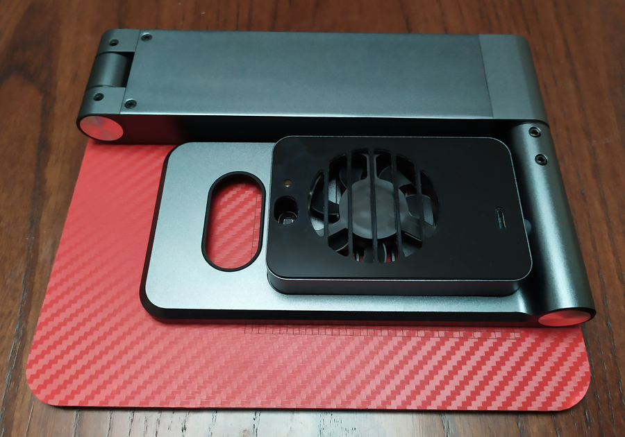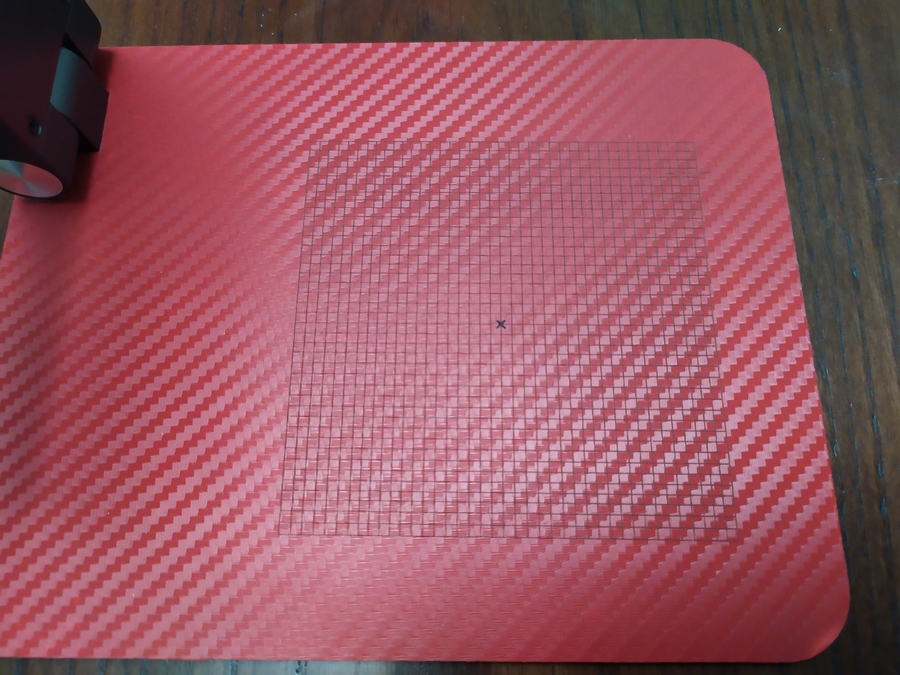

I was curious about its design, so I opened it up. It was easy. All the key components are in the rectangle shaped container. The plastic is stuck on with double sided tape. It does not require much effort to remove it.

Then, on the left, there are beeper, copper laser head for the 5-point guide (not a very useful feature in my opinion), and laser emitter + receiver for distance measurement.

In the middle, there's the fan for blowing smoke away for consistent engraving result.

On the right, connectors and the main processor.

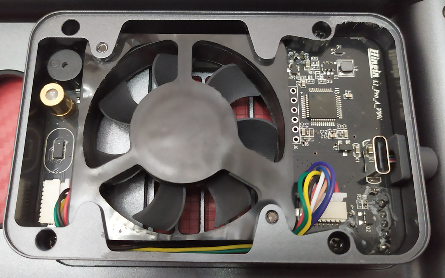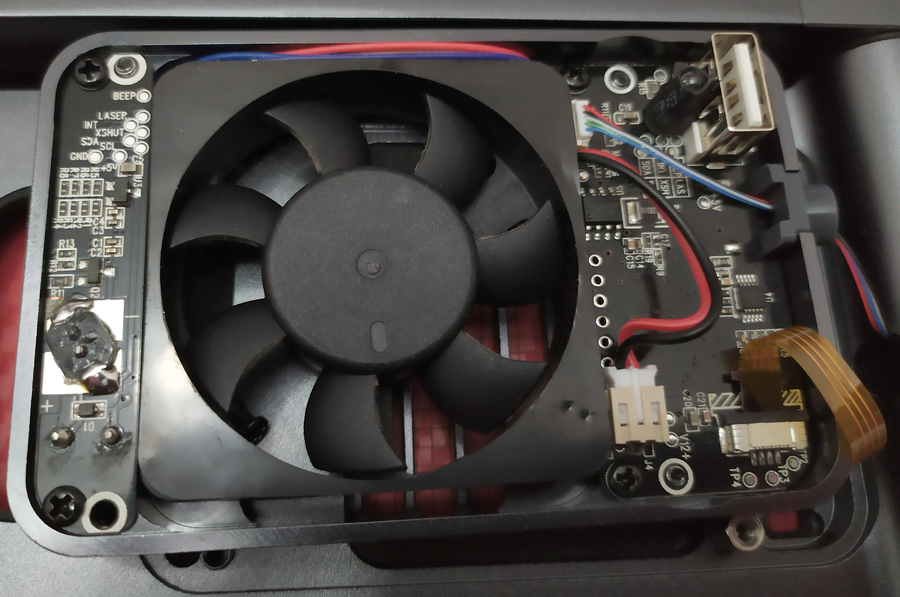