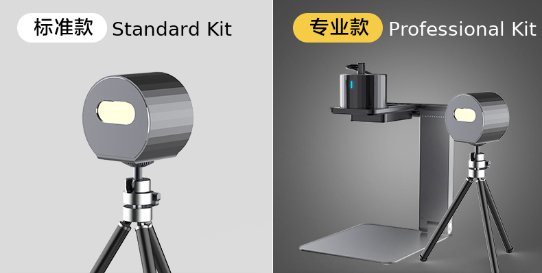

[中文测评点此处](README_CN.md)

# Laserpecker L1 & L1 Pro Review
I am a happy owner of both LaserPecker L1 and L1 Pro. Here I share some of my thoughts and uses of them. I'll refer to L1 Pro as Pro for short in the rest of the artical.

# LaserPecker
LaserPecker is brand of affordable and portable cunsumer level laser engravers. So far they have released their first generation laser engraveers (a standard and a Pro version). The company will release more models with more powerful capabilities in 2020 and future.

For more details, visit their official [English site](https://www.laserpecker.net/) or [Chinese site](http://www.laserpecker.cn/). 

# L1 vs L1 Pro Comparison

## The Look

Pro Standard kit vs Professional kit

## Specs

## Accessories

# L1

## Power Consumption & Heat Dissipation

## Accuracy

## Speed & Consiguration

## Gcode Manipution

### Grayscale & Cutting

### Oversize Engraving

## Woking with Different Materials

### Coloured Paper

### Felt Paper

### Photosensitive Stamp

### Plastic

## Kick-Ass Mod with Magnifier

# Pro

## Power Consumption & Heat Dissipation

## Accuracy

## Speed & Consiguration

## Gcode Manipution

### Grayscale & Cutting

## Woking with Different Materials

### Coloured Paper

### Felt Paper

### Photosensitive Stamp

### Plastic

## Kick-Ass Mod with Magnifier

# Automatic Stand

The automatic stand was released with the Pro model. It is compatible with L1 and can be purchased separately.
