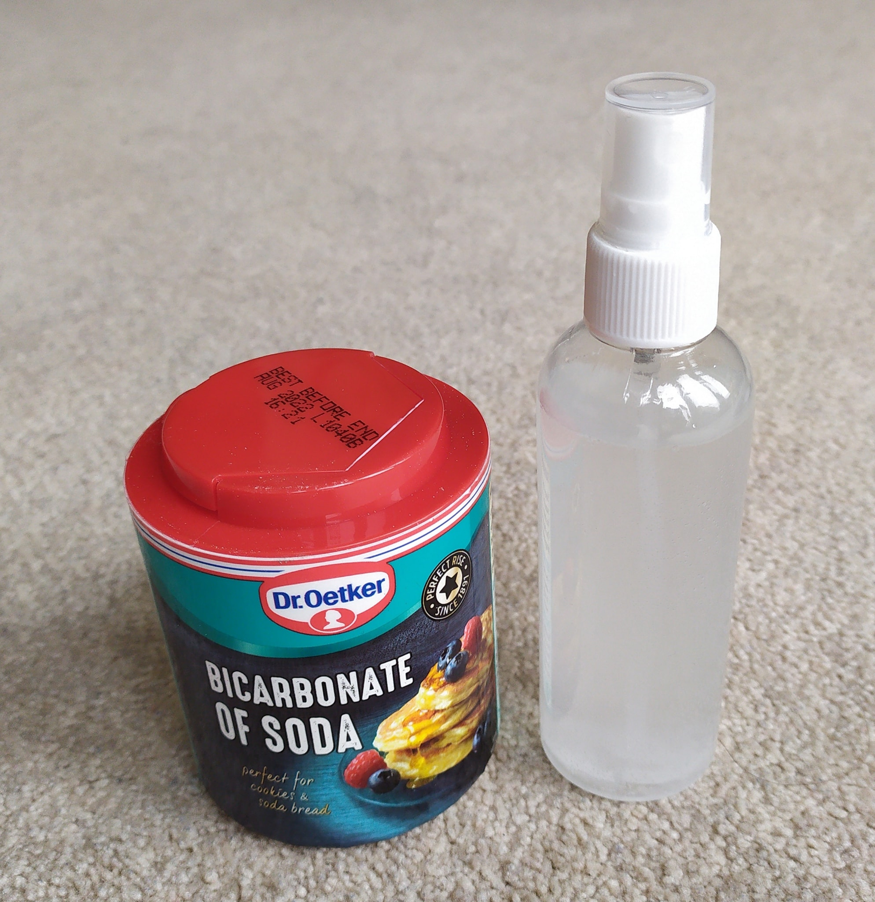
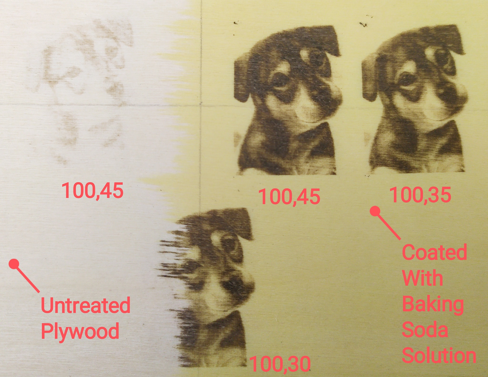
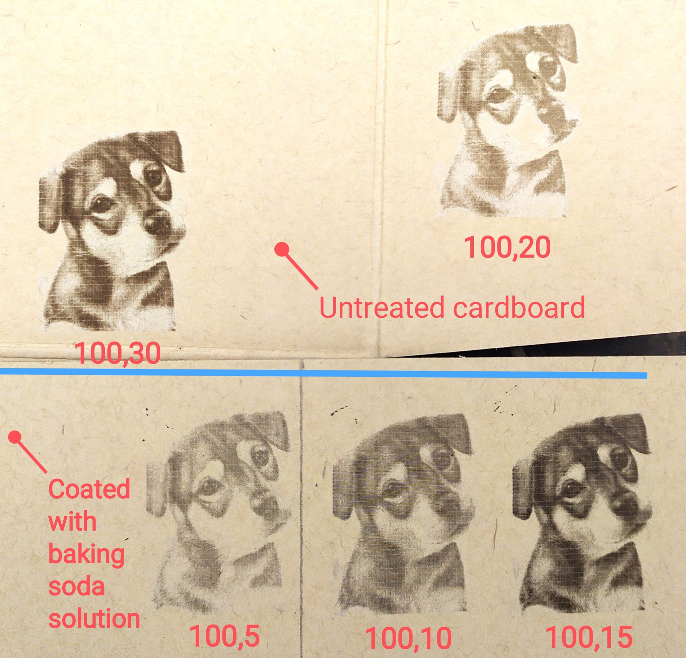
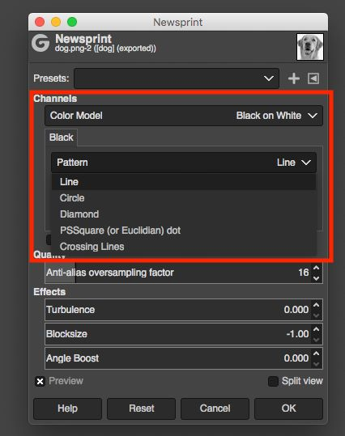
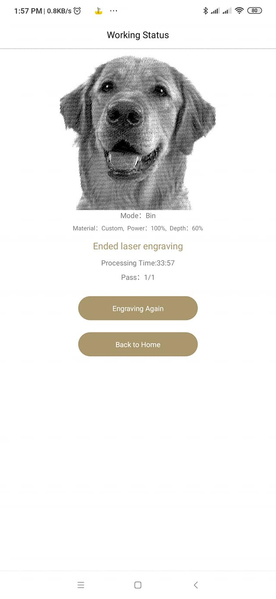
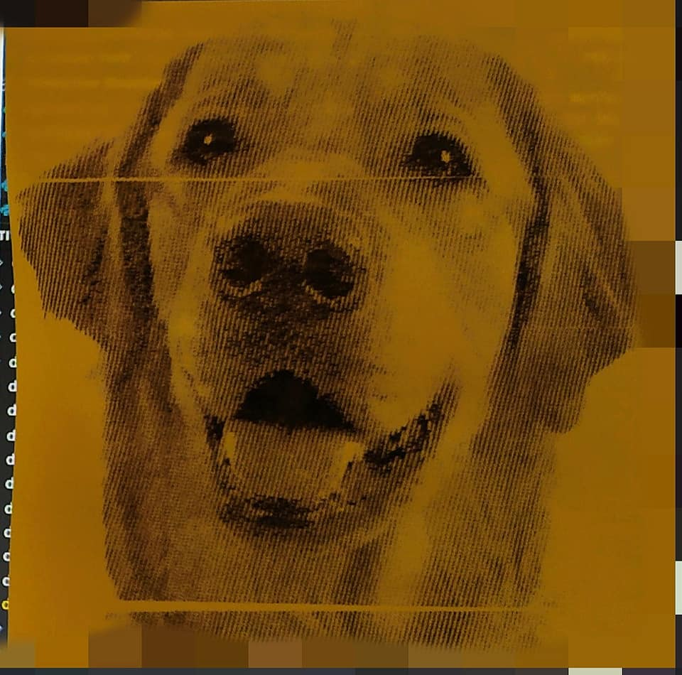

# Laser Engraving Tips & Tricks

## Safety

Never ever look at the laser when it's engraving with naked eyes. Do not stare at the laser when it's engraving even with eye protections. It's OK to look at the laser in preview mode. It's low power. I know it's hard to resist watching the ongoing engraving job, we have all done it... If you must watch it for whatever reason, point your phone's camera to it through some laser protection and watch over the phone screen.

If you wish to purchase your own laser protections, make sure they protect against 405-450nm laser.

In addition to eye protection, protect yourself from toxic fumes from laser engraving, especially when engraving any sort of plastic or paint. Although the fumes/smoke could potentially harm or kill you, all you need is good ventilation to stay safe. If the weather and space allow it, do your engravings outside (portable laser engraver FTW!). If you must do it indoors, try to stay near your window (and have a small fan to blow the smoke out if possible), or under your kitchen extractor hood, or in your bathroom with ventilation fan on, or in your workstation with a proper ventilation/air filtering system.

## Baking Soda Magic (on wood and fabric)

This is not rocket science, and the ratio does not have to be exact - mix **1 tea spoon** full of baking soda (sodium bicarbonate) in **half cup** of water. That's it. Apply a thin coating of baking soda solution on your wood or fabric with a brush, spray or just your finger; let it dry before engraving. The solution does not go off, so you can keep it for future use.

Baking soda helps browning of wood and fabric when lasered, so that the treated material requires much lower setting (e.g. half the normal depth, which also means a lot faster) to engrave and gives better results.

Here are some tests of mine on wood and cardboard:

 

## Dithering

Dithering an image means to use different densities of black and white pixels to emulate grayscale. The end goal is to use Bin mode (B&W) to engrave (or print) something that appears in grayscale.

### Step 1 - Resize

You **must** firstly decide your engraving size (e.g. 60mm x 40mm), and use your engraver's output resolution (pixels per mm) to work out the optimal size of the image in pixels. For L1/Pro, the engraving resolution is 10px/mm. For LP2, choose from 10px/mm (1k), 13px/mm (1.3k) or 20px/mm (2k) and stick with it.

Use `size (mm) x resolution (px/mm)` to get image size in pixels. Ignore dpi if you see it in your image resize tool. it's just another representation/unit of resolution. 10px/mm = 254dpi, 13px/mm = 330dpi and 20px/mm = 508dpi if you must know.

For example, I want a 60mm x 40mm engraving in 10px/mm resolution, I want to resize my image to 60x10=600px by 40x10=400px. If I use 2k resolution with my LP2, and I want an engraving of 50mm x 10mm, the optimal image size is 50x20=1000px by 10x20=200px.

The reason why it's so important to resize the image and stick with the output size is to avoid having the App to resize (scale down) the image for engraving, and produce **scaling artifacts**, which will look like some ghosting grid or rings in your engraving, but not visible in your converted image. It is a **mathamatical problem** (sampling), not a hardware issue. You can observe this by slowly zooming in and out a dithered image on your phone. Here is some additional info about it: http://www.glennchan.info/broadcast-monitors/scaling-artifacts/scaling-artifacts.htm

### Step 2 - Dither

A popular free & powerful browser-based tool is [imag-r.com](imag-r.com). You simply upload your image, resize it (there's a reason why the tool wants you to resize the image as step-1, see above!), and select a suitable profile to dither it. Finally downlaod the dithered image and send to LP App for engraving. I recommand you write the resolution and output size in mm in the file name if you want to reuse the dithered images.

Another tool is the built-in **Newsprint** filter of [GIMP](https://www.gimp.org/). Try different patterns (lines, dots, dimands, etc.), angle and sampling settings. Again, you need to resize your image first. Here's an example of a dog engraved on a Post-It note in Bin mode (ignore the gaps in the engraving, I accidentaly moved the paper during engraving):

### Step 3 - Engrave

Engrave in **Bin** mode, NOT Gray. That's the whole point of dithering.

Remember to stick with your initial choices of engraving size (and resolution if using LP2).

If you want to engrave it in a different size, re-dither your source image from the beginning.

## Glass work (L1/Pro)

The L1/Pro can not engrave on glass directly, but you can use it to make a stencil and then apply glass etching cream as an indirect way. ([Orinal Facebook post by David](https://www.facebook.com/groups/203376080793152/permalink/444034790060612/)) 

**Step 1**: Mask off and paint with matt black nail varnish.

**Step 2**: LP1 100,100 x3 passes.

**Step 3**: Cover with Armour Etch cream for 3 minutes.

**Step 4**: Wash off with water and then nail varnish remover.
 2) 
