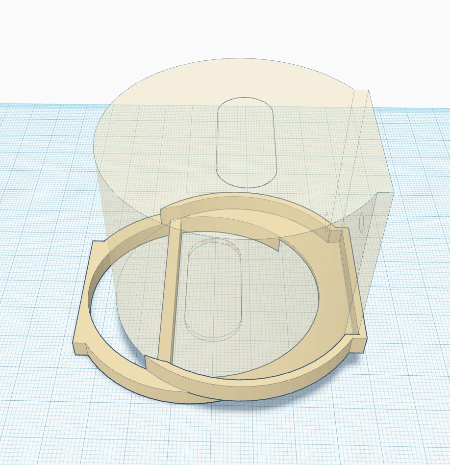
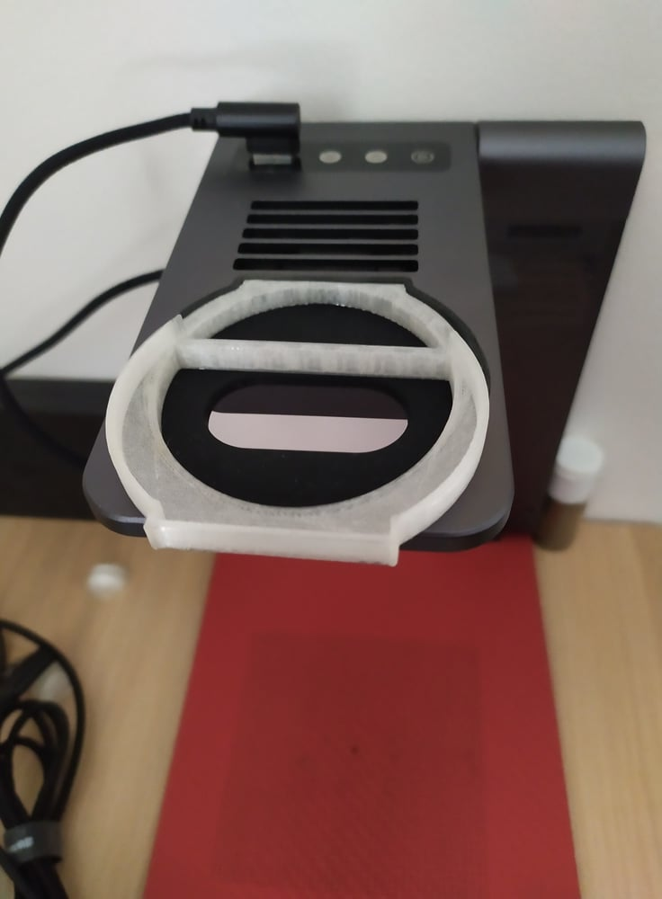
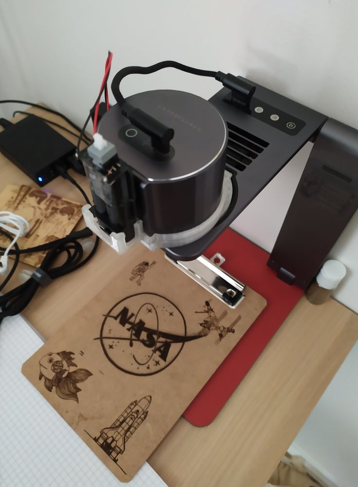
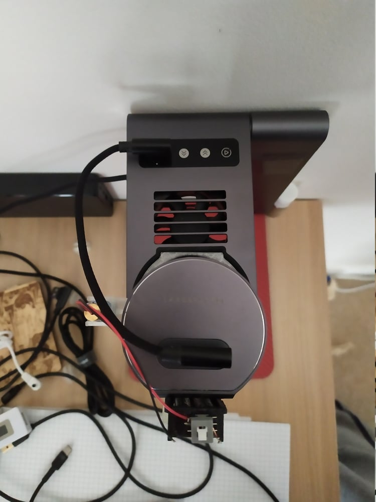
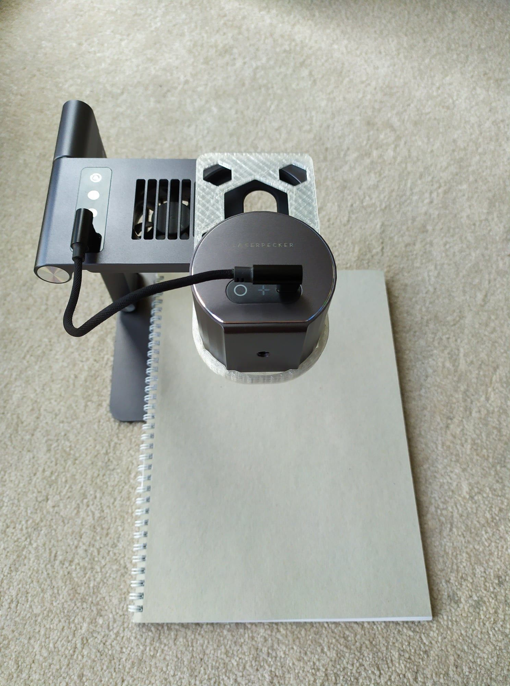
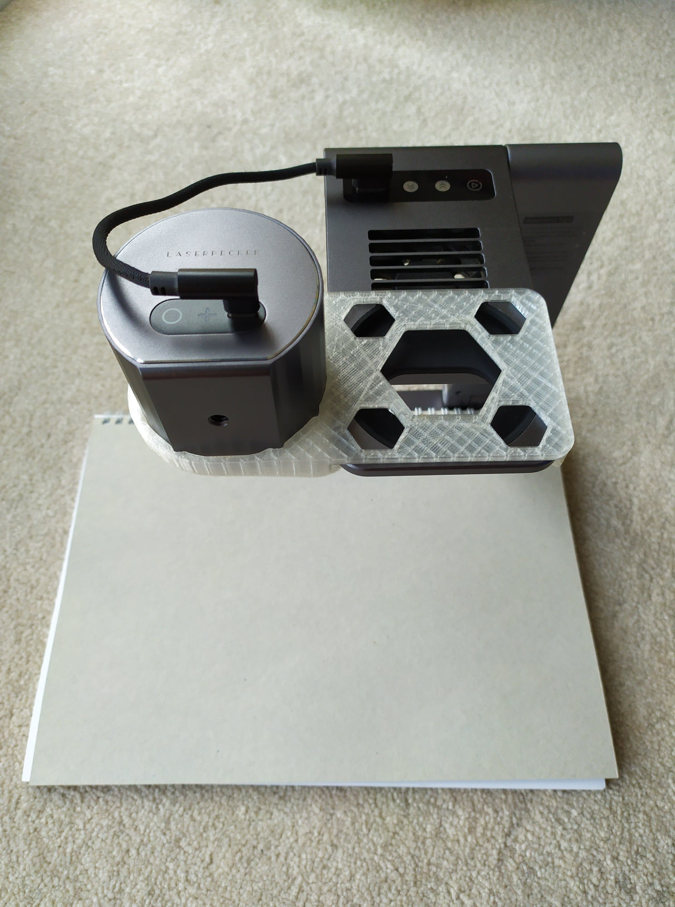
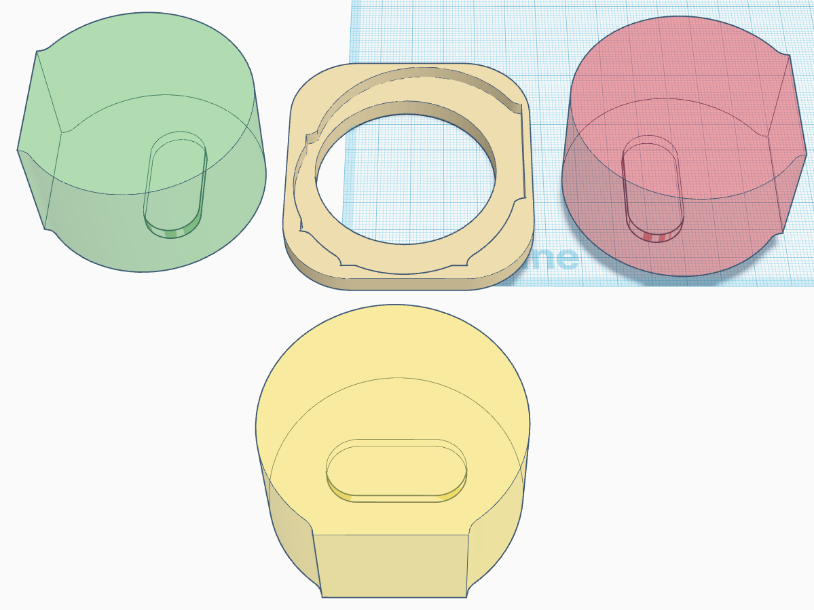
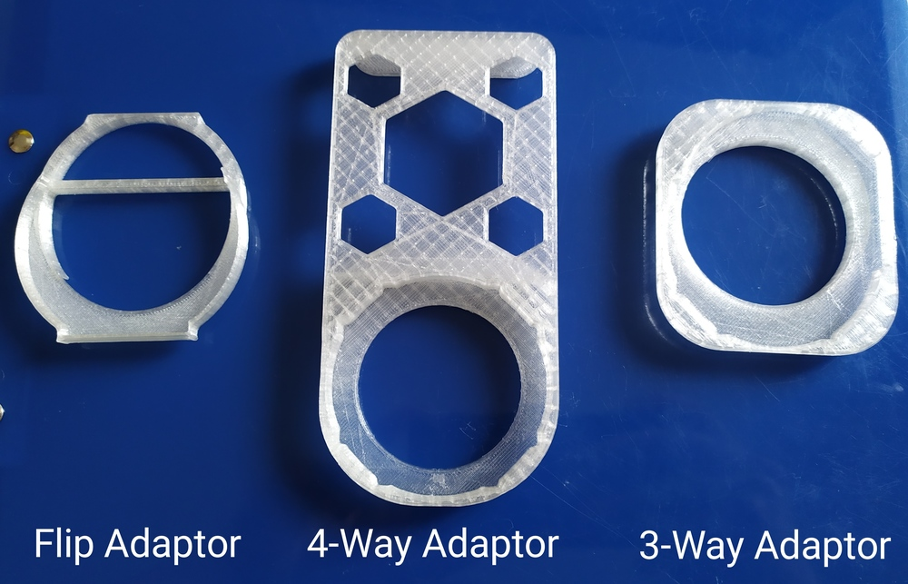

# Laser Guide Add-On to Assist Alignment for both L1 and L1 Pro

## Parts
* 9mm or 12mm diameter cross laser head, 3V or 5V
* some blue tac
* power source:
    * 2x AA or AAA batteries with holder for 3V laser head, or
    * a USB cable for 5V laser head
* optional: a DC switch
* 3D printed bracket:
    * [bracket stl file](/misc/laser_head_bracket.stl)
    * 20% fill, 0.2mm layer height, no support needed

## Assembly

Connect the laser head to the power source directly or via a switch for easy operation. If you use 5V version, you will need a multi-port USB power adapter or a 2nd power adapter to power the laser head.

This is how I attached everything to my Pro, with a self-locking push switch on top of the battery pack.

## Usage

You should do the follow for the initial calibration:

1. Place the engraver 20cm above a piece of non-white paper or cardboard
2. Engrave a perfect 10cm by 10cm cross using this [gcode file](/misc/cross.txt)
3. Turn on your cross laser, align the cross with the engraved cross. This is why the laser is attached to the adapter (or directly to the engraver body) with blue tac.
4. Done.

Provided there's enough blue tac to hold the laser head in place, the next time you turn on your engraver and the laser head, you only need to double check the engraver's laser origin (app > laser adjustment > turn on laser) is spot on the center of the cross laser. If it's off, it won't be much. Just slightly move the laser head a bit. You don't need to engrave the calibration cross every time you use it.

# Flip Adaptor for Auto-Stand

This allows you to view the target engraving from a more natural direction compared to the inverted way by the original design. It also resolves some restrictions on object placement due to the neck of the stand being in the way.

## Part

* 3D printed [flip adapter](/misc/LaserPecker_auto_stand_flip_adaptor.stl)
    * 20% fill, 0.2mm layer height

## Usage

Place the 3D printed flip adapter in the engraver's socket in the auto-stand, then put the engraver in the adapter as below:

# 4-Way Placement Extension for Auto-Stand

Let's take the flip adapter above to the next level, and make a 4-way extension for the auto-stand. It moves the engraver slightly further away from the pillar of the stand, allows the user to freely position large objects under the engraver as needed.

## Part

* 3D printed [4-way extension](/misc/LaserPecker_auto_stand_extension.stl)
    * flip the model to reduce need for support
    * 20% fill, 0.2mm layer height

## Usage

Click to watch demo:

# 3-Way Compact Adaptor for Auto-Stand

This is my 3rd design of adaptors to improve the usability of LaserPecker's Auto Stand.

Although the laser window in the engraver seems a slim, long shape, with careful placements, the engraver can be rotated 90 degrees and still produce the full 100*100mm engraving range through the slim hole in the auto stand.

Although this one does not move the engraver further away from the pillar of the auto stand, by allowing the engraver to face 3 different ways, you can actually avoid the pillar and engrave on most large objects.

## Part

* 3D printed [3-way adaptor](/misc/LaserPecker_auto_stand_3-way_adaptor.stl)
    * need support, either side up is fine
    * 15% fill, 0.2mm layer height
    * only takes about 4.2m of filament and 1h15min to print

## Usage

Click to watch demo:

