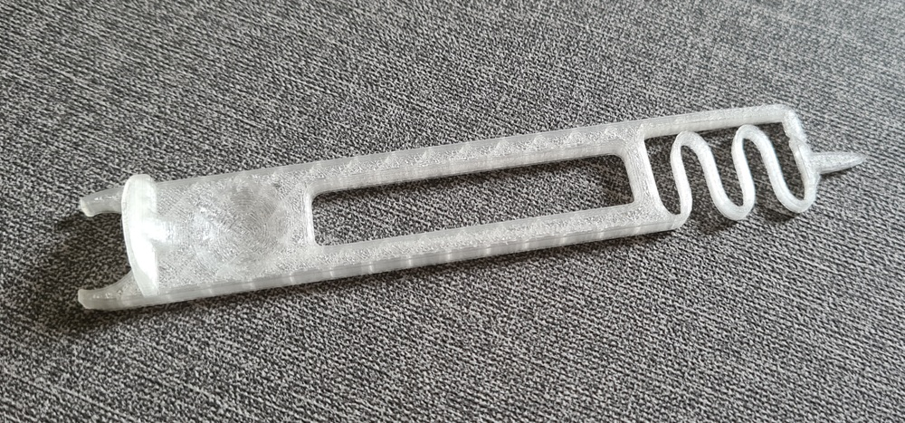
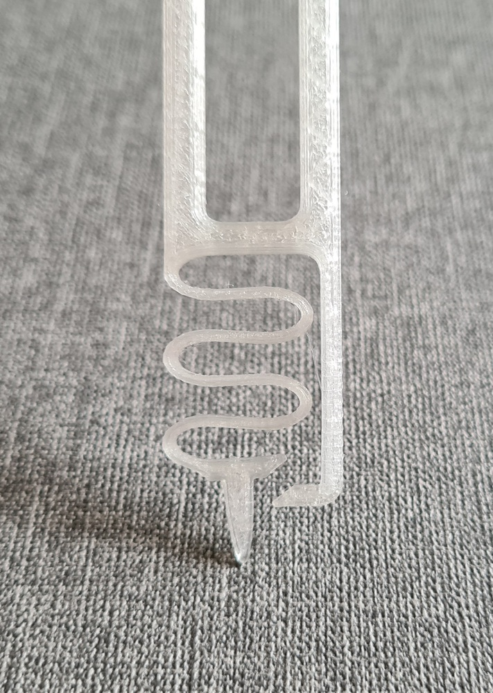
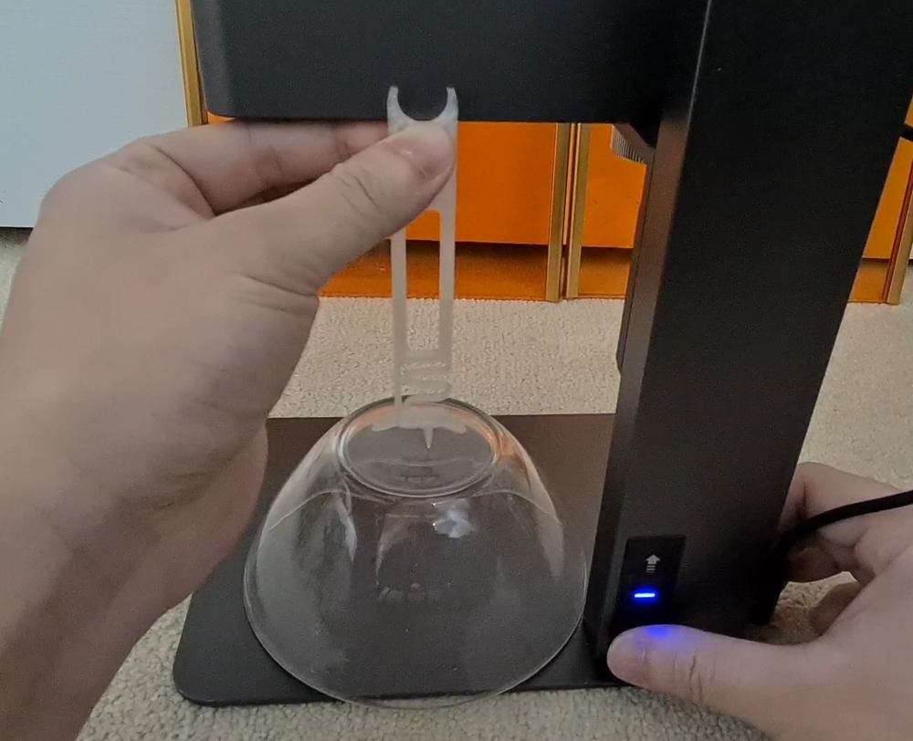
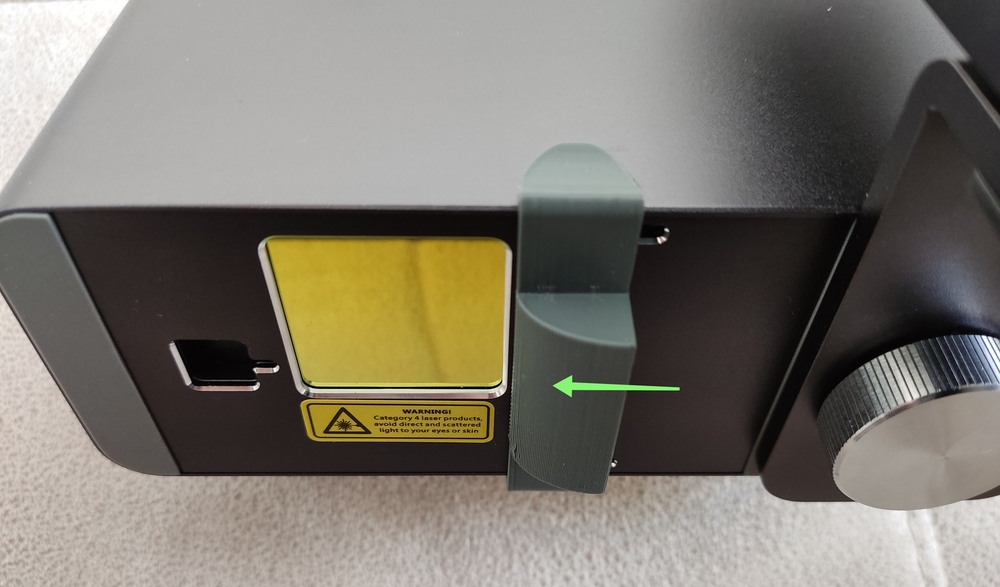
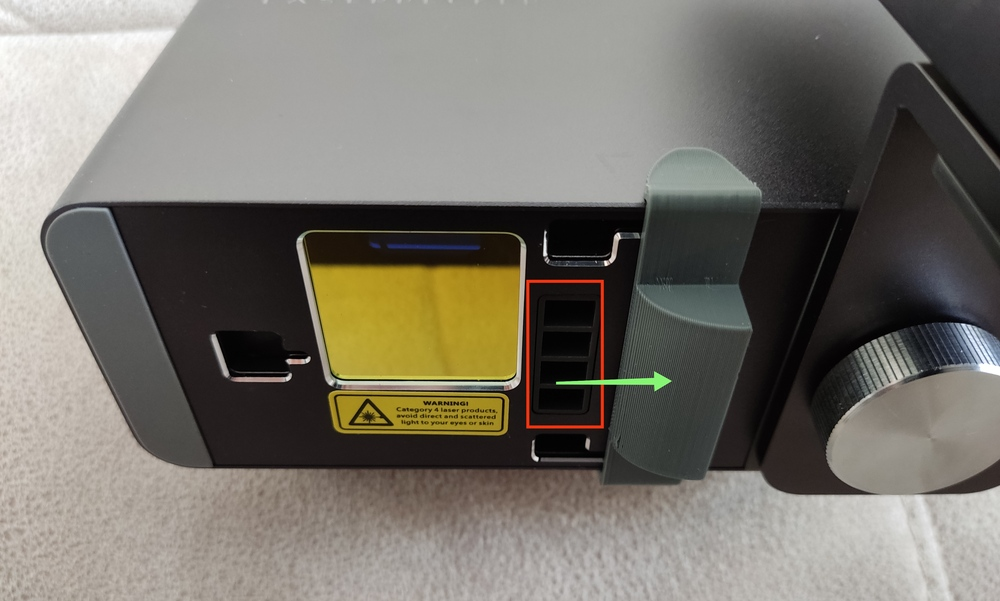
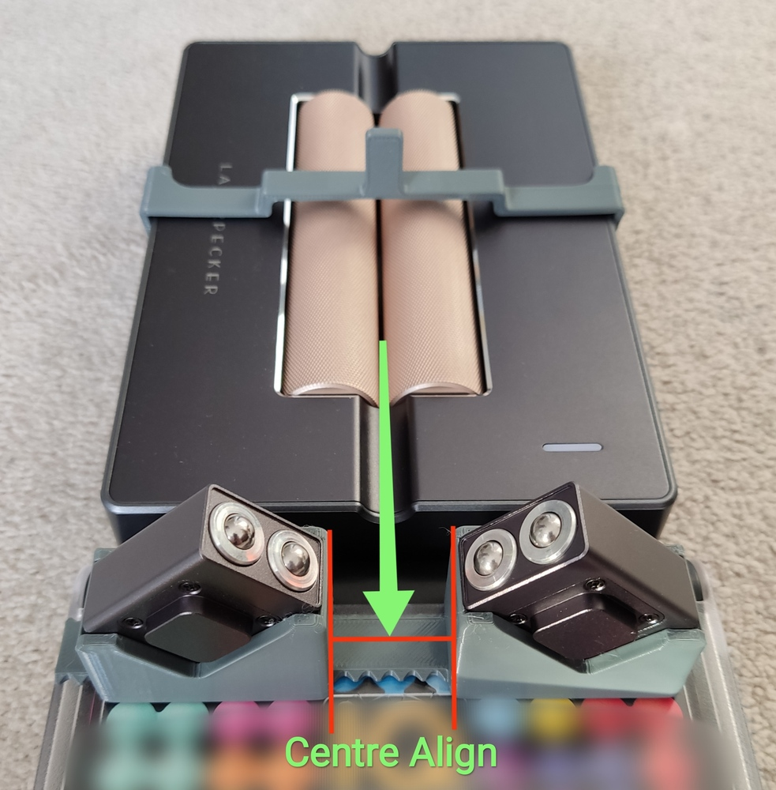
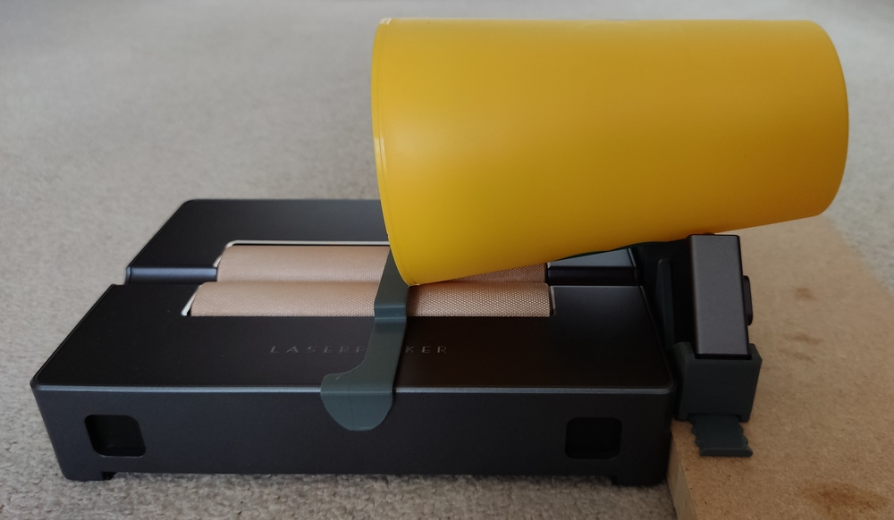
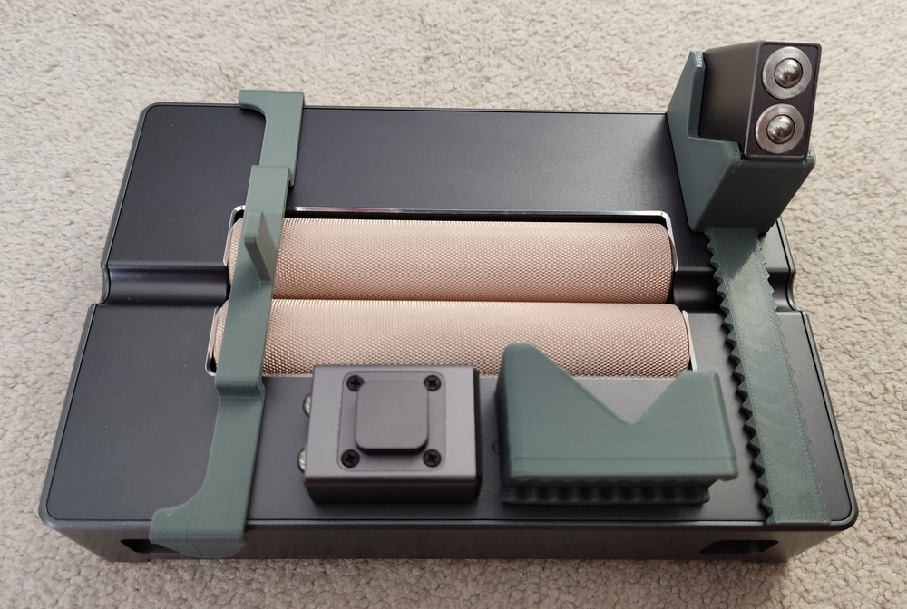

# Table of contents

- [Mods for L1/L1 Pro](#mods-for-l1l1-pro)
  - [Laser Guide Add-On to Assist Alignment](#laser-guide-add-on-to-assist-alignment)
  - [Flip Adaptor for Auto-Stand](#flip-adaptor-for-auto-stand)
  - [4-Way Placement Extension for Auto-Stand](#4-way-placement-extension-for-auto-stand)
  - [3-Way Compact Adaptor for Auto-Stand](#3-way-compact-adaptor-for-auto-stand)
- [Mods for LP2](#mods-for-lp2)
  - [Focus Distance Probe](#focus-distance-probe)
  - [Vent Deflector](#vent-deflector)
  - [3rd Axis Supports](#3rd-axis-supports)

# Mods for L1/L1 Pro

## Laser Guide Add-On to Assist Alignment

### Parts
* 9mm or 12mm diameter cross laser head, 3V or 5V
* some blue tac to keep the laser head in the holder and keep it adjustable
* power source:
    * 2x AA or AAA batteries with holder for 3V laser head, or
    * a USB cable for 5V laser head
* optional: a DC switch
* 3D printed bracket:
    * [bracket stl file](/misc/L1Pro_laser_head_bracket.stl)
    * 20% infill, 0.2mm layer height, no support needed

### Assembly

Connect the laser head to the power source directly or via a switch for easy operation. If you use 5V version, you will need a multi-port USB power adapter or a 2nd power adapter to power the laser head.

This is how I attached everything to my Pro, with a self-locking push switch on top of the battery pack.

### Usage

You should do the follow for the initial calibration:

1. Place the engraver 20cm above a piece of non-white paper or cardboard
2. Engrave a perfect 10cm by 10cm cross using this [gcode file](/misc/cross.txt)
3. Turn on your cross laser, align the cross with the engraved cross. This is why the laser is attached to the adapter (or directly to the engraver body) with blue tac.
4. Done.

Provided there's enough blue tac to hold the laser head in place, the next time you turn on your engraver and the laser head, you only need to double check the engraver's laser origin (app > laser adjustment > turn on laser) is spot on the center of the cross laser. If it's off, it won't be much. Just slightly move the laser head a bit. You don't need to engrave the calibration cross every time you use it.

## Flip Adaptor for Auto-Stand

This allows you to view the target engraving from a more natural direction compared to the inverted way by the original design. It also resolves some restrictions on object placement due to the neck of the stand being in the way.

### Part

* 3D printed [flip adapter (stl file)](/misc/L1Pro_auto_stand_flip_adaptor.stl)
    * 20% infill, 0.2mm layer height

### Usage

Place the 3D printed flip adapter in the engraver's socket in the auto-stand, then put the engraver in the adapter as below:

## 4-Way Placement Extension for Auto-Stand

Let's take the flip adapter above to the next level, and make a 4-way extension for the auto-stand. It moves the engraver slightly further away from the pillar of the stand, allows the user to freely position large objects under the engraver as needed.

### Part

* 3D printed [4-way extension (stl file)](/misc/L1Pro_auto_stand_extension.stl)
    * flip the model to reduce need for support
    * 20% infill, 0.2mm layer height

### Usage

Click to watch demo:

## 3-Way Compact Adaptor for Auto-Stand

This is my 3rd design of adaptors to improve the usability of LaserPecker's Auto Stand.

Although the laser window in the engraver seems a slim, long shape, with careful placements, the engraver can be rotated 90 degrees and still produce the full 100*100mm engraving range through the slim hole in the auto stand.

Although this one does not move the engraver further away from the pillar of the auto stand, by allowing the engraver to face 3 different ways, you can actually avoid the pillar and engrave on most large objects.

### Part

* 3D printed [3-way adaptor (stl file)](/misc/L1Pro_auto_stand_3-way_adaptor.stl)
    * need support, either side up is fine
    * 15% infill, 0.2mm layer height
    * only takes about 4.2m of filament and 1h15min to print

### Usage

Click to watch demo:

# Mods for LP2

## Focus Distance Probe

This is a 3D printed probe to meaaure exactly 110mm from the bottom of the LP2 to the engraving surface. It is flexible by design so that it will not damage itself or your object when the engravers moves too close to the object.

### Part

* 3D printed [110m probe (stl file)](/misc/LP2_110mm_probe.stl)
    * no support needed
    * 15%+ infill, 0.2mm- layer height
    * After printing, carefully separate the `/` design with a shape knife so that the end of the probe can retract when pressed.

### Usage

Push the end stopper to the bottom of the LP2, and lower the engraver till the tip of the probe touches the engraving surface without retraction.

The probe snaps onto the handle for easy storage.

Click to watch demo:

  

## Vent Deflector

This is needed only when you engrave very light material, such as embossing powder, or cutting thin paper, so that the airflow from the vent holes does not blow yuor material away during engraving.

### Part
* 3D printed [vent deflector (stl file)](/misc/LP2_vent_deflector.stl)
    * no support needed
    * 15%+ infill, 0.2mm- layer height

### Usage
You may keep it on the engraver and slide it to the desired position as needed.

 

## 3rd Axis Supports

This is a 3-piece set. They help you place a cone shaped object on the 3rd axis addon for engaving. If you place a cone on the rollers directly without this support, you will have 2 issues:

1) the top side to be engraved on is not horizontal, so it's difficult to alighn it with the engraver.
2) as the rollers roll the cone shaped object by contact, the big end and small end would be moving at different angular velocity, and therefore the whole object may skid or come off the rollers. It's a simple maths/geometry issue, not that the 3rd is faulty or anything.

As a solution, I designed this support to raise the small end of the object and to allow the small end to freely rotate at the same angular velocity as the big end moved by the rollers, solving exactly the 2 issues described above.

The end stopper (the big clip, AKA part C) stops the object from moving sideways by gravity. So all 3 parts are required.

In addition, since the final version of the 3rd axis rollers are metal instead of rubber, there's a big chance that the object may skid sicne the contact area is very small and on hard metal surface. A simple solution is to put a rubber band on the end of the cone to increase friction.

### Parts
* 3D printed [part A](/misc/LP2_3rd_Axis_support_A.stl), [part B](/misc/LP2_3rd_Axis_support_B.stl) and [part C](/misc/LP2_3rd_Axis_support_C.stl)
   * need support
   * 15%+ infill, 0.2mm- layer height

### Usage
* Adjust height of the end support with a stable flat object.
* Adjust spacing according to your object.
* Centre-align the end support.
* Place your object on the rollers, make sure the top of it is horizontal.
* Finally place the end stopper (the big clip) to stop it from moving during rolling.

Here is [an illustration of positioning the support](https://www.facebook.com/groups/374697760505822/permalink/466559177986346/) and [a demo of how to use it to engrave on a cone](https://www.facebook.com/groups/374697760505822/permalink/472151160760481/).

 

