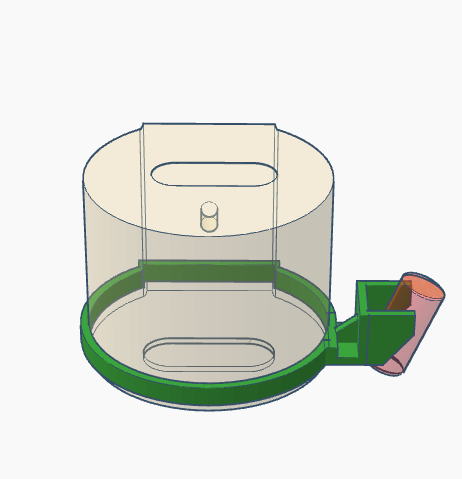
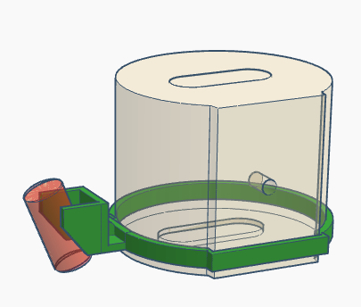
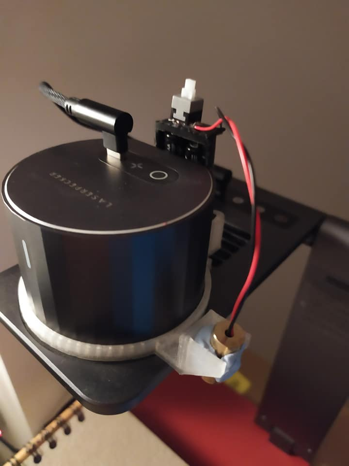
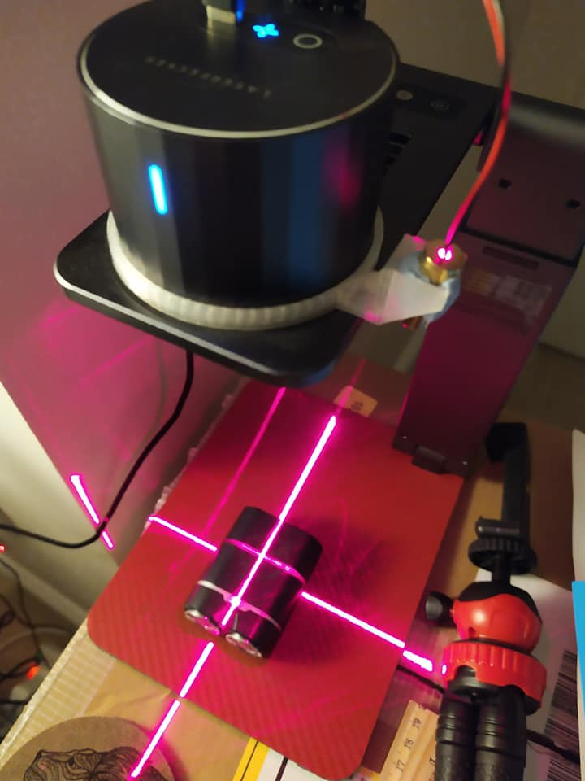
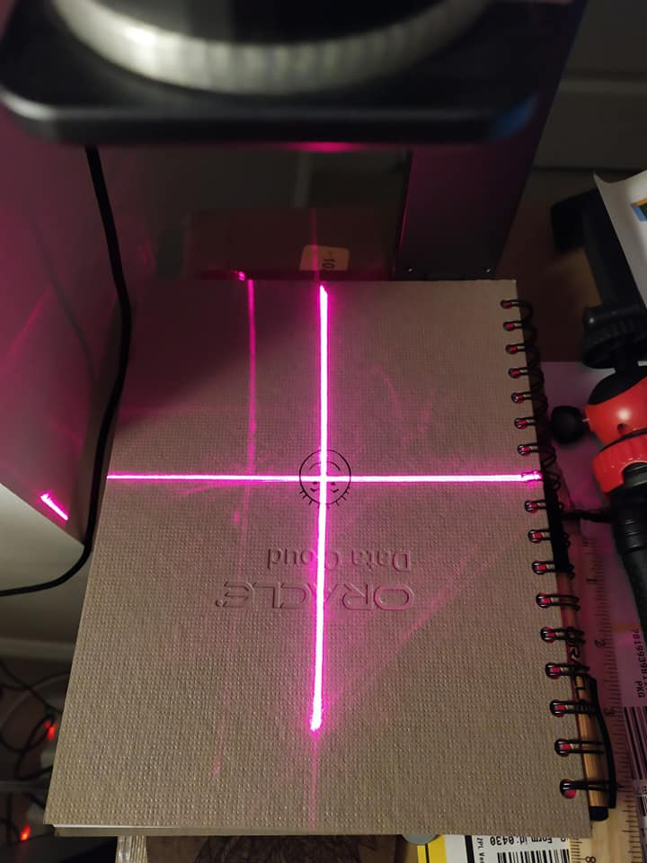

# Laser Guide Add-On to Assist Alignment for both L1 and L1 Pro

## Parts
* 9mm 5mW cross laser head, 3V or 5V
* some blue tac
* power source:
    * 2x AA or AAA batteries with holder for 3V laser head, or
    * a USB cable for 5V laser head
* optional: a DC switch
* optional: 3D printed adapter ring:
    * [v1: with AAA battery holder](/misc/laser_alignment_bracket_with_AAA_battery_holder.stl) or
    * [v2: without battery holder](/misc/laser_alignment_bracket_no_battery_holder.stl)

## Assembly

Connect the laser head to the power source directly or via a switch for easy operation. If you use 5V version, you will need a multiport USB power adapter or a 2nd power adapter to power the laser head.

This is how I attached everyting to my Pro, with a self-locking push switch on top of the battery pack.

## Usage

You should do the follow for the initial calibration:

1. Place the engraver 20cm above a piece of non-white paper or cardbaord
2. Engrave a perfect 10cm by 10cm cross using this [gcode file](/misc/cross.txt)
3. Turn on your cross laser, align the cross with the engraved cross. This is why the laser is attached to the adapter (or directly to the engraver body) with blue tac.
4. Done.

Provided there's enough blue tac to hold the laser head in place, the next time you turn on your engraver and the laser head, you only need to double check the engraver's laser origin (app > laser adjustment > turn on laser) is spot on the center of the cross laser. If it's off, it won't be much. Just slightly move the laser head a bit. You don't need to engrave the calibration cross every time you use it.

# Flip adaptor for auto-stand

# 4-way placement extension for auto-stand
