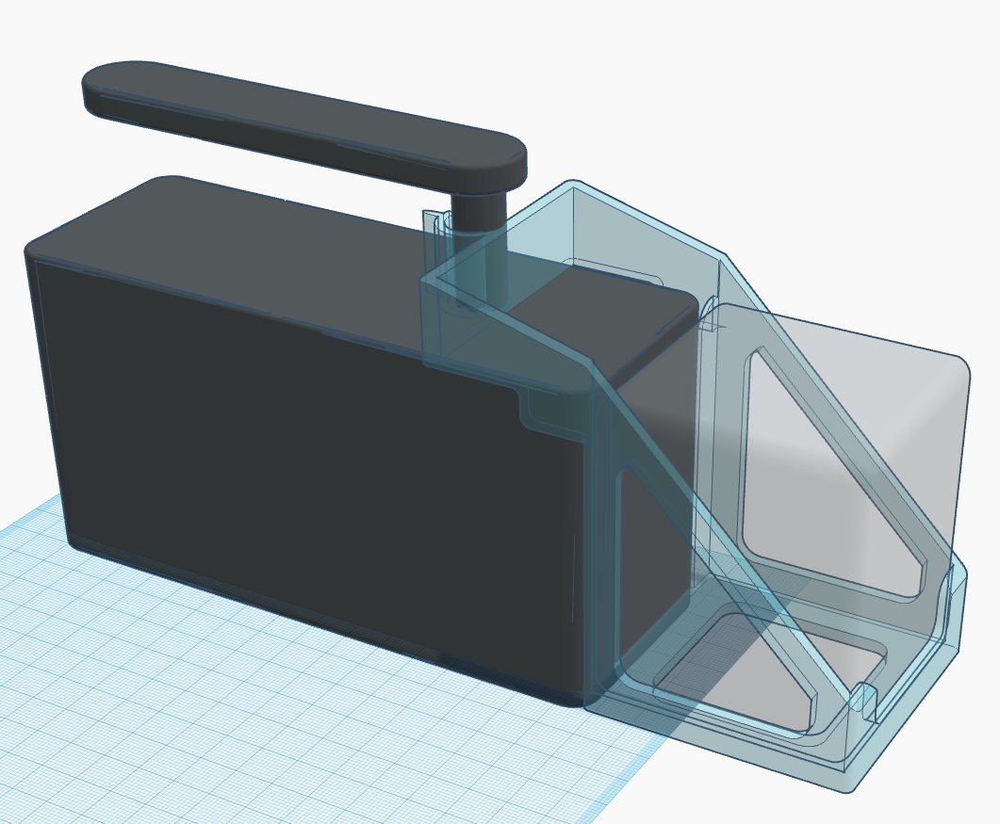
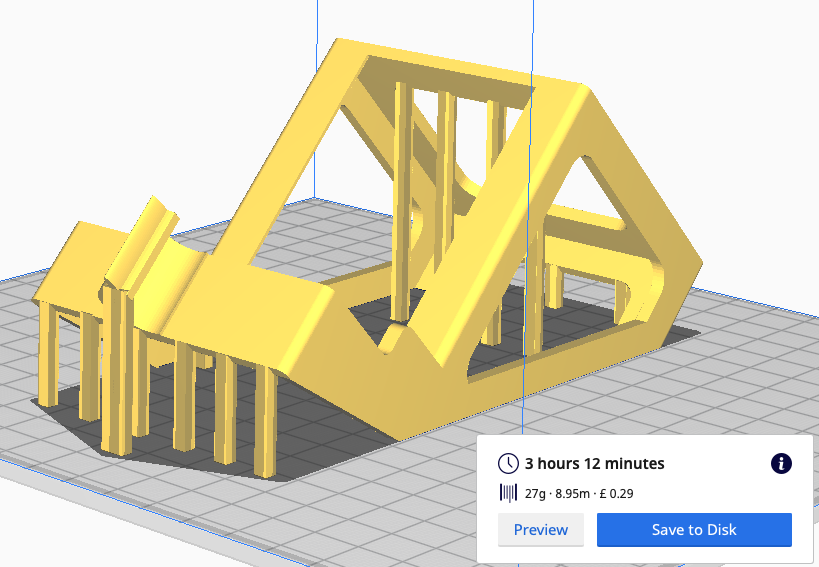
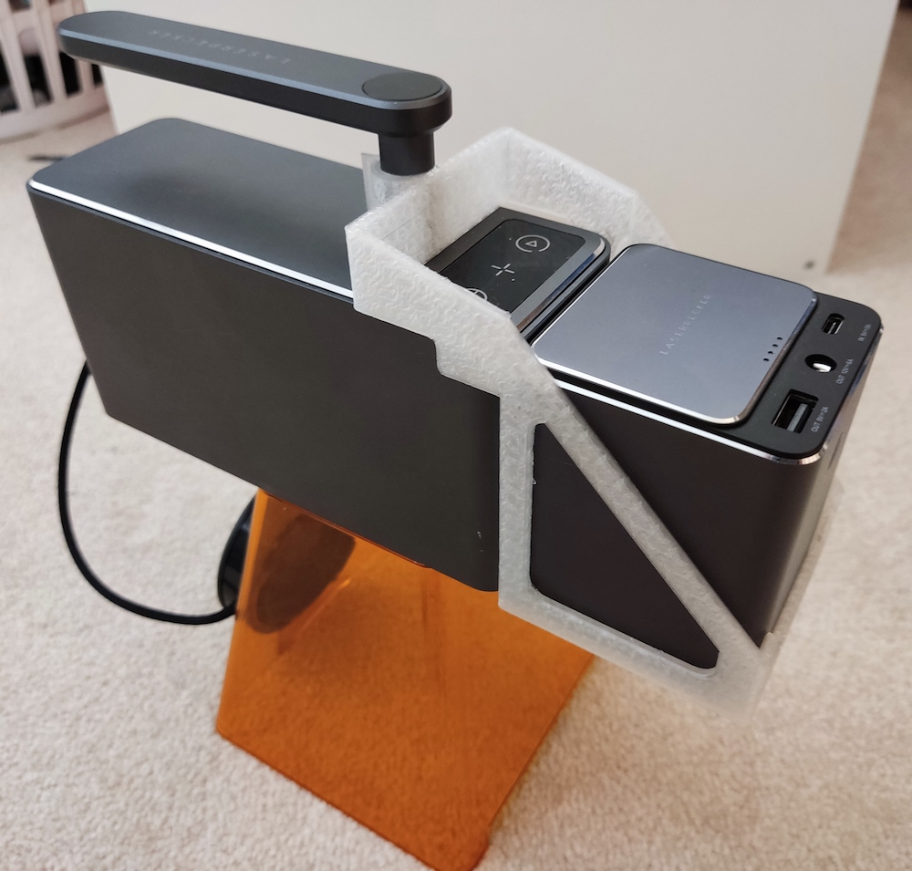
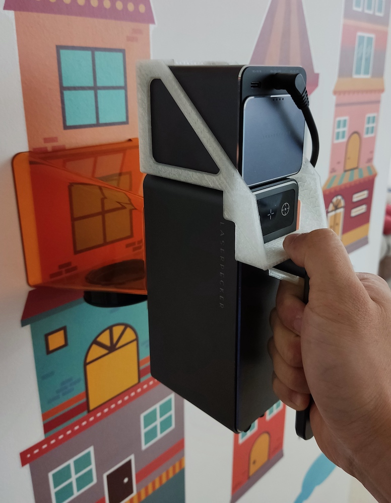

# Mods for L1/L1 Pro

moved to https://lp.systemd.one/?p=384

## Flip Adaptor for Auto-Stand

moved to https://lp.systemd.one/?p=408

## 4-Way Placement Extension for Auto-Stand
moved to https://lp.systemd.one/?p=410

## 3-Way Compact Adaptor for Auto-Stand

moved to https://lp.systemd.one/?p=417

# Mods for LP2

moved to https://lp.systemd.one/?p=419

## Double Distance Probe

moved to https://lp.systemd.one/?p=421

## Vent Deflector

This is needed only when you engrave very light material, such as embossing powder, or cutting thin paper, so that the airflow from the vent holes does not blow yuor material away during engraving.

### Part
* 3D printed [vent deflector (stl file)](/misc/LP2_vent_deflector.stl)
    * no support needed
    * 15%+ infill, 0.1-0.2mm layer height

### Usage
You may keep it on the engraver and slide it to the desired position as needed.

 

## 3rd Axis Supports

This is a 3-piece set. They help you place a cone shaped object on the 3rd axis addon for engaving. If you place a cone on the rollers directly without this support, you will have 2 issues:

1) the top side to be engraved on is not horizontal, so it's difficult to alighn it with the engraver.
2) as the rollers roll the cone shaped object by contact, the big end and small end would be moving at different angular velocity, and therefore the whole object may skid or come off the rollers. It's a simple maths/geometry issue, not that the 3rd is faulty or anything.

As a solution, I designed this support to raise the small end of the object and to allow the small end to freely rotate at the same angular velocity as the big end moved by the rollers, solving exactly the 2 issues described above.

The end stopper (the big clip, AKA part C) stops the object from moving sideways by gravity. So all 3 parts are required.

In addition, since the final version of the 3rd axis rollers are metal instead of rubber, there's a big chance that the object may skid sicne the contact area is very small and on hard metal surface. A simple solution is to put a rubber band on the end of the cone to increase friction.

### Parts
* 3D printed [part A](/misc/LP2_3rd_Axis_support_A.stl), [part B](/misc/LP2_3rd_Axis_support_B.stl) and [part C](/misc/LP2_3rd_Axis_support_C.stl)
   * need support
   * 15%+ infill, 0.1-0.2mm layer height

### Usage
* Adjust height of the end support with a stable flat object.
* Adjust spacing according to your object.
* Centre-align the end support.
* Place your object on the rollers, make sure the top of it is horizontal.
* Finally place the end stopper (the big clip) to stop it from moving during rolling.

Here is [an illustration of positioning the support](https://www.facebook.com/groups/374697760505822/permalink/466559177986346/) and [a demo of how to use it to engrave on a cone](https://www.facebook.com/groups/374697760505822/permalink/472151160760481/).

 

## Power Bank Holder

This holder snaps and locks onto the LP2 by itself, and keeps the power bank attached to the main unit for easy handheld engravings.

### Part
* 3D printed [LP2 Power Bank Holder (stl file)](/misc/LP2_power_bank_holder.stl)
  * Print at 135 degrees (longest side face down) to reduce the need of support.
  * 15% infill, 0.2mm layer height

 

### Usage
Click the image below to watch a video demo.

 
