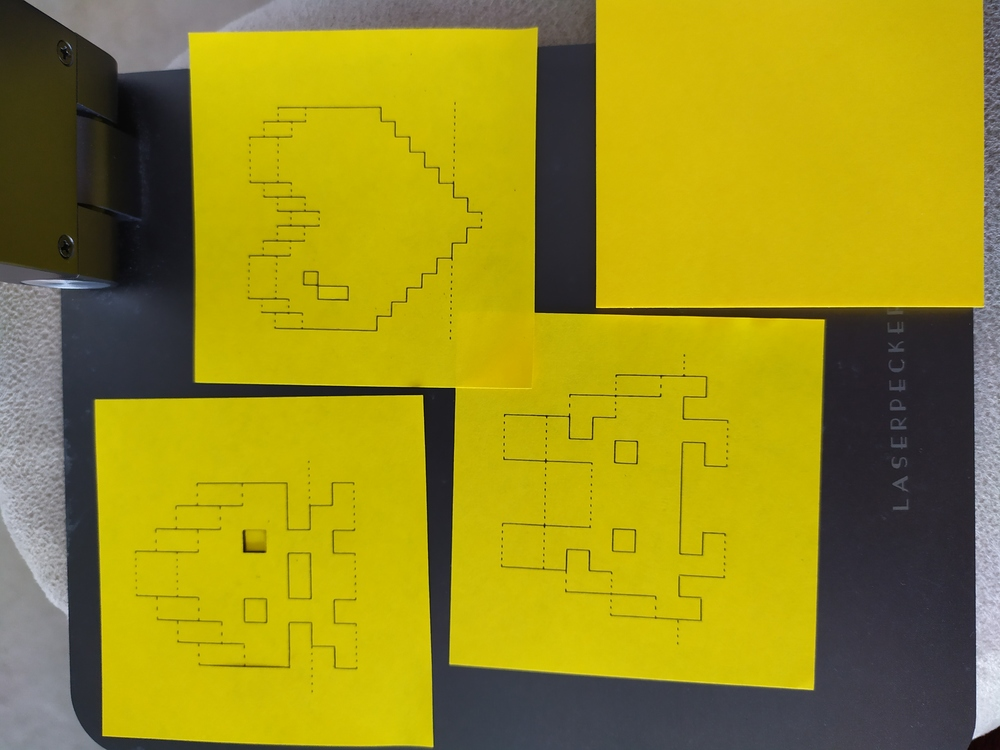
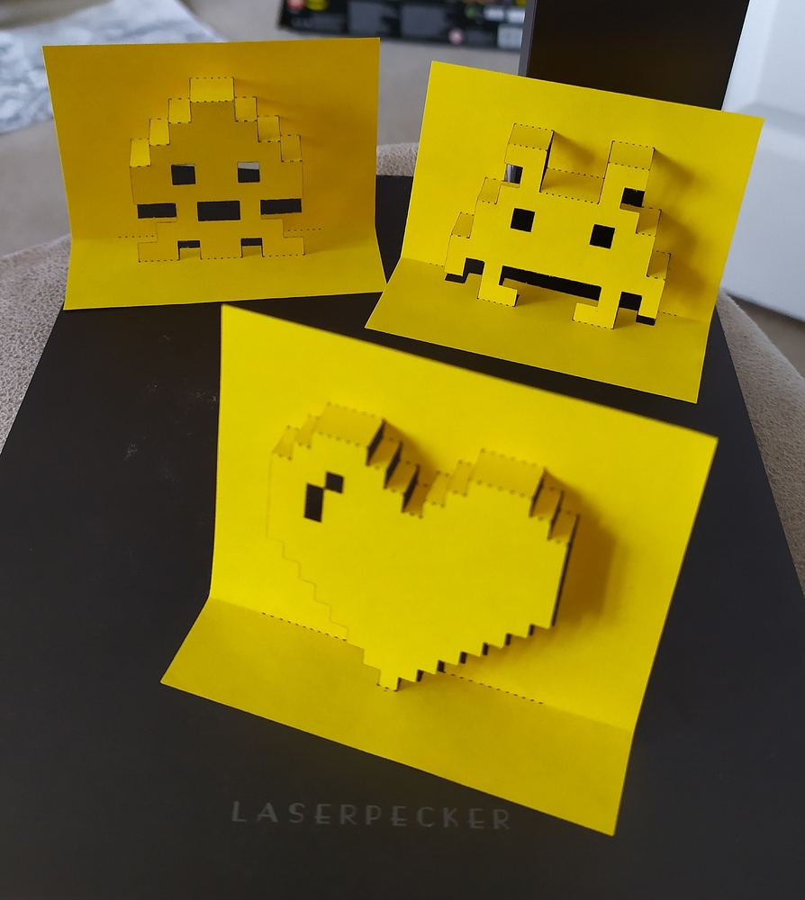
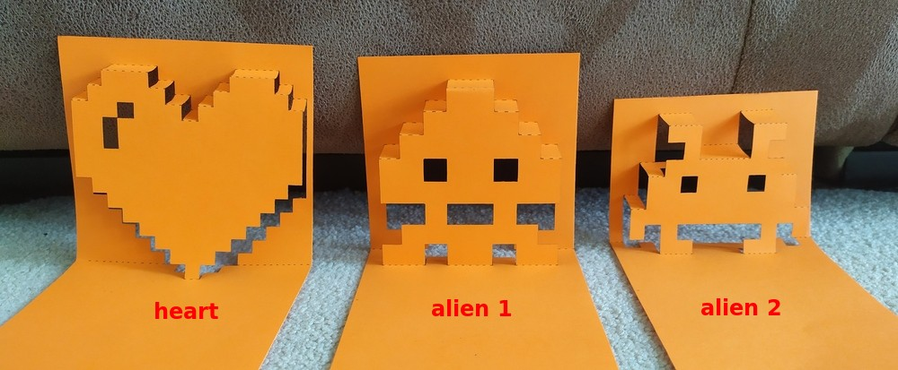

# Gcode for Pop Up Cards

## Credit

The designs come from:
* https://www.paperchase.com/the-journal/8-bit-pop-up-card/ 
* http://www.minieco.co.uk/popup-pixel-valentines-card-2013-new-improved/

**For non-commercial purposes only!**

## Instructions

I created these Gcode files using the templates downloaded from above linked web sites, and take no credit for the design. 

**These Gcode files are tailored for LaserPecker L1 and L1 Pro ONLY**

Steps:
1. Download Gcode (`.txt`) files listed above to your phone. Note there are 2 sets of files for *thin* (quick cut) and *thick* (slow cut) papers. **They do not work on white paper.**
    * Android: copy to `(phone storage) > laserpecker files` directory in your phone. This is also where additional custom fonts (`.ttf` files) live.
    * iOS (2nd-hand info): copy to `Files > Laserpecker > matarialgcode directory` (yes, the directory name is misspelt by LP). **Or** use the **Share** function. The Gcode files can be in any directory in the `Files` app. It can be in Dropbox, iCloud, any location accessible by `Files`. Then select the Gcode file within `Files`, click **Share** button, and select LaserPecker App to share to.
2. In LaserPercker App, go to `Examples` > `G-code` to select uploaded Gcode file and engrave. At the moment, power and speed (depth) settings are hard-coded in the Gcode files and can not be changed. So you need to choose the right set of Gcode files to cut with. The future version of LaserPecker App will allow users to override hard-coded settings for more flexibility.
3. Have a test run first. If 1-pass didn't cut it perfectly, you can either trace the burn marks with a sharp knife, or start over and use the multi pass setting for the number of passes your paper requires.
4. To avoid paper warping and ruining the job, use some weights around the paper to keep it down.
