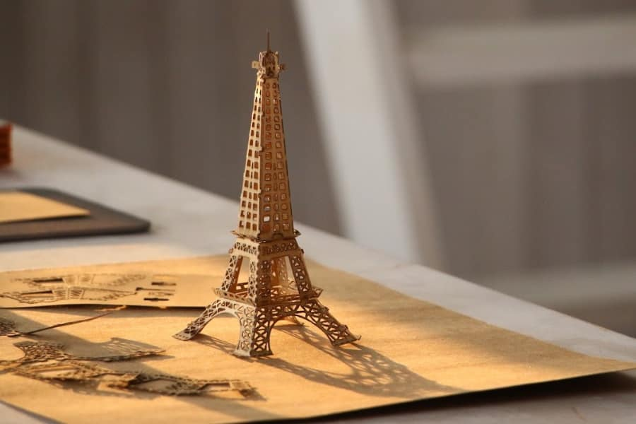

# Gcode for Paper Eiffel Tower

**These Gcode files are tailored for LaserPecker L1 and L1 Pro.**

Curious about the paper Eiffel tower as seen in the LP promo photos? Here are the Gcode files so you can make your own!

Steps:
1. Download all 3 Gcode (`.txt`) files listed above to your phone. 
2. Find four pieces of paper of minimal 10x10cm size (or a large piece of paper, you get the idea). Avoid white paper as it's not the best for cutting. I cut up 2 brown envelopes for this.
3. Cut 2 copies of `tower_part_1_x2_copies.txt`; 1 copy of `tower_part_2.txt`; 1 copy of `tower_part_3.txt`. Each requires 10x10cm sized paper.
4. If 1-pass didn't cut it perfectly, do not move it and have a 2nd pass. And for the following cuts, use the multi pass setting for the number of passes your paper requires.
5. To avoid paper warping and ruining the job, use some weights around the paper to keep it down.

